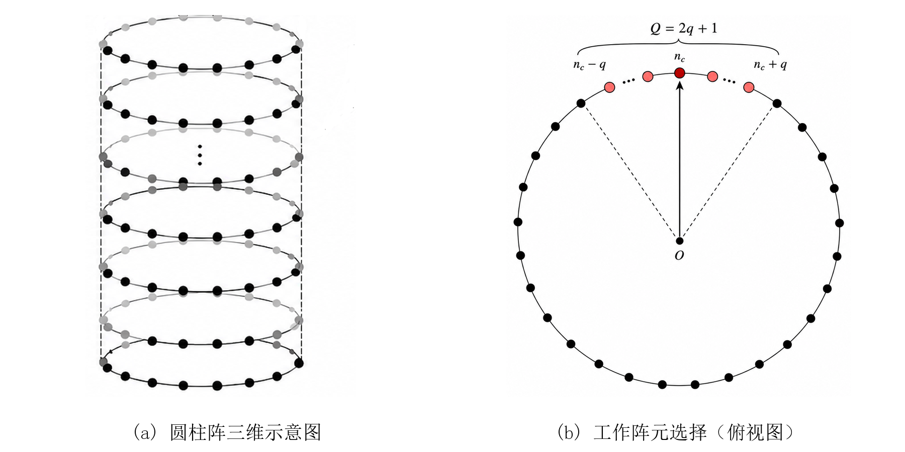
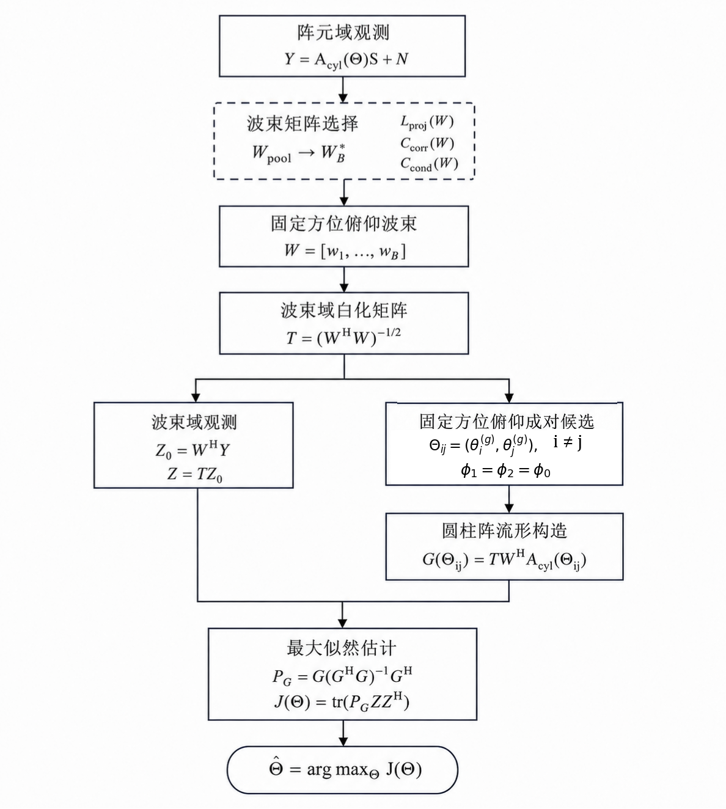
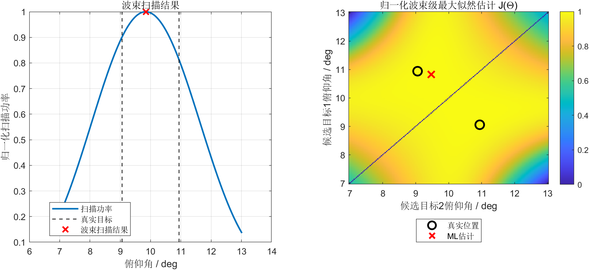
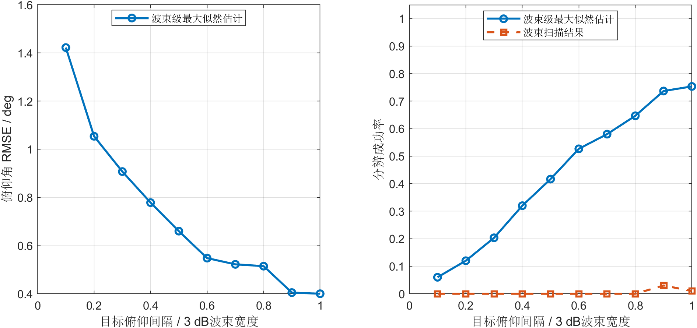
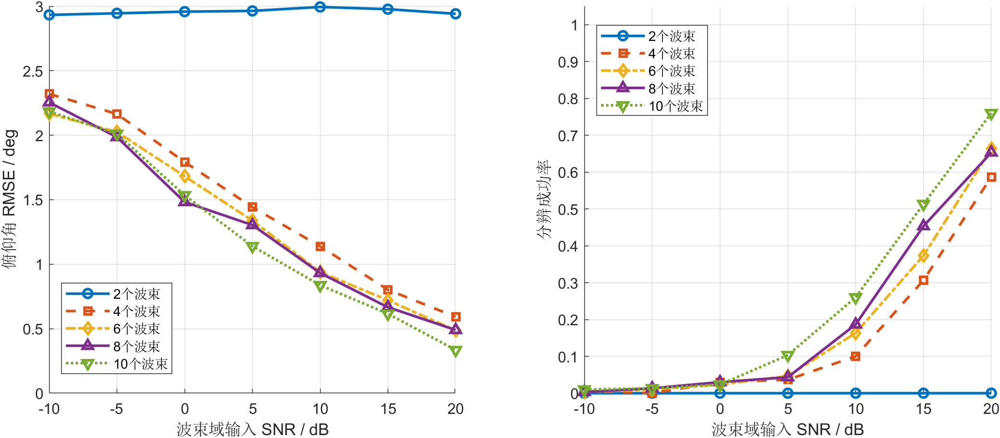
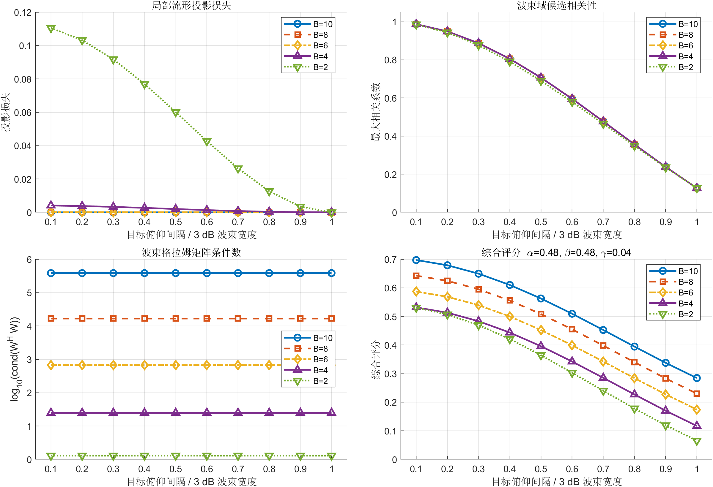
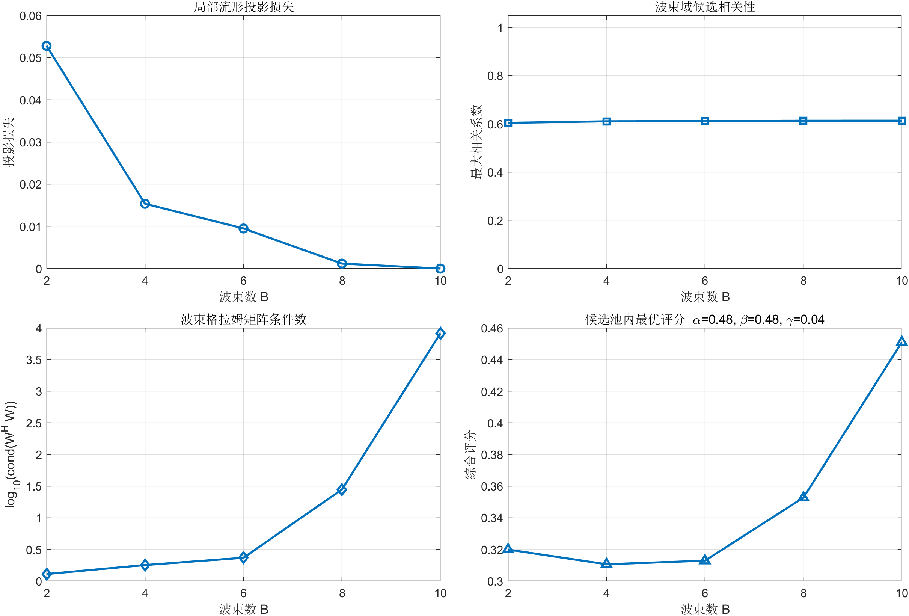
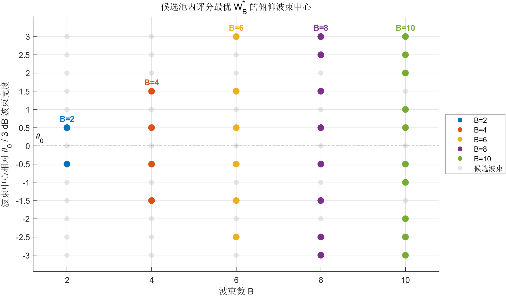

# 面向圆柱阵的波束级最大似然估计测角方法

## 摘要

针对传统测角分辨率受限和圆柱阵建模计算量较大的问题，本文提出一种面向圆柱阵的波束级最大似然测角方法。该方法基于圆柱阵真实阵元坐标建立模型，将阵元域接收信号投影到波束域，并参考凝视雷达工作模式固定方位对俯仰角进行最大似然估计；同时提出一种波束转换矩阵的选择准则，进一步降低计算量。仿真结果表明，在波束域中，该方法能够利用少量俯仰波束实现最大似然估计的超分辨测角和波束转换矩阵的有效选择。

**关键词：** 圆柱阵；波束域；最大似然估计；超分辨测角

## 1 引言

随着雷达、电子侦察和通信感知系统的发展，对阵列测角提出了严峻的挑战。随着目标密度提高和雷达搜索场景的复杂，接收端常需处理角度间隔小于波束的目标。而圆柱阵由环向阵元和垂直孔径的结构，使其兼具方位和俯仰信息获取能力，适用于三维测角和空间态势感知[1,2]。

传统波束测角分辨能力受波束宽度和信噪比限制。当大于一个目标落入同一主瓣或半波束宽度内时，空间谱可能合并为单峰，导致角度偏差。最大似然估计直接利用阵列流形和观测残差，在相干源和低信噪比条件下具有优势[3,4]，但阵元域最大似然估计的计算量会随目标数和网格密度快速增长。

近年来，波束域处理为降低计算量提供了可行路径。现有的波束域操作思路主要是先将阵元域观测投影到波束域，再完成参数估计，从而减少输入维度[5-9]。已有研究表明，波束域变换会影响流形保持、参数估计误差[9-11]，因此对于圆柱阵关键在于用少量波束保留真实流形，并在波束域进行最大似然估计。

本文提出了针对圆柱阵的波束级最大似然估计的测角方法。该方法根据全息凝视雷达的工作模式选取工作子阵，以真实阵元坐标建立模型，将阵元域观测投影到波束域，并在波束域进行最大似然估计得到测角结果。同时根据局部流形保持、波束相关性和数值稳定性这三个指标，提出了一种贪心算法作为波束选择准则。实现了三个指标的折中和数据降维，提升了运算效率。仿真结果验证了所提出算法的有效性。

## 2 信号模型

### 2.1 圆柱阵及工作阵元

设圆柱阵由 $N_{\psi}$ 个方位列和 $N_z$ 个俯仰层组成，圆柱半径为 $R_c$，垂直层间距为 $d_z$。用 $\psi_n$ 表示第 $n$ 个方位列的几何圆周角，则

$$
\psi_n=\psi_{\mathrm{ref}}+(n-1)\Delta_{\psi}.
$$

其中，

$$
\Delta_{\psi}=\frac{2\pi}{N_{\psi}},
$$

表示相邻方位列在圆周方向上的角间隔。该量由方位列总数决定，用于将离散方位列索引映射到实际圆周角度。

第 $m$ 个俯仰层高度为

$$
z_m=z_{\mathrm{ref}}+(m-1)d_z .
$$

其中，$\psi_{\mathrm{ref}}$ 和 $z_{\mathrm{ref}}$ 分别为圆周参考角和高度参考点。

圆柱阵第 $(n,m)$ 个阵元的位置向量为
$$
\mathbf{r}_{n,m}=
\left[
R_c\cos\psi_n,\ 
R_c\sin\psi_n,\ 
z_m
\right]^T .
$$

圆柱阵共有 $N_{\psi}N_z$ 个阵元。在工作模式下，围绕方位中心 $\phi_0$ 选取工作子阵，则中心列索引为

$$
n_c=\arg\min_n \left|\psi_n-\phi_0\right|.
$$

该式表示从所有方位列中选取与方位中心 $\phi_0$ 最近的列作为工作子阵中心。

设工作扇区对应的方位列数为 $Q$，且 $Q=2q+1$。则以中心列 $n_c$ 为基准，两侧各取 $q$ 列，得到了根据当前工作扇区选定的工作列集合

$$
\mathcal{I}_{\psi}=
\left\{
n_c-q,\ldots,n_c,\ldots,n_c+q
\right\}\quad(\mathrm{mod}\ N_{\psi}).
$$

若工作子阵保留上述 $Q$ 个方位列和全部 $N_z$ 个俯仰层，则工作子阵阵元数为

$$
M=QN_z .
$$

### 2.2 阵元域观测

工作子阵第 $i$ 个阵元的坐标记为 $\mathbf{p}_i=[x_i,y_i,z_i]^T$，$i=1,\ldots,M$。目标方位角和俯仰角分别记为 $\phi$ 和 $\theta$，其单位方向向量及圆柱阵导向矢量分别为

$$
\begin{aligned}
\mathbf{u}(\phi,\theta)
&=
\left[
\cos\theta\cos\phi,\ 
\cos\theta\sin\phi,\ 
\sin\theta
\right]^T,\\
\mathbf{a}_{\mathrm{cyl}}(\phi,\theta)
&=\left[
\exp\left(j\frac{2\pi}{\lambda}\mathbf{p}_1^T\mathbf{u}(\phi,\theta)\right),
\ldots,
\exp\left(j\frac{2\pi}{\lambda}\mathbf{p}_M^T\mathbf{u}(\phi,\theta)\right)
\right]^T .
\end{aligned}
\tag{1}
$$

其中，$\lambda$ 为信号波长。设局部角域内包含 $K$ 个目标，且 $K$ 已知。记第 $k$ 个目标的二维方向参数为 $\boldsymbol{\eta}_k=(\phi_k,\theta_k)$，并令 $\Theta=\{\boldsymbol{\eta}_k\}_{k=1}^{K}$，则阵元域导向矩阵为

$$
A_{\mathrm{cyl}}(\Theta)=
\left[
\mathbf{a}_{\mathrm{cyl}}(\phi_1,\theta_1),
\ldots,
\mathbf{a}_{\mathrm{cyl}}(\phi_K,\theta_K)
\right]
\in\mathbb{C}^{M\times K},
\tag{2}
$$

对 $L$ 个快拍，阵元域观测模型为

$$
Y=A_{\mathrm{cyl}}(\Theta)S+N,
\qquad
S\in\mathbb{C}^{K\times L},
\quad
N\in\mathbb{C}^{M\times L} .
\tag{3}
$$

其中，$Y\in\mathbb{C}^{M\times L}$，$S$ 为目标复包络矩阵。阵元噪声满足 $\mathbf{n}_l\sim\mathcal{CN}(\mathbf{0},\sigma^2I_M)$。

### 2.3 波束域观测

选取 $B$ 个局部波束构成波束矩阵 $W\in\mathbb{C}^{M\times B}$，其中 $B\ll M$。第 $b$ 个波束中心为 $(\phi_0,\theta_b)$，相应权向量取归一化圆柱阵导向矢量：

$$
W=\left[\mathbf{w}_1,\ldots,\mathbf{w}_B\right],
\qquad
\mathbf{w}_b=
\frac{\mathbf{a}_{\mathrm{cyl}}(\phi_0,\theta_b)}
{\left\|\mathbf{a}_{\mathrm{cyl}}(\phi_0,\theta_b)\right\|_2},
\qquad b=1,2,\ldots,B .
\tag{4}
$$

阵元域观测经 $W^H$ 投影后，得到常规波束域观测

$$
Z=W^HY
=W^HA_{\mathrm{cyl}}(\Theta)S+W^HN
\in\mathbb{C}^{B\times L} .
\tag{5}
$$

定义波束域导向矩阵 $G(\Theta)$ 和波束域噪声 $N_b$，则式(5)可写为

$$
G(\Theta)=W^HA_{\mathrm{cyl}}(\Theta)
\in\mathbb{C}^{B\times K},
\qquad
N_b=W^HN,
\qquad
Z=G(\Theta)S+N_b .
\tag{6}
$$

式(6)为后续最大似然估计所采用的波束域模型，它将观测维度由 $M$ 维压缩至 $B$ 维。若 $W$ 列满秩但列向量非正交，则 $N_b$ 的协方差为 $\sigma^2W^HW$。此时在最大似然估计前进行白化：

$$
T=(W^HW)^{-1/2},
\qquad
\bar{Z}=TZ,
\quad
\bar{G}(\Theta)=TG(\Theta),
\quad
\bar{N}=TN_b,
\qquad
E[\bar{\mathbf{n}}_l\bar{\mathbf{n}}_l^H]=\sigma^2 I_B .
\tag{7}
$$

为简化记号，后文仍以 $Z$、$G(\Theta)$ 和 $\boldsymbol{\nu}_l$ 表示实际参与最大似然计算的波束域观测、流形和等效噪声。

## 3 圆柱阵的波束级最大似然测角算法和波束选择规则

### 3.1 最大似然估计

对$K$ 个目标，设局部搜索窗口的中心为 $(\phi_0,\theta_0)$，方位半宽和俯仰半宽分别为 $\Delta_{\phi}^{\mathrm{win}}$ 与 $\Delta_{\theta}^{\mathrm{win}}$。候选角度集合定义为

$$
\Omega_{\mathrm{win}}^{(K)}=
\left\{
\Theta=\{\boldsymbol{\eta}_k\}_{k=1}^{K}:
\begin{array}{l}
\phi_k\in[\phi_0-\Delta_{\phi}^{\mathrm{win}},\phi_0+\Delta_{\phi}^{\mathrm{win}}],\\
\theta_k\in[\theta_0-\Delta_{\theta}^{\mathrm{win}},\theta_0+\Delta_{\theta}^{\mathrm{win}}],
\quad k=1,\ldots,K
\end{array}
\right\}.
\tag{8}
$$

该定义假定已经给出目标大致范围。

对第 $l$ 个快拍，波束域输入统一写为

$$
\mathbf{z}_l=G(\Theta)\mathbf{s}_l+\boldsymbol{\nu}_l,\qquad
\mathbf{s}_l\in\mathbb{C}^{K},\qquad
\boldsymbol{\nu}_l\sim\mathcal{CN}(\mathbf{0},\sigma^2I_B),
\quad l=1,\ldots,L .
\tag{9}
$$

直接采用最大似然估计[4,5]，则给定候选 $\Theta$ 时，线性未知量 $S$ 的最小二乘估计为

$$
\widehat{S}(\Theta)
=
G^{\dagger}(\Theta)Z,
\qquad
G^{\dagger}(\Theta)=
\left(G^{H}(\Theta)G(\Theta)\right)^{-1}G^{H}(\Theta),
\tag{10}
$$

其中，式(10)右侧的展开式适用于 $G(\Theta)$ 满列秩的情形；$G^{\dagger}(\Theta)$ 表示 Moore-Penrose 广义逆。相应的候选导向子空间投影矩阵为

$$
P_G
=
G(\Theta)G^{\dagger}(\Theta),
\tag{11}
$$

将式(10)代回似然函数后，可得到仅关于角度参数的集中似然估计[4,5]：

$$
J(\Theta)=\mathrm{tr}\left(P_GZZ^{H}\right).
\tag{12}
$$

因此，一般 $K$ 目标角度估计为

$$
\widehat{\Theta}
=
\arg\max_{\Theta\in\Omega_{\mathrm{win}}^{(K)}}
J(\Theta).
\tag{13}
$$

式(8)至式(13)适用于目标数 $K$ 的情形。本文中令 $K=2$，并假设两个目标的方位角均等于方位中心 $\phi_0$：

$$
\phi_1=\phi_2=\phi_0 .
\tag{14}
$$

将俯仰波束指向为

$$
\mathcal{G}_{\theta}
=
\left\{
\theta_1^{(g)},\theta_2^{(g)},\ldots,\theta_{N_g}^{(g)}
\right\}.
\tag{15}
$$

为排除两个候选角度完全相同所导致的导向矩阵秩亏，仅要求 $i\ne j$，并遍历完整的双向俯仰候选，即

$$
\Omega_{\mathrm{pair},\theta}
=
\left\{
\Theta_{ij}
=
\left(
(\phi_0,\theta_i^{(g)}),(\phi_0,\theta_j^{(g)})
\right):
1\le i,j\le N_g,\quad i\ne j
\right\}.
\tag{16}
$$

对于任一候选 $\Theta_{ij}$，波束域导向矩阵变为

$$
G_2(\Theta_{ij})=
\left[
\mathbf{g}(\phi_0,\theta_i^{(g)}),
\mathbf{g}(\phi_0,\theta_j^{(g)})
\right]
\in\mathbb{C}^{B\times 2},
\qquad
\mathbf{g}(\phi,\theta)=T W^H\mathbf{a}_{\mathrm{cyl}}(\phi,\theta).
$$

将 $K=2$ 和式(16)代入式(13)，得到本文采用的最大似然估计：

$$
\widehat{\Theta}_2
=
\arg\max_{\Theta_{ij}\in\Omega_{\mathrm{pair},\theta}}
\mathrm{tr}\left[
G_2(\Theta_{ij})G_2^{\dagger}(\Theta_{ij})ZZ^H
\right].
\tag{17}
$$

### 3.2 波束选择准则

在波束级最大似然估计中，$W$ 同时决定输入维度、局部流形保持程度和波束域噪声结构。波束过多会增加候选计算规模，并可能增强波束间相关性；波束过少或覆盖不合理可能损失目标可分辨信息。因此，$W$ 的选择需要在降维、流形保持和数值稳定性之间平衡。本文基于三项诊断量给出波束选择的准则。

设候选波束集合为

$$
W_{\mathrm{pool}}
=
\left[
\mathbf{w}_1,\mathbf{w}_2,\cdots,\mathbf{w}_{B_0}
\right],
\tag{18}
$$

现需要从中选取 $B$ 个波束：

$$
W=
\left[
\mathbf{w}_{i_1},\mathbf{w}_{i_2},\cdots,\mathbf{w}_{i_B}
\right].
\tag{19}
$$

可从三类指标诊断 $W$ 是否适合：

第一，局部流形投影损失可写为
$$
\mathcal{L}_{\mathrm{proj}}(W)
=
1-
\frac{\left\|P_W\mathcal{A}_{\mathrm{local}}\right\|_F^2}
{\left\|\mathcal{A}_{\mathrm{local}}\right\|_F^2},
\tag{20}
$$

其中，$\mathcal{A}_{\mathrm{local}}$ 表示局部窗口内采样得到的圆柱阵导向流形集合，$P_W=W(W^HW)^\dagger W^H$ 为所选波束子空间的投影矩阵。该指标可理解为局部阵列流形在所选波束子空间之外损失的相对能量，与波束域变换误差、阵列流形分离和关注区域内流形保持准则一致[9,10,12]。当 $\mathcal{L}_{\mathrm{proj}}(W)$ 接近 0 时，说明局部流形大部分能量能够由所选波束子空间表示；当其增大时，说明投影后流形失真加重，最大似然估计可利用的信息减少。

第二，投影后目标候选流形的最大相关性可定义为

$$
C_{\mathrm{corr}}(W)
=
\max_{(\boldsymbol{\eta}_1,\boldsymbol{\eta}_2)\in\mathcal{P}_{\mathrm{local}}}
\frac{
\left|\mathbf{g}_{W}^{H}(\boldsymbol{\eta}_1)
\mathbf{g}_{W}(\boldsymbol{\eta}_2)\right|
}
{
\left\|\mathbf{g}_{W}(\boldsymbol{\eta}_1)\right\|_2
\left\|\mathbf{g}_{W}(\boldsymbol{\eta}_2)\right\|_2
},
\tag{21}
$$

其中，$\boldsymbol{\eta}=(\phi,\theta)$ 表示二维方向参数，$\mathbf{g}_{W}(\boldsymbol{\eta})=W^H\mathbf{a}_{\mathrm{cyl}}(\boldsymbol{\eta})$，且 $\mathbf{a}_{\mathrm{cyl}}(\boldsymbol{\eta})\equiv\mathbf{a}_{\mathrm{cyl}}(\phi,\theta)$。该形式对应稀疏测向和字典设计中常用的互相干系数或字典相干性思想，用于表示投影后候选流形列之间的冗余程度[13,14]。$C_{\mathrm{corr}}(W)$ 越小，表示局部候选在波束域中越容易区分；若接近 1，则不同候选方向的波束域导向向量几乎共线，目标估计更容易受噪声影响。

第三，可用格拉姆矩阵条件数诊断所选波束的数值稳定性：

$$
C_{\mathrm{cond}}(W)
=
\log_{10}
\left(
\max\left(\kappa(W^H W),1\right)
\right).
\tag{22}
$$

条件数和格拉姆矩阵病态性可用于诊断波束域处理或有效字典的数值稳定性。当 $\kappa(W^HW)=1$ 时，$C_{\mathrm{cond}}(W)=0$，表示所选波束近似正交、数值条件较好；当 $C_{\mathrm{cond}}(W)$ 增大时，说明波束间相关性或尺度不均衡增强，白化和投影计算可能放大噪声扰动。

基于上述指标，可采用综合贪心波束选择算法逐步选择波束。设第 $k$ 步的试探矩阵为 $W_i^{(k)}=[W_{k-1},\mathbf{w}_i]$，综合评分准则可写为

$$
\mathrm{score}\!\left(W_i^{(k)}\right)
=
\alpha \mathcal{L}_{\mathrm{proj}}\!\left(W_i^{(k)}\right)
+
\beta C_{\mathrm{corr}}\!\left(W_i^{(k)}\right)
+
\gamma C_{\mathrm{cond}}\!\left(W_i^{(k)}\right).
\tag{23}
$$

其中，$\alpha$、$\beta$ 和 $\gamma$ 为三项诊断量的权重。该评分函数借鉴波束域设计、测量矩阵设计、流形保真度、相干性和条件数诊断等思想，面向本文最大似然估计来构造工程化折中准则[11,14,15]。评分越小，表示当前候选波束集合在局部流形保持、波束相关性和数值稳定性之间的综合折中越好。每一步选取评分最小的候选波束：

$$
i_k=
\arg\min_{i\in\mathcal{I}_{\mathrm{remain}}}
\mathrm{score}\!\left(W_i^{(k)}\right).
\tag{24}
$$

该策略为波束数选择、波束中心布设和在线计算量控制提供可量化准则。

本文实验固定目标的方位，因此局部流形可写为俯仰切片

$$
\mathcal{A}_{\mathrm{slice}}
=
\left[
\mathbf{a}_{\mathrm{cyl}}(\phi_0,\theta_1^{(g)}),
\mathbf{a}_{\mathrm{cyl}}(\phi_0,\theta_2^{(g)}),
\cdots,
\mathbf{a}_{\mathrm{cyl}}(\phi_0,\theta_{N_g}^{(g)})
\right],
\tag{25}
$$

候选集合变为

$$
\mathcal{P}_{\mathrm{slice}}
=
\left\{
(\theta_i^{(g)},\theta_j^{(g)})
\mid
1\le i,j\le N_g,\quad i\ne j,\ 
\left|\theta_j^{(g)}-\theta_i^{(g)}\right|
\ge \Delta_{\theta,\min}
\right\}.
\tag{26}
$$

其中，$\theta_i^{(g)}\in\mathcal{G}_{\theta}$ 为俯仰波束，$\Delta_{\theta,\min}$ 为统计候选相关性时采用的最小俯仰间隔。由于最大似然估计在波束域进行了白化处理，则式(21)中的投影导向向量在当前实验中变为

$$
\widetilde{\mathbf{g}}_{W}(\theta^{(g)})
=
T W^H \mathbf{a}_{\mathrm{cyl}}(\phi_0,\theta^{(g)}),
\qquad
T=(W^H W)^{-1/2}.
\tag{27}
$$

### 3.3 算法流程

波束级最大似然估计以阵元域观测 $Y$、波束矩阵 $W$、局部方位中心 $\phi_0$ 和俯仰搜索网格 $\mathcal{G}_{\theta}$ 为输入，其中波束矩阵的选择作为可选操作。算法先计算波束域观测 $Z=T W^{H}Y$；再对每个候选 $\Theta_{ij}$ 生成圆柱阵导向矩阵和波束域流形 $G_2(\Theta_{ij})$；随后根据式(17)输出目标最大似然估计结果。

算法如图 2 所示：

### 3.4 复杂度分析

波束矩阵 $W$ 确定后，计算量主要来自最大似然估计。对于单个候选 $\Theta_{ij}$，构造投影矩阵并计算似然函数的复杂度可写为
$$
C_{\mathrm{score}}(B,K,L)
=
O(BK^2+K^3+BKL),
\tag{28}
$$

本文固定 $K=2$，因此单个候选的主要复杂度可简化为 $O(BL)$。对于包含 $N_g$ 个俯仰波束搜索，候选数量为

$$
N_{\mathrm{pair},\theta}
=
N_g(N_g-1).
\tag{29}
$$

因此，波束级最大似然估计求解的复杂度为

$$
C_{\mathrm{ML}}
=
O\!\left(N_g(N_g-1)BL\right).
\tag{30}
$$

由于 $B\ll M$，波束域处理相较于阵元域搜索能够显著降低计算量。

## 4 仿真实验与结果分析

仿真采用圆柱阵工作子阵，阵列半径为 $0.4\ \mathrm{m}$，每层包含 144 个方位阵元，垂直32 层，层间距为 $16\ \mathrm{mm}$，载频为 $8\ \mathrm{GHz}$。工作子阵在方位方向连续选取 49 列，并保留全部俯仰层。方位中心和俯仰中心分别设为 $\phi_0=8^\circ$ 和 $\theta_0=10^\circ$。仿真考虑两个目标，二者方位角均为 $\phi_0$，俯仰角关于 $\theta_0$ 对称设置，分别取 $\theta_0-\Delta_\theta/2$ 和 $\theta_0+\Delta_\theta/2$。工作子阵在 $(\phi_0,\theta_0)$ 处的俯仰向 3 dB 波束宽度约为 $3.7681^\circ$。

每次测角采用 $L=1$ 个快拍，两个目标信号具有相同平均功率，噪声为波束域中的复高斯白噪声。俯仰搜索范围取 $\theta_0\pm0.8\mathrm{BW}_{3\mathrm{dB}}$，并均匀划分为 $N_g=161$ 个搜索点；相邻俯仰波束中心间隔取 $0.5\mathrm{BW}_{3\mathrm{dB}}$。涉及统计性能的实验中，每组参数进行 $D=300$ 次蒙特卡洛试验。

由于固定目标的方位角度，本文采用俯仰角均方根误差和分辨成功率评价测角性能。俯仰角均方根误差定义为

$$
\mathrm{RMSE}_{\theta}
=
\sqrt{
\frac{1}{2D}
\sum_{n=1}^{D}
\sum_{i=1}^{2}
\left(
\widehat{\theta}_{(i)}^{(n)}
-
\theta_{(i)}^{(n)}
\right)^2
}.
\tag{31}
$$

分辨成功率用于评价算法分辨是否成功。当算法输出两个可区分结果，且两个目标的配对误差均不超过 $0.1\mathrm{BW}_{3\mathrm{dB}}$（约 $0.3768^\circ$）时，判定该次试验分辨成功

**实验一：** 为了验证波束级最大似然估计对同一主瓣内近邻目标的分辨能力，并与波束扫描结果进行对比，设置波束数 $B=10$，白化波束域输入 SNR 为 $18\ \mathrm{dB}$，目标俯仰间隔从 $0.1\mathrm{BW}_{3\mathrm{dB}}$ 变化至 $1.0\mathrm{BW}_{3\mathrm{dB}}$，间隔步长为 $0.1\mathrm{BW}_{3\mathrm{dB}}$。首先选取俯仰间隔为 $0.5\mathrm{BW}_{3\mathrm{dB}}$ 的代表性结果，如图 3 所示。

图 3 左图中，两个真实目标位于同一主瓣范围内，波束扫描结果形成一个合并主峰，只能给出单个等效位置。右图中，最大似然估计在真实目标位置附近形成峰值，说明波束域流形保留了目标的子空间差异。由于搜索不限定两个目标俯仰角的大小关系，评分图关于主对角线对称，存在两个位置具有相同评分；主对角线对应两个候选角度相同的秩亏情况，不参与搜索。

进一步对全部目标间隔进行统计，结果如图 4 所示。由于波束扫描结果只包含一个混合峰位置，图 4 左图仅给出波束级最大似然估计的目标 RMSE，右图比较波束级最大似然估计与波束扫描结果的分辨成功率。

图 4 显示，波束级最大似然估计的 RMSE 随目标间隔增大而整体下降，分辨成功率随之提高。波束扫描结果在各目标间隔下均难以稳定形成两个目标。该实验表明，波束级最大似然估计能够在同一波束范围内提高近邻目标的分辨能力。

**实验二：** 为了评估噪声水平和波束域维数对波束级最大似然测角性能的影响，将目标间隔固定为 $0.8\mathrm{BW}_{3\mathrm{dB}}$，波束域输入 SNR 从 $-10\ \mathrm{dB}$ 变化至 $20\ \mathrm{dB}$，步长为 $5\ \mathrm{dB}$，并分别设置 $B=10$、$B=8$、$B=6$、$B=4$ 和 $B=2$。不同 SNR 和波束数组合下的测角结果如图 5 所示。

图 5 表明，当波束数较为充足时，RMSE 随白化波束域输入 SNR 提高而整体下降，分辨成功率随之提高，说明信噪比改善能够增强近邻目标的角度信息。相比之下，波束数过少时，RMSE 始终处于较高水平，且难以实现稳定分辨，表明过低的波束域维数无法充分保留目标可分辨信息。适当增加波束数能够改善测角性能，但也会提高波束域维数并影响数值稳定性，因此需要在估计精度、分辨能力和计算代价之间综合选择。

**实验三：** 为了验证波束选择评分能反映局部流形保持、候选相关性和数值稳定性之间的折中，在 $\theta_0$ 附近构造包含 13 个俯仰波束的候选池，相邻候选波束中心间隔取 $0.5\mathrm{BW}_{3\mathrm{dB}}$。分别考察 $B=10$、$B=8$、$B=6$、$B=4$ 和 $B=2$，目标俯仰间隔从 $0.1\mathrm{BW}_{3\mathrm{dB}}$ 变化至 $1.0\mathrm{BW}_{3\mathrm{dB}}$。综合评分权重取 $\alpha=0.48$、$\beta=0.48$ 和 $\gamma=0.04$。首先从候选池中连续、居中选取 $B$ 个波束，得到不同目标间隔下的评分结果，如图 6 所示。

{ width=92% }

图 6 表明，在固定波束排布下，随着目标俯仰间隔增大，波束域候选最大相关系数持续下降，综合评分总体降低，说明候选方向之间的可区分性逐步增强。投影损失主要随波束数变化，波束数较少时局部流形信息保留不足，增加波束数可有效降低投影损失。与此同时，同一波束数下的条件数指标基本不随目标间隔变化，但会随波束数增加而增大，反映出流形保持能力提升与数值稳定性下降之间的制约关系。

进一步地，为评价该评分对实际波束集合的选择能力，对 13 个候选波束中的全部 $B$ 元组合进行穷举，并将每个组合在上述 10 个目标间隔下的投影损失、候选相关性和综合评分分别取平均，选择综合评分最小的波束矩阵 $W_B^\star$。不同波束数下的最优评分结果如图 7 所示。

{ width=92% }

图 7 表明，采用候选池内评分最优的波束集合后，平均投影损失随波束数增加而持续下降，说明增加波束有利于保持局部阵列流形。平均最大相关系数变化较小，表明经过候选池优化后，该指标对波束数不敏感；条件数指标则随波束数增加而明显上升，说明过多波束会降低数值稳定性。综合评分随波束数增加呈先下降后上升的趋势，并在$B=4$ 至 $B=6$ 附近达到较低水平，表明适中的波束数能够在流形保持、目标可分辨信息和数值稳定性之间取得较好的折中。

图 8 进一步给出了不同波束数下 $W_B^\star$ 对应的实际俯仰波束，其中每个圆点表示一个波束指向，纵轴为波束中心相对 $\theta_0$ 的俯仰偏移。

{ width=82% }

图 8 表明，评分最优波束整体上关于 $\theta_0$ 呈近似对称分布。

## 5 结束语

本文围绕圆柱阵实现波束级最大似然估计，将阵元域观测投影到波束域，在目标方位角相同的条件下构造俯仰候选，进行最大似然估计，并引入了一种波束选择的准则，用更少的波束在局部流形保持、波束相关性和数值稳定性之间实现折中，进一步降低了计算维度，提升了运算效率，证明了本算法和准则的有效性。

## 参考文献
[1] Krim H, Viberg M. Two decades of array signal processing research: the parametric approach[J]. IEEE Signal Processing Magazine, 1996, 13(4): 67-94. DOI: 10.1109/79.526899.

[2] Pesavento M, Trinh-Hoang M P, Viberg M. Three more decades in array signal processing research: an optimization and structure exploitation perspective[J]. IEEE Signal Processing Magazine, 2023, 40(4): 92-106. DOI: 10.1109/MSP.2023.3255558.

[3] Van Trees H L. Optimum Array Processing: Part IV of Detection, Estimation, and Modulation Theory[M]. New York: Wiley, 2002.

[4] Stoica P, Sharman K C. Maximum likelihood methods for direction-of-arrival estimation[J]. IEEE Transactions on Acoustics, Speech, and Signal Processing, 1990, 38(7): 1132-1143. DOI: 10.1109/29.57542.

[5] Zoltowski M D, Lee T S. Maximum likelihood based sensor array signal processing in the beamspace domain for low angle radar tracking[J]. IEEE Transactions on Signal Processing, 1991, 39(3): 656-671. DOI: 10.1109/78.80885.

[6] Zoltowski M D, Kautz G M, Silverstein S D. Beamspace Root-MUSIC[J]. IEEE Transactions on Signal Processing, 1993, 41(1): 344-364. DOI: 10.1109/TSP.1993.193151.

[7] Xu G, Silverstein S D, Roy R H, Kailath T. Beamspace ESPRIT[J]. IEEE Transactions on Signal Processing, 1994, 42(2): 349-356. DOI: 10.1109/78.275607.

[8] Lee H B, Wengrovitz M S. Resolution threshold of beamspace MUSIC for two closely spaced emitters[J]. IEEE Transactions on Acoustics, Speech, and Signal Processing, 1990, 38(9): 1545-1559. DOI: 10.1109/29.60074.

[9] Belloni F, Richter A, Koivunen V. DoA estimation via manifold separation for arbitrary array structures[J]. IEEE Transactions on Signal Processing, 2007, 55(10): 4800-4810. DOI: 10.1109/TSP.2007.896115.

[10] Hassanien A, Elkader S A, Gershman A B, Wong K M. Convex optimization based beam-space preprocessing with improved robustness against out-of-sector sources[J]. IEEE Transactions on Signal Processing, 2006, 54(5): 1587-1595. DOI: 10.1109/TSP.2006.870564.

[11] Khabbazibasmenj A, Hassanien A, Vorobyov S A, Morency M W. Efficient transmit beamspace design for search-free based DOA estimation in MIMO radar[J]. IEEE Transactions on Signal Processing, 2014, 62(6): 1490-1500. DOI: 10.1109/TSP.2014.2299513.

[12] Belloni F, Koivunen V. Beamspace transform for UCA: error analysis and bias reduction[J]. IEEE Transactions on Signal Processing, 2006, 54(8): 3078-3089. DOI: 10.1109/TSP.2006.877664.

[13] Malioutov D, Cetin M, Willsky A S. A sparse signal reconstruction perspective for source localization with sensor arrays[J]. IEEE Transactions on Signal Processing, 2005, 53(8): 3010-3022. DOI: 10.1109/TSP.2005.850882.

[14] Kilic B, Gungor A, Kalfa M, Arikan O. Adaptive measurement matrix design in direction of arrival estimation[J]. IEEE Transactions on Signal Processing, 2022, 70: 4745-4760. DOI: 10.1109/TSP.2022.3209880.

[15] Ibrahim M, Ramireddy V, Lavrenko A, Koenig J, Roemer F, Landmann M, Grossmann M, Del Galdo G. Design and analysis of compressive antenna arrays for direction of arrival estimation[J]. Signal Processing, 2017, 138: 35-47. DOI: 10.1016/j.sigpro.2017.03.013.
