# 面向圆柱阵局部未分辨双目标的低复杂度波束级最大似然测角方法

# 中文摘要

圆柱阵兼具方位向环形覆盖和俯仰向垂直孔径，适用于三维测角；但其真实阵列流形由方位、俯仰和阵元几何共同决定，使局部未分辨双目标的联合最大似然搜索具有较高计算负担。本文面向前端已给出局部粗中心和搜索窗口的双目标簇，研究一种低复杂度 controlled pair2d beamspace ML 后端测角方法。研究范围限定于给定局部窗口内的双目标精估计，不涉及全空域盲搜、完整前端闭环或自动单双目标模型判别。

所提方法将阵元域观测投影至低维波束域，并通过 $G(\Theta)=W^{H}A_{\mathrm{cyl}}(\Theta)$ 保留真实圆柱阵流形；阵列导向矢量采用双程相位模型，$\eta_{\mathrm{rt}}=2$。核心参数化以中心角、方位分离、俯仰分离和方向变量描述局部双目标结构，从而在保留俯仰分离能力的同时降低搜索维度。围绕 controlled pair2d beamspace ML 后端方法，本文进一步给出三类支撑机制：面向 ML 后端的波束矩阵选择、fixed topK3 coarse-to-fine 搜索与 C05 自适应搜索预算控制，以及 shared-center canonical beamspace manifold cache。上述机制均服务于同一目标，即在不改变 DML 评分准则的前提下减少候选评分或重复流形构造成本。

在记录的局部比较场景中，controlled pair2d beamspace ML 达到与 local full4D 上界参考一致的最高联合成功率，full4D 相对 pair2d 的复杂度代理比约为 3.96。greedy_combined_B7 在当前波束池、场景集和后端估计器下作为推荐波束矩阵输入，且波束数增加并未呈现单调收益。fixed topK3 coarse-to-fine 搜索将候选评分数由 131461 降至平均 19161.9，约降低 6.86 倍。对于 C05 自适应搜索预算控制，零偏验证中 fixed/adaptive 平均候选数由 18558 降至 13242.6，候选数比例约为 0.7136；在 Metkl30 多随机种子复验的 450 个样本中，full-grid match、topK miss 和 boundary hit 分别为 450/450、0/450 和 0/450。缓存等价性与运行时间验证表明，cached lookup 与 direct manifold construction 在估计结果、DML 评分和搜索策略输出上保持一致，并降低重复流形构造成本和后端运行时间。强相干边界、代表性案例和防御性分支仍作为局限性处理，本文不宣称所有强相干场景均已解决，也不宣称已完成 FPGA 实现或完整实时闭环。

**关键词：** 圆柱阵；波束域；最大似然估计；双目标测角；自适应搜索；流形缓存；低复杂度实现

# Abstract

Cylindrical arrays provide circular azimuthal coverage and vertical aperture information, making them suitable for three-dimensional direction-of-arrival estimation. Their true array manifold, however, is jointly determined by azimuth, elevation, and sensor geometry, so maximum-likelihood search for a local unresolved two-target cluster can become computationally expensive. This paper studies a low-complexity controlled pair2d beamspace ML backend estimator for the case in which a front end has already supplied a local coarse center and search window. The work does not address global blind search, a complete front-end closed loop, or automatic single-/two-target model selection; it focuses on two-target refinement inside the given local window.

The proposed method projects the element-domain observation into a low-dimensional beamspace while retaining the true cylindrical-array manifold through $G(\Theta)=W^{H}A_{\mathrm{cyl}}(\Theta)$. The steering-vector model uses the double-path phase factor $\eta_{\mathrm{rt}}=2$. The core parameterization describes the local two-target structure by a center angle, azimuth separation, elevation separation, and an orientation variable, thereby preserving elevation separation while reducing the search dimension. Around the controlled pair2d beamspace ML backend, the paper studies three supporting mechanisms: beamspace-matrix selection for the ML backend, fixed topK3 coarse-to-fine search and C05 adaptive search-budget control, and a shared-center canonical beamspace manifold cache. These mechanisms serve one objective: reducing candidate scoring or repeated manifold construction without changing the DML scoring criterion.

In the recorded local comparison scenarios, controlled pair2d beamspace ML achieved the same highest joint success rate as the local full4D upper-bound reference, with a full4D-to-pair2d complexity-proxy ratio of about 3.96. Under the current beam pool, scenario set, and backend estimator, greedy_combined_B7 was used as the recommended beamspace-matrix input, and increasing the number of beams did not yield monotonic gains. Fixed topK3 coarse-to-fine search reduced the number of candidate scoring evaluations from 131461 to an average of 19161.9, a reduction of about 6.86 times. For C05 adaptive search-budget control, the zero-bias validation reduced the fixed/adaptive mean candidate counts from 18558 to 13242.6, giving a candidate-count ratio of about 0.7136; in the 450-sample Metkl30 repeated-seed recheck, the full-grid match, topK miss, and boundary hit counts were 450/450, 0/450, and 0/450, respectively. Cache-equivalence and timing validation showed that cached lookup and direct manifold construction preserved estimates, DML scores, and search-budget decisions while reducing repeated manifold construction and backend execution time. Strong-coherence boundary cases, representative case analysis, and defensive branches remain limitations; the paper does not claim that all strong-coherence scenes are solved, nor that FPGA deployment or a complete real-time closed loop has been achieved.

**Keywords:** cylindrical array; beamspace; maximum likelihood estimation; two-target DOA estimation; adaptive search; manifold cache; low-complexity implementation

# 第1章 绪论

## 1.1 研究背景与工程动机

阵列测角是雷达、电子侦察和通信感知一体化系统中的基础问题。随着目标密度提高，接收端经常需要处理角度间隔较小、波束主瓣内相互叠加的局部未分辨目标。圆柱阵兼具方位环形覆盖和俯仰垂直孔径信息，适合三维测角；但其真实阵列流形由方位、俯仰和阵元几何共同决定，导向矢量呈现明显非线性耦合，直接阵元域联合搜索的计算负担较高[1-6]。

传统阵元级处理能够最大限度保留流形信息，但当待估参数由单目标扩展为双目标时，局部窗口内的四维角度搜索仍会迅速膨胀。波束级处理先将观测投影到较低维的 beamspace，再在波束域完成后端估计，既能降低每次候选评分的矩阵规模，也便于与工程波束输出衔接。因此，面向局部未分辨双目标的低复杂度 beamspace ML 后端具有明确的工程意义[6-11]。

## 1.2 圆柱阵局部未分辨双目标问题

本文关注的对象并非全空域任意多目标盲搜索，而是前端检测之后的局部未分辨双目标簇。假设前端已给出目标簇的粗方位中心、粗俯仰中心和局部搜索窗口；后端仅在该窗口内进一步估计两个近邻目标的角度参数。这一设定符合“前端粗检测、后端精估计”的工程链条，也使本文能够集中讨论圆柱阵真实流形、波束降维和局部双目标 ML 估计之间的关系[7,10,12-15]。

在局部未分辨场景中，两个目标的波束响应可能落在相邻甚至重叠的波束索引范围内。若仅依赖单目标峰值检测或简单波束索引分裂，容易出现目标合并、虚假分裂或边界命中等问题；若目标相干或强相干，协方差结构还会进一步退化。因此，后端算法需在尽可能低的维度上显式保留双目标流形结构[13-18]。

## 1.3 既有 beam-index smoothing MUSIC 的局限性

前期 beam-index smoothing MUSIC 思路试图在波束索引域进行平滑，以缓解局部相干目标的子空间退化问题。该思路具有工程直观性，但核心假设依赖波束索引之间存在近似平移或局部平滑关系；而圆柱阵真实导向矢量并不天然满足均匀线阵式的平移不变性。换言之，波束索引上的“相邻”不必然等价于物理角度流形上的局部线性变化[2,8,16-19]。

这种适用性不足在圆柱阵双目标场景中更明显。圆柱阵导向矢量同时受环向位置和垂直位置影响，方位与俯仰耦合会改变不同波束之间的相干关系。若继续把波束索引当作可直接平滑的近似阵列孔径，容易削弱对真实三维阵列流形的利用。基于此，本文不再沿用 beam-index smoothing MUSIC 作为主线，而是转向保留真实圆柱阵流形的 beamspace ML 方法[7-9,13-15,20-22]。

## 1.4 本文研究思路与主要贡献

本文的研究思路是从圆柱阵真实流形出发，构建一个受局部前端先验约束的后端 beamspace ML 测角框架。具体而言，前端已提供目标簇的粗方位、粗俯仰中心和局部搜索窗口；本文仅在该窗口内估计两个近邻目标的角度参数。与基于波束编号的经验平滑不同，本文在低维 beamspace 中仍通过 $A_{\mathrm{cyl}}(\Theta)$ 保留圆柱阵真实几何流形，并以 DML 准则完成局部双目标搜索[7,11-15,20-24]。

本文贡献可概括为一条主贡献和三个支撑机制。主贡献是提出面向圆柱阵局部未分辨双目标簇的 controlled pair2d beamspace ML 后端测角方法。该方法以中心角、方位分离、俯仰分离和方向变量表示局部双目标结构，使搜索不再退化为 common-el 约束，也不采用 full4D 作为默认工程算法；common-el 仅作为低复杂度基线，local full4D 仅作为局部上界参考。

三个支撑机制分别对应后端输入设计、候选搜索预算控制和重复流形构造加速。第一，比较多种波束矩阵选择策略，并在当前实验条件下采用 greedy_combined_B7 作为推荐波束矩阵输入。第二，将 fixed topK3 coarse-to-fine 搜索与 C05 自适应搜索预算控制结合，用于减少候选评分数量；其中 C05 只调整搜索预算，不改变 DML 评分或波束矩阵。第三，构造 shared-center canonical beamspace manifold cache，在 exact-grid lookup 与匹配排列条件下减少重复流形构造开销。三类机制均服务于 controlled pair2d beamspace ML 主线，而不是与主算法并列的独立贡献。

## 1.5 研究范围与章节安排

需要强调的是，本文研究范围限定在前端检测后的局部未分辨双目标簇。本文假设前端已给出粗方位、粗俯仰中心和局部搜索窗口，不涉及完整前端工程闭环、全空域盲多目标搜索以及自动单双目标模型选择。本文实验还显示强相干边界场景仍存在失败或虚警风险，因此不宣称所有强相干边界均可被解决。

全文结构如下：第2章建立圆柱阵阵元域和波束域信号模型；第3章介绍 controlled pair2d beamspace ML 算法与 DML 准则；第4章讨论面向 ML 后端的波束矩阵选择；第5章给出低复杂度搜索与缓存机制，其中包括 fixed topK3 coarse-to-fine 搜索、C05 自适应搜索预算控制和 shared-center canonical beamspace manifold cache；第6章按照证据链顺序给出实验结果，依次验证主算法有效性、波束矩阵选择、搜索加速、自适应预算、缓存等价性与运行时间结果；第7章总结创新点、局限性和后续工作方向。

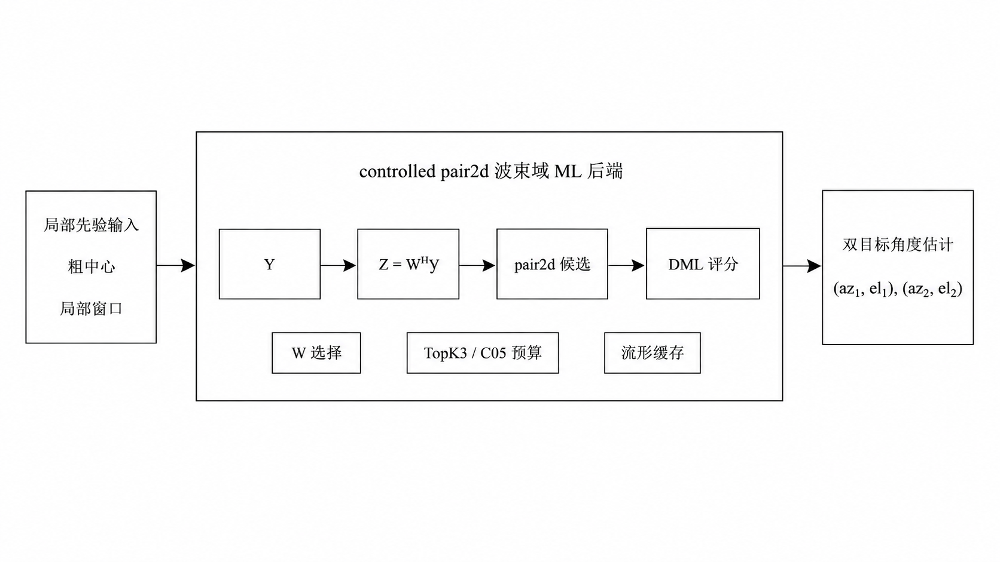

# 第2章 圆柱阵波束域信号模型

本章建立后续 beamspace ML 后端所使用的信号模型和符号约定。模型的作用是给出从阵元域观测到 beamspace 观测、再到局部双目标候选评分的输入接口，而不是描述完整雷达前端检测闭环。为保持与代码和实验一致，本章保留圆柱阵真实阵元坐标和双程传播相位模型，并在局部窗口内定义后端搜索边界。

## 2.1 圆柱阵几何与角度参数定义

设圆柱阵由 *M* 个接收阵元组成，第 *m* 个阵元的位置向量记为 $\mathbf{p}_m=[x_m,y_m,z_m]^T$。由于圆柱阵通常同时包含环向孔径和垂直孔径，其阵元位置不再满足一维均匀线阵的简单平移结构。本文采用真实阵元坐标构造阵列导向矢量，而不把圆柱阵近似为均匀线阵或规则波束索引阵列[10,20-22,25]。

目标方向由方位角 *az* 和俯仰角 *el* 表示。令入射方向单位向量为 $\mathbf{u}(az,el)$。本文实验采用雷达双程传播相位模型，令双程相位因子为 $\eta_{\mathrm{rt}}=2$；在窄带远场假设下，第 *m* 个阵元相对于参考点的相位可由阵元位置与入射方向的内积决定。圆柱阵单目标导向矢量可写为：

$$
\mathbf{a}_{\mathrm{cyl}}(az,el)=
\left[
\exp\left(j\eta_{\mathrm{rt}}\frac{2\pi}{\lambda}\mathbf{p}_1^T\mathbf{u}(az,el)\right),
\cdots,
\exp\left(j\eta_{\mathrm{rt}}\frac{2\pi}{\lambda}\mathbf{p}_M^T\mathbf{u}(az,el)\right)
\right]^T
$$

其中，$\lambda$ 为信号波长，$\eta_{\mathrm{rt}}=2$ 对应双程传播相位因子。上述表达的核心是保留圆柱阵真实几何流形：不同阵元的 $x_m$、$y_m$ 和 $z_m$ 共同决定导向矢量随方位、俯仰变化的相位结构。后续 beamspace ML 的评分仍在波束域中完成，但候选流形并不由波束索引上的经验规则给出，而是先由 $\mathbf{a}_{\mathrm{cyl}}(az,el)$ 或其组成的导向矩阵描述真实圆柱阵流形，再经波束矩阵投影到低维 beamspace 后进入最大似然准则[20-22]。因此，本文的 beamspace 处理是对物理阵列流形的低维投影，而不是对波束索引序列的经验替代。

## 2.2 阵元域双目标信号模型

本文考虑前端检测后的局部未分辨双目标簇。这里的“局部”意味着前端已经给出了粗中心和搜索窗口；“双目标”意味着后端默认当前簇需要用两个导向矢量联合解释。设两个目标的角度分别为 $(az_1,el_1)$ 和 $(az_2,el_2)$，对应的阵元域导向矩阵为[12-15]：

$$
A_{\mathrm{cyl}}(\Theta)=
\left[
\mathbf{a}_{\mathrm{cyl}}(az_1,el_1),
\mathbf{a}_{\mathrm{cyl}}(az_2,el_2)
\right]
$$

其中，$\Theta$ 表示双目标角度参数集合。若接收端获得 L 个快拍，则阵元域观测矩阵可表示为：

$$
Y=A_{\mathrm{cyl}}(\Theta)S+N
$$

其中，$Y\in\mathbb{C}^{M\times L}$ 为阵元域观测矩阵，$S\in\mathbb{C}^{2\times L}$ 为双目标复包络信号矩阵，$N\in\mathbb{C}^{M\times L}$ 为噪声矩阵。对于确定性最大似然估计，*S* 可视为待消元的未知确定性信号，而角度参数 $\Theta$ 通过导向矩阵影响观测子空间。

局部未分辨双目标的困难在于，两个导向矢量之间可能具有较高相关性。当目标方位和俯仰间隔较小、信号相干性较强或弱目标幅度较低时，单目标峰值检测和低维经验分裂规则容易失效。因此，本文在后端显式构造双目标导向矩阵，并通过最大似然准则评价候选双目标参数的拟合能力[12-18]。这一设定也限定了本文贡献的范围：方法解决的是局部双目标后端估计问题，而非自动判断一个簇中是否一定存在两个目标。

## 2.3 波束矩阵与 beamspace 投影

为降低后端计算复杂度，引入波束矩阵 $W\in\mathbb{C}^{M\times B}$，其中 *B* 为选取的波束数。波束矩阵的列向量可以来自已有二维波束池，也可以由不同选择策略从候选波束中筛选得到。阵元域观测 *Y* 经 *W* 投影后得到波束域观测矩阵[6-9,11,21]：

$$
Z=W^{H}Y
$$

将阵元域模型代入上式，可得：

$$
Z=W^{H}A_{\mathrm{cyl}}(\Theta)S+W^{H}N
$$

定义波束域导向矩阵：

$$
G(\Theta)=W^{H}A_{\mathrm{cyl}}(\Theta)
$$

则 beamspace 观测模型可简写为：

$$
Z=G(\Theta)S+\widetilde{N}
$$

其中，$\widetilde{N}=W^{H}N$ 为波束域噪声项。与阵元级模型相比，beamspace 模型将后端输入维度从 *M* 降低到 *B*。若 $B\ll M$，则每次候选评分中的矩阵运算规模显著减小；若 *W* 能覆盖局部双目标簇的主要流形变化，则估计性能仍可保持[6-11,21]。因此，*W* 的作用不仅是降维，还决定了后端 DML 能够利用哪些局部流形信息；第4章将专门讨论该输入矩阵的选择。

## 2.4 局部搜索窗口与参数边界

本文不研究全空域盲多目标搜索，而是以前端已给出的局部先验为基础。设前端给出的粗中心为 $(az_0,el_0)$，后端在局部窗口 $\Omega_{\mathrm{win}}$ 内搜索双目标参数。为避免与第3章的目标分离量混淆，记局部窗口的方位半宽和俯仰半宽分别为 $\Delta_{az}^{\mathrm{win}}$ 与 $\Delta_{el}^{\mathrm{win}}$。一般地，该局部窗口可表示为：

$$
\Omega_{\mathrm{win}}=
\left\{
\Theta:
az_i\in[az_0-\Delta_{az}^{\mathrm{win}},az_0+\Delta_{az}^{\mathrm{win}}],
el_i\in[el_0-\Delta_{el}^{\mathrm{win}},el_0+\Delta_{el}^{\mathrm{win}}],
i=1,2
\right\}
$$

在 full4D 表达中，$\Theta$ 可由四个独立角度变量组成；在本文主算法 controlled pair2d 表达中，$\Theta$ 将进一步由中心角和受控分离参数生成。两者都服务于同一物理问题，即在局部窗口内寻找能够最好解释 beamspace 观测 *Z* 的双目标导向矩阵。

需要注意的是，局部窗口并非算法自动保证正确的全局搜索区域。如果前端粗中心偏差过大，真实目标可能靠近窗口边界甚至落出窗口；此时后端 ML 即使在窗口内完成精确搜索，也不能弥补前端先验错误。第5章和第6章将通过 coarse-to-fine 结果、C05 边界标记和代表性案例讨论这一边界。

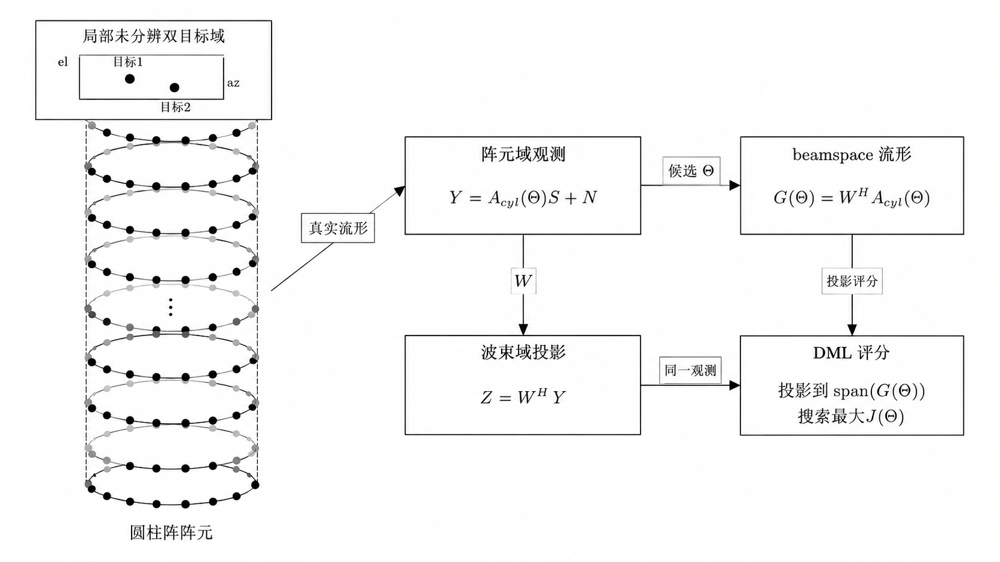

下文表 2-1 给出基本信号模型符号，表 2-2 给出后端算法与搜索符号。

表 2-1 基本信号模型符号

| 符号或参数 | 含义 | 说明 |
| --- | --- | --- |
| *M* | 阵元数 | 理论模型中的阵元总数 |
| N_elem | 工作子阵有效阵元数 | 本文实验记录为 2080 |
| $\mathbf{p}_m$ | 第 *m* 个阵元位置向量 | $[x_m,y_m,z_m]^T$ |
| *az* / *el* | 方位角 / 俯仰角 | 角度单位，局部窗口内搜索 |
| $\mathbf{a}_{\mathrm{cyl}}(az,el)$ | 圆柱阵单目标导向矢量 | 由真实阵元坐标构造 |
| $A_{\mathrm{cyl}}(\Theta)$ | 双目标导向矩阵 | 两个目标导向矢量按列组成 |
| *Y* | 阵元域观测矩阵 | $Y\in\mathbb{C}^{M\times L}$ |
| *S* | 双目标复包络矩阵 | DML 中作为未知确定性信号消元 |
| *N* | 阵元域噪声矩阵 | 与观测同维度 |

表 2-2 后端算法与搜索符号

| 符号或参数 | 含义 | 说明 |
| --- | --- | --- |
| *W* | 波束矩阵 | $W\in\mathbb{C}^{M\times B}$ |
| *B* | 选取波束数 | 本文实验推荐 *B*=7 |
| *Z* | 波束域观测矩阵 | $Z=W^HY$ |
| $G(\Theta)$ | 波束域导向矩阵 | $G(\Theta)=W^HA_{\mathrm{cyl}}(\Theta)$ |
| $\Omega_{\mathrm{win}}$ | 局部搜索窗口 | 前端给出的后端搜索范围 |
| $\Delta_{az}^{\mathrm{win}}$ | 局部窗口方位半宽 | 限定 $az_i$ 搜索范围 |
| $\Delta_{el}^{\mathrm{win}}$ | 局部窗口俯仰半宽 | 限定 $el_i$ 搜索范围 |
| $\Theta$ | 双目标角度参数集合 | 可由 full4D 或 controlled pair2d 表达 |
| $G_{\mathrm{cache}}$ | canonical beamspace manifold cache | exact-grid lookup，不插值 |

# 第3章 受控参数化波束级最大似然测角方法

本章给出本文后端测角方法的核心参数化与评分流程。其基本任务不是在全空域内重新完成多目标检测，而是在第2章定义的局部窗口内，对已经进入后端处理的局部未分辨双目标簇进行联合角度估计。为此，本章先给出所有模型共用的 DML 评分准则，再说明 controlled pair2d 如何在保留俯仰分离表达能力的同时压缩候选结构，最后明确它与 common-el baseline 以及局部 full4D 上界参考之间的关系。

## 3.1 DML 准则与投影矩阵表达

在第2章的 beamspace 模型中，角度参数 $\Theta$ 只通过波束域导向矩阵 $G(\Theta)$ 影响观测 *Z*。因此，后端可以把不同双目标参数化方式统一到同一个评分问题上：给定候选 $\Theta$，先将双目标复包络矩阵 *S* 作为未知确定性参数消元，再评价该候选导向子空间对观测能量的解释能力。这样，common-el、controlled pair2d 和 full4D 的差别主要体现在候选集合如何生成，而不体现在评分准则本身。

为说明该评分准则与确定性最大似然之间的关系，先在等效白噪声或已白化的 beamspace 坐标下写出集中似然推导。对第 $l$ 个快拍，有

$$
\mathbf{z}_l=G(\Theta)\mathbf{s}_l+\widetilde{\mathbf{n}}_l,\qquad
\widetilde{\mathbf{n}}_l\sim\mathcal{CN}(\mathbf{0},\sigma^2 I_B),\quad l=1,\ldots,L .
$$

因此，给定 $\Theta$、$S$ 和噪声方差 $\sigma^2$ 时，全部快拍的条件概率密度可写为

$$
p(Z\mid\Theta,S,\sigma^2)
=\frac{1}{(\pi\sigma^2)^{BL}}
\exp\left(
-\frac{\left\|Z-G(\Theta)S\right\|_F^2}{\sigma^2}
\right).
$$

取对数并记残差能量为

$$
E(\Theta,S)=\left\|Z-G(\Theta)S\right\|_F^2 ,
$$

则对数似然为

$$
\ell(\Theta,S,\sigma^2)
=-BL\log(\pi\sigma^2)-\frac{E(\Theta,S)}{\sigma^2}.
$$

对 $\sigma^2$ 求偏导并令其为零，可得

$$
\frac{\partial \ell}{\partial \sigma^2}
=-\frac{BL}{\sigma^2}+\frac{E(\Theta,S)}{(\sigma^2)^2}=0,
$$

从而

$$
\widehat{\sigma}^2=\frac{1}{BL}E(\Theta,S).
$$

将 $\widehat{\sigma}^2$ 代回对数似然函数，有

$$
\ell(\Theta,S,\widehat{\sigma}^2)
=-BL\log\left(\pi\frac{E(\Theta,S)}{BL}\right)-BL .
$$

由于对数函数单调，且上式中除 $E(\Theta,S)$ 外的比例项不改变极值位置，最大化似然等价于最小化残差能量：

$$
\max_{\Theta,S,\sigma^2}\ell(\Theta,S,\sigma^2)
\Longleftrightarrow
\min_{\Theta,S}\left\|Z-G(\Theta)S\right\|_F^2 .
$$

进一步地，在固定候选 $\Theta$ 时，$G(\Theta)$ 已知，未知复包络矩阵 *S* 的最小二乘估计为

$$
\widehat{S}(\Theta)
=\left(G^{H}(\Theta)G(\Theta)\right)^{-1}G^{H}(\Theta)Z .
$$

将 $\widehat{S}(\Theta)$ 代回残差项，可得

$$
Z-G(\Theta)\widehat{S}(\Theta)
=\left(I-P_G\right)Z
=P_G^{\perp}Z .
$$

其中，候选导向子空间的投影矩阵为

$$
P_G=G(\Theta)\left(G^{H}(\Theta)G(\Theta)\right)^{-1}G^{H}(\Theta)
$$

且

$$
P_G^{\perp}=I-P_G .
$$

因此，最小残差形式可写为

$$
\widehat{\Theta}
=\arg\min_{\Theta\in\Omega_{\mathrm{win}}}
\mathrm{tr}\left(P_G^{\perp}ZZ^{H}\right).
$$

又因为

$$
\mathrm{tr}\left(P_G^{\perp}ZZ^{H}\right)
=\mathrm{tr}\left(ZZ^{H}\right)-\mathrm{tr}\left(P_GZZ^{H}\right),
$$

其中 $\mathrm{tr}(ZZ^{H})$ 与候选角度 $\Theta$ 无关，所以最小化噪声子空间残差等价于最大化候选导向子空间解释的观测能量。本文由此采用如下 beamspace DML 评分函数：

$$
J(\Theta)=\mathrm{tr}\left(P_GZZ^{H}\right)
$$

最终角度估计由准则最大化给出：

$$
\widehat{\Theta}=\arg\max_{\Theta\in\Omega_{\mathrm{win}}}J(\Theta)
$$

上述准则与阵元域确定性最大似然具有一致的物理含义，但评分运算发生在 *B* 维 beamspace 中，而不是 *M* 维阵元空间中。该设计使后续章节可以分别讨论两个问题：第4章关注 *W* 是否保留了局部双目标流形信息，第5章关注如何减少需要评分的候选数量和重复流形构造开销。本章只定义算法模型和流程，模型成功率、候选复杂度等证据统一在第6章给出。

## 3.2 controlled pair2d 参数化思想

局部双目标若直接使用四个独立角度变量 $(az_1,el_1,az_2,el_2)$ 表达，则候选空间为 full4D，表达能力最强，但候选数也随网格密度快速增加。另一方面，若强行采用 common-el 假设，则搜索空间较小，却会丢失两个目标存在俯仰分离时的几何信息。controlled pair2d 位于这两者之间：它把双目标写成中心角、方位分离、俯仰分离和有限方向变量的组合，在局部窗口内保留二维角度分离，同时避免两个目标完全独立搜索带来的候选膨胀。

设局部中心角为 $(az_c,el_c)$，方位分离为 $\Delta_{az}$，俯仰分离为 $\Delta_{el}$，并引入方向变量 $q\in\{+1,-1\}$ 表示方位排序下俯仰分离的正负方向，则在 $az_1<az_2$ 的约束下可构造双目标候选：

$$
az_1=az_c-\frac{\Delta_{az}}{2},\quad
az_2=az_c+\frac{\Delta_{az}}{2}
$$

$$
el_1=el_c-q\frac{\Delta_{el}}{2},\quad
el_2=el_c+q\frac{\Delta_{el}}{2}
$$

图 3-1 用方位-俯仰平面给出该参数化的几何含义。该写法的作用并不是声称局部双目标一定严格关于中心对称，而是在前端已经给出局部中心和窗口的条件下，用受控的中心-分离结构生成可复现、可搜索的候选集合。common-el 可看作 $\Delta_{el}=0$ 的退化情况；full4D 则允许两个点完全独立变化，主要用于判断受控参数化在当前局部场景中的表达能力上限。

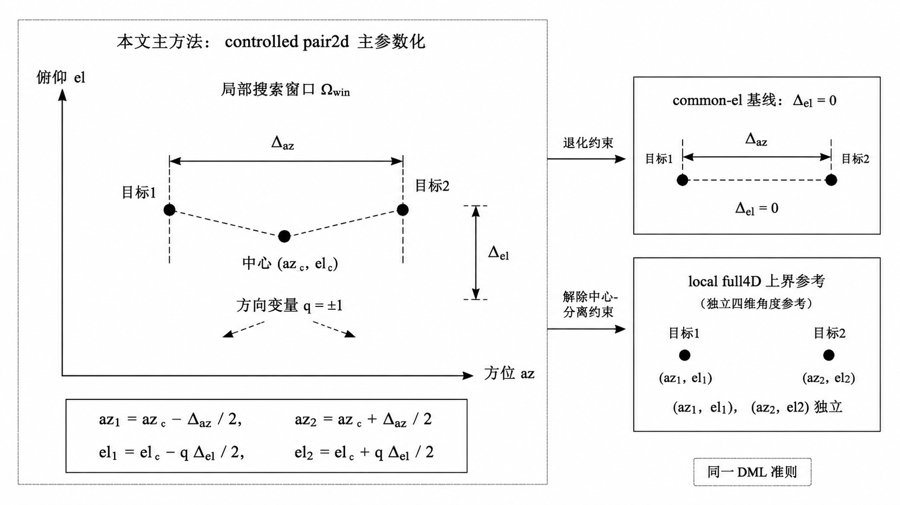

## 3.3 common-el、controlled pair2d 与 full4D 的关系

三类模型共用第3.1节的 DML 评分准则，但承担不同的论文角色。common-el 模型假设两个目标共享同一俯仰角，仅在方位上分离，适合作为低复杂度 baseline，用于暴露一维分裂假设在局部二维分离场景中的不足。controlled pair2d 是本文主算法，允许双目标同时具有方位和俯仰分离，但通过中心和分离参数对局部结构进行约束。full4D 模型允许两个目标的方位和俯仰完全独立变化，是局部窗口内表达能力最强的参考搜索，但其复杂度使其不适合作为默认后端方案。

因此，本章不把三类模型写成互相替代的工程实现，而是把它们作为同一 DML 后端下的三种候选集合：common-el 给出受限 baseline，controlled pair2d 给出本文主方案，full4D 给出局部上界参考。表 3-1 总结三者的角色定位，实验数值对比统一在第6章给出。

表 3-1 三类 beamspace ML 模型角色对比

| 模型 | 参数化方式 | 章节角色 |
| --- | --- | --- |
| common-el | 两目标共享 *el*，主要搜索方位分离 | baseline |
| controlled pair2d | 中心角、$\Delta_{az}$、$\Delta_{el}$ 与方向 $q$ | 本文主算法 |
| full4D | $(az_1,el_1,az_2,el_2)$ 独立变化 | 局部上界参考 |

## 3.4 算法流程

本文主算法的输入包括阵元域观测 *Y*、波束矩阵 *W*、前端给出的局部双目标簇搜索窗口以及 controlled pair2d 候选网格。算法首先计算 beamspace 观测 $Z=W^{H}Y$；随后对每个候选 $\Theta_{\mathrm{pair2d}}$ 生成圆柱阵导向矩阵 $A_{\mathrm{cyl}}(\Theta)$ 和波束域导向矩阵 $G(\Theta)$；再根据 DML 准则计算 $J(\Theta)$；最后选取评分最大的候选作为双目标角度估计。

这一流程的输入输出边界需要单独强调。它默认处理对象已经是局部双目标簇，不包含自动单双目标模型选择，也不负责判断前端粗中心是否覆盖真实目标。若前端给出的中心或窗口明显错误，后端只能在给定窗口内返回最优候选，而不能把局部搜索扩展成全空域盲搜。

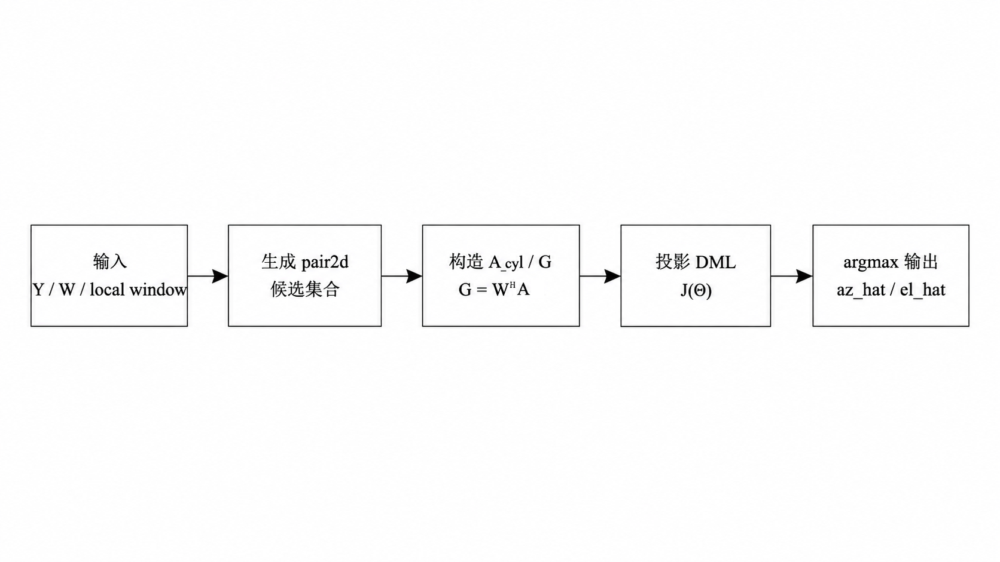

算法 1 controlled pair2d beamspace DML 步骤

| 步骤 | 操作 | 输出 |
| --- | --- | --- |
| 1 | 由前端粗中心和局部窗口生成 pair2d 候选集合 | $\Omega_{\mathrm{pair2d}}$ |
| 2 | 使用波束矩阵计算 $Z=W^HY$ | beamspace 观测 |
| 3 | 对每个候选构造 $A_{\mathrm{cyl}}(\Theta)$ 与 $G(\Theta)$ | beamspace 流形 |
| 4 | 计算 $P_G$ 与 DML 评分 $J(\Theta)$ | 候选分数 |
| 5 | 取 $\arg\max_\Theta J(\Theta)$ | 双目标角度估计 |

图 3-3 将算法 1 中的候选生成、DML 评分和最大化选择三个步骤展开为一个代表性局部窗口内的可视化。该图的作用不是报告统计性能，而是说明 controlled pair2d 如何在给定 beamspace 观测后构造受控双目标候选，并通过同一 DML 准则完成候选评分。

在图 3-3A 中，方位维度采用有序约束 $az_1<az_2$，俯仰维度由中心 $el_c$、分离量 $\Delta_{el}$ 和方向变量 $q$ 生成两个目标的俯仰角。该表示保留了局部双目标的二维分离结构，同时避免把 $(az_1,el_1,az_2,el_2)$ 作为完全独立变量进行枚举。灰色 $\Delta_{el}=0$ 参考线表示 common-el 退化情形，仅用于说明模型关系。

图 3-3B 给出对应的剖面 DML 评分地形。对每一个 $(el_c,\Delta_{el})$，图中颜色表示在方位有序约束和方向变量上取最大后的归一化评分：

$$
J_{\mathrm{prof}}(el_c,\Delta_{el})
=
\max_{az_1<az_2,\ q}
J(az_1,az_2,el_c,\Delta_{el},q).
$$

因此，热图展示的是 controlled pair2d 在低维参数子空间中的候选评分过程，而不是新的估计准则。图中归一化仅用于显示，后端估计仍以原始 DML 评分 $J(\Theta)$ 的最大值确定 $\hat{\Theta}$。

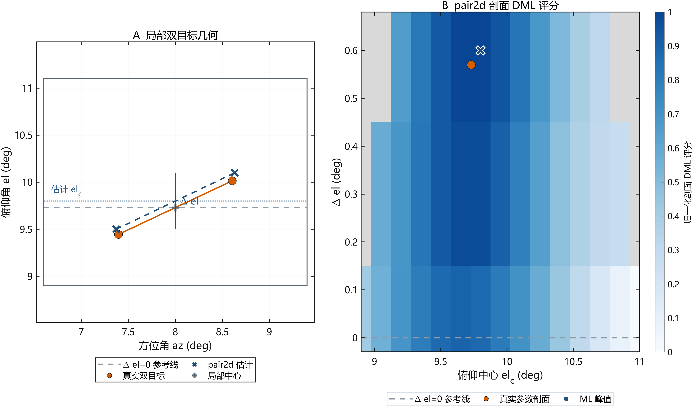

## 3.5 复杂度与候选维度分析

beamspace ML 的计算复杂度主要由两部分组成：一是每个候选评分时的矩阵运算代价，二是候选集合规模。波束投影将单次评分的运算维度从阵元数 *M* 降低为波束数 *B*；controlled pair2d 则从候选生成层面减少需要进入 DML 评分的角度组合。二者对应不同的降复杂度来源，不能互相替代。

在本文证据链中，第3章只说明 controlled pair2d 为什么是主算法参数化；第4章进一步讨论如何选择 *W*；第5章再讨论如何减少候选评分与重复流形构造。第6章通过模型参数化对比验证 controlled pair2d 的主算法角色，并保留强相干、弱目标和前端偏差等压力场景中的边界说明。

# 第4章 面向 ML 后端的波束矩阵选择

第3章的 DML 准则假定 beamspace 导向矩阵 $G(\Theta)=W^HA_{\mathrm{cyl}}(\Theta)$ 能够保留局部双目标区分所需的信息。因此，*W* 的选择直接影响后端估计性能和计算代价。本章把 *W* 选择表述为面向 controlled pair2d beamspace ML 后端的输入设计问题，并给出后续实验中比较的几类选择策略。

## 4.1 波束矩阵选择目标

在 beamspace ML 中，波束矩阵 *W* 同时决定后端输入维度和目标流形信息保留程度。若 *W* 中包含过多波束，后端每次候选评分的矩阵规模增加；若波束数量过少或覆盖不合理，则局部双目标的可分辨信息可能在投影中损失。因此，*W* 选择不是单纯的降维问题，而是面向后端 ML 估计性能的输入设计问题。

设候选波束池为：

$$
W_{\mathrm{pool}}=[\mathbf{w}_1,\mathbf{w}_2,\cdots,\mathbf{w}_{B_0}]
$$

需要从中选取 *B* 个波束组成后端输入矩阵：

$$
W=\left[\mathbf{w}_{i_1},\mathbf{w}_{i_2},\cdots,\mathbf{w}_{i_B}\right]
$$

## 4.2 投影保持、低相关与条件数诊断

现有 beamspace 变换、阵列流形分离和降维阵列处理研究表明，降维矩阵不仅影响计算量，也会改变后端可利用的阵列流形信息、估计偏差和数值稳定性[21-22,26-27]。

局部双目标 ML 后端对 *W* 的要求并不由单一指标决定。投影保持不足会使候选导向矩阵难以表达真实局部流形；投影后的局部双目标流形相关性过高会降低两个候选目标的可分性；条件数恶化则可能放大 DML 投影计算中的数值不稳定。因此，本章将几类策略放在同一设计框架中比较：regular 3dB beam grid 是工程基线，按 3dB 覆盖规则选取固定波束；greedy_projection 关注局部流形投影保持；greedy_lowcorr 关注投影后局部流形低相关；greedy_combined 综合考虑投影损失、流形相关性和条件数；SVD upper bound 则只作为信息保持上界参考。本章仅讨论选择逻辑、公式与机制可视化，成功率和 *B*-budget 实验曲线在第6章给出。

投影损失可概念性表示为：

$$
\mathcal{L}_{\mathrm{proj}}(W)=
1-\frac{\left\|P_W\mathcal{A}_{\mathrm{local}}\right\|_F^2}
{\left\|\mathcal{A}_{\mathrm{local}}\right\|_F^2}
$$

该投影损失可理解为局部阵列流形在所选 beamspace 子空间中的能量保留率，其思想与阵列插值、流形匹配和 beamspace 变换误差分析中常用的 Frobenius 范数流形近似准则相近[21,27-28]。

流形相关性惩罚可由投影后两个候选目标导向向量的归一化互相关给出。令

$$
\mathbf{g}_{W}(\theta)=W^H\mathbf{a}_{\mathrm{cyl}}(\theta),
$$

则局部双目标候选集合 $\mathcal{P}_{\mathrm{local}}$ 上的最大流形相关可写为：

$$
C_{\mathrm{corr}}(W)=
\max_{(\theta_1,\theta_2)\in\mathcal{P}_{\mathrm{local}}}
\frac{\left|\mathbf{g}_{W}^{H}(\theta_1)\mathbf{g}_{W}(\theta_2)\right|}
{\left\|\mathbf{g}_{W}(\theta_1)\right\|_2
\left\|\mathbf{g}_{W}(\theta_2)\right\|_2}.
$$

该最大归一化内积形式对应 sparse DOA 和字典设计中常用的 mutual coherence 或 dictionary coherence，用于刻画阵列流形样本或有效字典列之间的冗余程度和候选可分性[29-32]。

条件数诊断用于刻画所选波束矩阵自身的数值稳定性。本文采用波束矩阵 Gram 矩阵的条件数作为第三个诊断量：

$$
C_{\mathrm{cond}}(W)
=
\log_{10}
\left(
\max\left(\kappa(W^HW),1\right)
\right).
$$

条件数和 Gram 矩阵病态性常用于诊断有效 steering matrix 或 dictionary matrix 的数值稳定性；在 beamspace 或压缩测量设计中，较差的条件数通常意味着后续投影或参数估计更容易受到噪声和列相关性的影响[23,32-33]。

上述三个量分别对应投影保持、投影后双目标可分性和数值稳定性。需要说明的是，式中的 $\mathcal{L}_{\mathrm{proj}}(W)$ 是便于解释的信息保留形式；代码实现中采用归一化残差范数形式：

$$
\mathcal{L}_{\mathrm{proj}}^{\mathrm{code}}(W)
=
\frac{\left\|
\mathcal{A}_{\mathrm{local}}-P_W\mathcal{A}_{\mathrm{local}}
\right\|_F}
{\left\|\mathcal{A}_{\mathrm{local}}\right\|_F}
=
\sqrt{
1-\frac{\left\|P_W\mathcal{A}_{\mathrm{local}}\right\|_F^2}
{\left\|\mathcal{A}_{\mathrm{local}}\right\|_F^2}
}.
$$

两种写法都描述局部流形未被所选波束子空间解释的程度，只是一个以能量比例表示，一个以残差范数表示；实际代码在投影计算中加入小正则项以提高数值稳定性。

## 4.3 greedy_combined 选择准则

综合上述指标，本文采用 greedy_combined 作为面向 ML 后端的候选选择准则。该准则并不只追求单一投影能量或最低相关性，而是在局部流形信息保持、投影后双目标流形相关性和数值条件之间折中。具体推荐的波束数 *B* 需要由实验验证确定；本文在第6章通过 *W* 策略对比和 *B*-budget 曲线给出当前实验条件下的推荐配置。

在具体实现中，greedy_combined 采用逐步贪心选择。设第 *k* 步已经选中的波束集合为 $W_{k-1}$，从候选池中临时加入候选波束 $\mathbf{w}_i$ 后得到试探矩阵 $W_i^{(k)}=[W_{k-1},\mathbf{w}_i]$。对每一个试探矩阵计算综合评分：

$$
\mathrm{score}\!\left(W_i^{(k)}\right)
=
\alpha \mathcal{L}_{\mathrm{proj}}\!\left(W_i^{(k)}\right)
+
\beta C_{\mathrm{corr}}\!\left(W_i^{(k)}\right)
+
\gamma \log_{10}
\left(
\max\left(\kappa\!\left((W_i^{(k)})^H W_i^{(k)}\right),1\right)
\right),
$$

并选取评分最小的候选波束进入当前集合：

$$
i_k=
\arg\min_{i\in\mathcal{I}_{\mathrm{remain}}}
\mathrm{score}\!\left(W_i^{(k)}\right).
$$

其中，$\mathcal{L}_{\mathrm{proj}}(W)$ 表示局部流形投影损失，$C_{\mathrm{corr}}(W)$ 表示局部双目标候选在 beamspace 中的最大流形相关，$\kappa(W^HW)$ 为波束矩阵 Gram 矩阵的条件数；$\alpha$、$\beta$ 和 $\gamma$ 为三项诊断量的权重。本文实验代码采用 $\alpha=1$、$\beta=1$、$\gamma=0.05$ 作为当前配置。该评分函数只用于在给定候选波束池内进行工程折中选择，不构成全局最优性证明。换言之，greedy_combined 并非复现已有固定公式，而是借鉴 beamspace design、measurement matrix design、流形保真度、相干性和条件数诊断等思想，面向本文局部双目标 beamspace ML 后端构造的工程化折中准则[32,34-35]。

需要强调的是，*W* 选择依赖当前二维波束池、局部场景集合和 controlled pair2d 后端模型。若硬件码本、局部窗口范围或代表场景发生变化，应重新进行 *W* 策略和 *B*-budget 验证。后续搜索加速与缓存实验均在第6章确定的推荐 *W* 配置上展开，以避免把搜索机制的收益和输入矩阵变化混在一起。

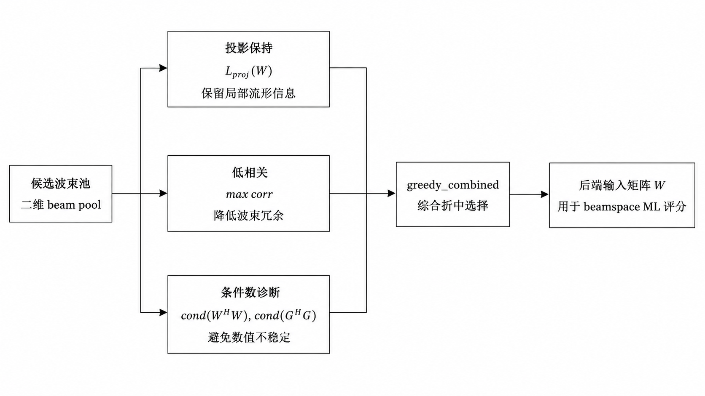

图 4-1 中的三类判断机制分别对应上文的三个诊断量：投影保持对应 $\mathcal{L}_{\mathrm{proj}}(W)$，低流形相关对应 $C_{\mathrm{corr}}(W)$，条件数诊断对应 $C_{\mathrm{cond}}(W)$。greedy_combined 的作用是把三类诊断量放入同一个贪心候选选择评分中，而不是把三者作为互相独立的三个后端估计器。

为补充图 4-1 的流程性说明，图 4-2 给出一组由 MATLAB 生成的机制可视化。该图不用于报告统计性能，而是用于说明不同 *W* 选择策略如何作用于同一候选波束池，并展示推荐配置 greedy_combined_B7 的选中波束位置及其投影保持、流形相关性和数值条件诊断。图 4-2A 给出二维候选波束池及若干 *B*=7 选择结果；图 4-2B 给出投影损失、最大流形相关和 $C_{\mathrm{cond}}(W)$ 随波束数 *B* 的变化；图 4-2C 给出 greedy_combined_B7 的归一化 Gram 矩阵 $|W^H W|$，用于显示所选 7 个波束向量之间的相关结构。需要区分的是，图 4-2B 中的最大流形相关用于评价投影后候选目标的可分性，而图 4-2C 中的 Gram 矩阵用于诊断选中波束本身是否存在明显冗余。SVD upper bound 仅作为理想低维子空间参考，不作为工程可实现的波束选择策略。

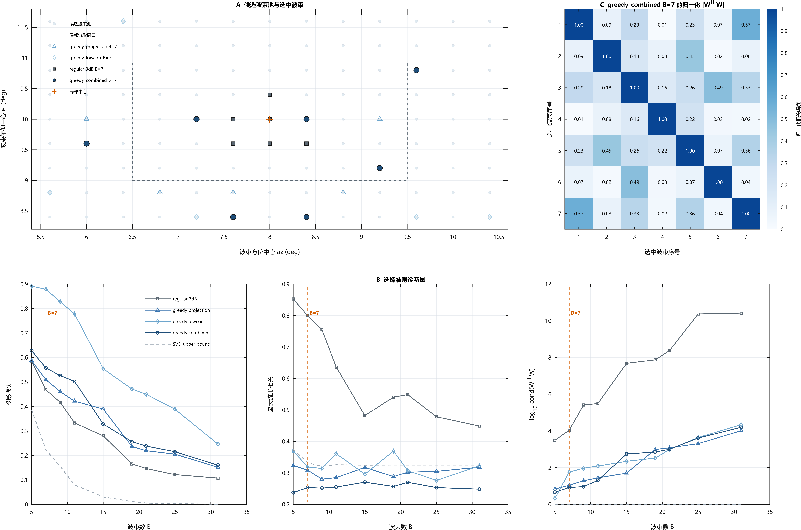

由图 4-2 可见，不同诊断指标并不总是给出完全一致的排序，因此本文将 *W* 选择视为局部流形保持、低相关性和数值条件之间的折中问题；正式的后端成功率与 RMSE 验证见第6.3节。

表 4-1 *W* 选择策略设计思想对比

| 策略 | 主要依据 | 工程定位 |
| --- | --- | --- |
| regular 3dB beam grid | 规则波束覆盖 | 可解释基线和回退策略 |
| greedy_projection | 降低局部流形投影损失 | 信息保持候选策略 |
| greedy_lowcorr | 降低局部流形相关 | 可分性诊断候选策略 |
| greedy_combined | 投影、流形相关、条件数综合 | 本文推荐策略 |
| SVD upper bound | 理想低维子空间 | 上界诊断，不直接工程实现 |

# 第5章 低复杂度搜索与缓存机制

第3章给出了 controlled pair2d 的候选表达，第4章给出了面向该后端的波束矩阵选择。本章进一步处理实现层面的主要计算瓶颈：在局部窗口和推荐 *W* 已确定后，如何减少不必要的候选评分，并避免重复构造相同或等价的 beamspace 流形。为保持技术边界清晰，本章所有机制都只改变搜索组织或流形复用方式，不改变第3章定义的 DML 评分函数。

## 5.1 候选评分复杂度来源

在 controlled pair2d beamspace ML 中，每一个候选参数 $\Theta$ 都需要构造波束域导向矩阵 $G(\Theta)$、投影矩阵 $P_G$，并计算 DML 评分 $J(\Theta)$。即使单次评分已在低维 beamspace 内完成，候选数量过高仍会使总计算量成为后端处理瓶颈。full fine 搜索因此更适合作为精度基准和一致性参照，而不适合直接作为工程默认方案。

本章把复杂度来源分成两类处理。fixed topK3 coarse-to-fine 搜索和 C05 自适应搜索预算控制作用于候选集合，减少进入细评分阶段的候选数；shared-center canonical beamspace manifold cache 作用于流形构造，减少重复导向矢量与流形矩阵构造。二者都服务于同一个 DML 后端，因此其有效性应通过第6章的候选数、full-grid match、topK miss、boundary hit、直接构造/缓存查找一致性和运行时间指标来验证。

## 5.2 fixed topK3 coarse-to-fine 搜索

多目标 ML DOA 的直接细网格联合搜索计算量较高，已有工作通常通过交替优化、降维搜索或多分辨率网格细化降低搜索复杂度[12,14,36-37]。

fixed topK3 coarse-to-fine 搜索的动机是避免在整个细网格上直接评分，同时不把粗搜索阶段的单一峰值误判为最终答案。本文采用 degree-based el_sep 参数化，即俯仰分离参数直接以物理角度单位给出。更完整地，粗搜索集合应理解为 controlled pair2d 参数空间中的离散候选集合：

$$
\Omega_{\mathrm{coarse}}
=
\left\{
(az_1,az_2,el_c,\Delta_{el},q)
\right\}.
$$

其中，

$$
az_1,az_2\in\mathcal A_{az}^{\mathrm{coarse}},
\qquad
az_1<az_2,
$$

$$
el_c\in\mathcal A_{el,c}^{\mathrm{coarse}},
$$

$$
\Delta_{el}\in
\mathcal D_{el}^{\mathrm{coarse}},
$$

$$
q\in\{+1,-1\}.
$$

这里，$\mathcal A_{az}^{\mathrm{coarse}}$ 和 $\mathcal A_{el,c}^{\mathrm{coarse}}$ 由前端粗中心、局部搜索窗口和粗搜索步长共同确定；$\Delta_{el}$ 只表示双目标俯仰分离这一维的候选取值，不是整个粗搜索范围。两个目标的俯仰角由中心、分离和方向变量恢复为

$$
el_1=el_c+\frac{q\Delta_{el}}{2},
\qquad
el_2=el_c-\frac{q\Delta_{el}}{2}.
$$

推荐配置中，粗搜索的俯仰分离候选列表为

$$
\mathcal{D}_{el}^{\mathrm{coarse}}=\{0,0.36,0.72\}
$$

细化搜索沿用上述 controlled pair2d 参数化，只是把粗方位网格和粗俯仰中心网格替换为围绕 topK 粗候选的局部细网格，并把俯仰分离列表替换为：

$$
\mathcal{D}_{el}^{\mathrm{fine}}=\{0,0.24,0.36,0.48,0.60,0.72\}
$$

该设置使粗网格覆盖主要分离区域，同时在细化阶段恢复更密集的分离候选。需要强调的是，$\mathcal D_{el}^{\mathrm{coarse}}$ 和 $\mathcal D_{el}^{\mathrm{fine}}$ 只是俯仰分离维度上的候选列表；完整候选仍同时包含两个有序方位、俯仰中心和方向变量。

粗到细搜索先在 $\Omega_{\mathrm{coarse}}$ 上计算同一个 DML 评分 $J(\Theta)$，保留评分最高的 topK 个粗候选，再围绕这些候选构造局部细化窗口：

$$
\mathcal{K}=\mathrm{TopK}_{\Theta\in\Omega_{\mathrm{coarse}}}J(\Theta)
$$

$$
\Omega_{\mathrm{local}}=\bigcup_{\Theta_k\in\mathcal{K}}\Omega_k
$$

最终估计仍由 $J(\Theta)$ 最大化得到。换言之，coarse-to-fine 改变的是候选进入细评分阶段的顺序和范围，而不是似然评分本身。本文保留多个粗候选而非单一峰值，是为了降低粗网格量化误差、噪声扰动或多峰地形导致的漏检风险；具体 topK 数值由第6章 full-grid match、topK miss 和 boundary hit 指标验证。本文采用 fixed topK3 作为默认粗到细配置，并进一步将该配置与 full fine 搜索对照，检验候选压缩是否引入 full-grid mismatch、topK miss 或 boundary hit。

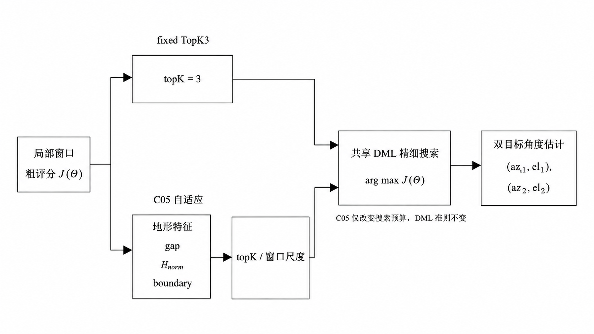

## 5.3 C05 自适应搜索预算策略

C05 在 fixed topK3 基础上进一步讨论搜索预算能否按似然地形自适应分配。其目标不是提出新的 ML 准则，而是在局部评分地形较清晰时减少细化预算，在边界风险或多峰风险较高时增加保护。早期单一 uncertainty 策略容易把复杂度保护退化为普遍增加预算；本文采用的修正思路是将单一不确定度拆成搜索预算不确定度 U_search 和置信度不确定度 U_confidence。高 H_norm 并不必然要求扩展搜索窗口，cond_risk 偏高也不直接触发扩窗；fixed topK3 保留为 NORMAL 默认策略。

C05 沿用第3.1节的 DML 评分准则，仅根据粗搜索阶段的似然地形调整进入细化阶段的搜索预算。设粗搜索候选按 DML 评分降序排列为

$$
J_1 \ge J_2 \ge J_3 \ge \cdots ,
$$

其中 $J_i=J(\Theta_i)$。为避免不同样本的评分幅度影响后续判别，先将粗搜索分数写成相对于第一名的归一化差分：

$$
s_i=\frac{J_i-J_1}{\max(|J_1|,\epsilon)} .
$$

在该定义下，$s_1=0$，其余候选满足 $s_i\le 0$。这种相对评分差异可视为候选之间相对支持度的度量，与统计模型选择中使用 relative likelihood 或模型权重描述候选不确定性的思想一致[38-39]。C05 随后用温度参数 $\tau$ 将这些相对分数映射为候选间的相对权重：

$$
p_i=
\frac{\exp\left(s_i/\tau-\max_k(s_k/\tau)\right)}
{\sum_k \exp\left(s_k/\tau-\max_k(s_k/\tau)\right)} .
$$

其中，减去 $\max_k(s_k/\tau)$ 仅用于数值稳定，不改变各候选之间的相对权重。上述权重满足

$$
p_i\ge 0,\qquad \sum_i p_i=1,
$$

且任意两个候选的权重比为

$$
\frac{p_i}{p_j}
=
\exp\left(\frac{s_i-s_j}{\tau}\right).
$$

因此，$\tau$ 控制粗搜索分数差异被放大的程度；本文 C05 配置采用 $\tau=0.02$。将相对分数指数归一化为候选权重，并用熵衡量权重分布是否集中，是统计模型选择和机器学习不确定度估计中常见的候选不确定度刻画方式[39-41]。基于该权重分布，可定义粗搜索似然地形的归一化熵：

$$
H_J=-\sum_i p_i\log(p_i+\epsilon),
$$

$$
H_{\mathrm{norm}}=
\frac{H_J}{\log(K_{\max})}.
$$

如果第一候选明显强于其他候选，则 $p_1$ 接近 1，其余 $p_i$ 接近 0，此时熵较低；如果多个候选分数接近，则权重分布更分散，此时熵较高。因此，

$$
H_{\mathrm{norm}}\uparrow
$$

表示粗搜索似然地形更平、更不集中，多峰或候选混淆风险更强。为描述第一候选相对第三候选的分离程度，定义

$$
\mathrm{gap}_{13}
=
\frac{J_1-J_3}{\max(|J_1|,\epsilon)} ,
$$

并进一步得到

$$
\mathrm{gap\_risk}
=
1-\min\left(
\frac{\mathrm{gap}_{13}}{\mathrm{gap\_scale}},1
\right),
\qquad
\mathrm{gap\_scale}=0.003 .
$$

当 $\mathrm{gap}_{13}$ 较小时，第一候选相对后续候选不够突出，gap_risk 增大。边界风险由最佳粗候选相对于局部窗口边界的距离定义。设局部窗口方位边界为 $[az_{\min},az_{\max}]$，俯仰边界为 $[el_{\min},el_{\max}]$，则

$$
d_{az}=
\min(
az_1-az_{\min},
az_{\max}-az_1,
az_2-az_{\min},
az_{\max}-az_2
),
$$

$$
d_{el}=
\min(
el_c-el_{\min},
el_{\max}-el_c
),
$$

$$
\mathrm{boundary\_margin}
=
\min\left(
\frac{d_{az}}{\Delta az_{\mathrm{coarse}}},
\frac{d_{el}}{\Delta el_{\mathrm{coarse}}}
\right).
$$

本文采用

$$
\mathrm{boundary\_risk}
=
\begin{cases}
1, & \mathrm{boundary\_margin}<1.5,\\
0, & \text{otherwise}.
\end{cases}
$$

当最佳粗候选远离窗口边界时，$d_{az}$ 和 $d_{el}$ 相对粗网格步长较大，$\mathrm{boundary\_margin}$ 较大，$\mathrm{boundary\_risk}=0$，说明当前局部窗口对该候选仍有足够余量；当最佳粗候选靠近方位或俯仰边界时，$\mathrm{boundary\_margin}$ 变小并可能触发 $\mathrm{boundary\_risk}=1$，表示后续细化搜索存在被窗口边界截断的风险。该边界裕度不是已有 DOA 文献中的固定公式，而是受 coarse-to-fine 和 hierarchical search 中局部区域细化与区域收缩思想启发，用于防止最佳粗候选靠近窗口边界时细化搜索被截断[37]。

数值条件风险由最佳候选对应的 beamspace 流形矩阵给出：

$$
\kappa_G=\operatorname{cond}(G^HG),
$$

$$
\mathrm{cond\_risk}
=
\min\left(
\max\left(\frac{\log_{10}(\kappa_G)}{8},0\right),1
\right).
$$

当 $G^HG$ 条件较好时，$\kappa_G$ 较小，$\mathrm{cond\_risk}$ 较低，说明当前 beamspace 双目标流形的投影计算较稳定；当两个候选目标在 beamspace 中过于相近或流形列相关性较强时，$G^HG$ 条件数增大，$\mathrm{cond\_risk}$ 随之升高，表示该候选的数值稳定性和可分性风险增大。该风险量与前述 Gram 条件数和 dictionary coherence 诊断一致，用于刻画两个 beamspace steering columns 过于接近时的数值病态和可分性下降[23,29-30,32-33]。

在上述量的基础上，C05 将搜索预算不确定度与置信度不确定度分开定义：

$$
U_{\mathrm{search}}=
0.65\,\mathrm{gap\_risk}
+0.30\,\mathrm{boundary\_risk}
+0.05\,\min(H_{\mathrm{norm}},0.5)
$$

$$
U_{\mathrm{confidence}}=
0.35\,H_{\mathrm{norm}}
+0.25\,\mathrm{gap\_risk}
+0.25\,\mathrm{cond\_risk}
+0.15\,\mathrm{boundary\_risk}
$$

其中，U_search 仅用于决定搜索预算是否收缩或增加，U_confidence 用于给出结果置信度标记；二者不改变 DML 评分函数。本文 C05 固定参数为：gap_scale=0.003，easy_gap_threshold=0.002，ambiguous_gap_threshold=0.0008，easy_topK=1，ambiguous_topK=5，boundary_topK=5，easy_window_scale=0.6，boundary_window_scale=1.15，cond_threshold=0.85。为区分判定条件与预算配置，先将 C05 的实际触发分支写为

$$
\pi_{\mathrm{C05}}=
\begin{cases}
\mathrm{ILL\_CONDITIONED},
&
\mathrm{cond\_risk}\ge \mathrm{cond\_threshold},
\\
\mathrm{BOUNDARY},
&
\mathrm{cond\_risk}<\mathrm{cond\_threshold},\ 
\mathrm{boundary\_risk}=1,
\\
\mathrm{SCORE\_AMBIGUOUS},
&
\mathrm{cond\_risk}<\mathrm{cond\_threshold},\ 
\mathrm{boundary\_risk}=0,\ 
\mathrm{gap}_{13}<\mathrm{ambiguous\_gap\_threshold},
\\
\mathrm{EASY},
&
\mathrm{cond\_risk}<\mathrm{cond\_threshold},\ 
\mathrm{boundary\_risk}=0,\ 
\mathrm{gap}_{13}\ge \mathrm{easy\_gap\_threshold},
\\
\mathrm{NORMAL},
&
\text{otherwise}.
\end{cases}
$$

在该分支标签下，对应的细化搜索预算可写为

$$
(K,\alpha_{az},\alpha_{el})=
\begin{cases}
(3,1.00,1.00),
&
\pi_{\mathrm{C05}}=\mathrm{ILL\_CONDITIONED},
\\
(5,1.15,1.15),
&
\pi_{\mathrm{C05}}=\mathrm{BOUNDARY},
\\
(5,1.00,1.00),
&
\pi_{\mathrm{C05}}=\mathrm{SCORE\_AMBIGUOUS},
\\
(1,0.60,0.60),
&
\pi_{\mathrm{C05}}=\mathrm{EASY},
\\
(3,1.00,1.00),
&
\pi_{\mathrm{C05}}=\mathrm{NORMAL}.
\end{cases}
$$

其中，$K$ 为进入细化阶段的粗候选数，$\alpha_{az}$ 和 $\alpha_{el}$ 分别为方位和俯仰细化窗口缩放系数。若基础细化窗口宽度为 $\Delta az_0$ 和 $\Delta el_0$，则

$$
\Delta az=\alpha_{az}\Delta az_0,\qquad
\Delta el=\alpha_{el}\Delta el_0 .
$$

保留的粗候选集合和细化候选集合分别为

$$
\mathcal K=\{\Theta_1,\ldots,\Theta_K\},
$$

$$
\Omega=
\bigcup_{\Theta_k\in\mathcal K}
\Omega_k(\Delta az,\Delta el).
$$

最终估计仍由同一 DML 准则给出：

$$
\widehat{\Theta}
=
\arg\max_{\Theta\in\Omega}J(\Theta).
$$

因此，C05 改变的是进入细化评分的候选数量和局部窗口尺度，而不是 $G(\Theta)$、$P_G$ 或 $J(\Theta)$ 的定义。ILL_CONDITIONED 在当前搜索配置的压力测试中未被自然触发，仅通过防御性探测验证其逻辑正确性。

图 5-1 将 fixed topK3 coarse-to-fine 与 C05 置于同一搜索预算框架中，用于说明二者的机制关系及其与第6章实验指标的对应。C05 的作用边界是调节 topK/window 等搜索预算，不改变 DML 评分函数，也不改变最终似然准则。

图 5-2 给出 C05 自适应搜索预算机制的 MATLAB 运行样本可视化。图 5-2A 在 gap_13 与 $U_{\mathrm{search}}$ 构成的平面中展示不同策略分支对应的粗搜索似然地形特征；图 5-2B 在相同 gap_13 轴上给出 adaptive/fixed 候选数比例，用于说明 C05 对细化阶段搜索预算的响应方式。该图采用当前 C05 配置下的零偏扫描样本与偏置样本，以覆盖 EASY、NORMAL 和 SCORE_AMBIGUOUS 等实际触发分支。图中候选数比例仅用于说明搜索预算变化，不改变第3章定义的 DML 评分准则，也不替代第6.5节的统计验证结果。当前样本中 BOUNDARY 与 ILL_CONDITIONED 未自然触发，其作用仍作为保护分支和边界条件处理。

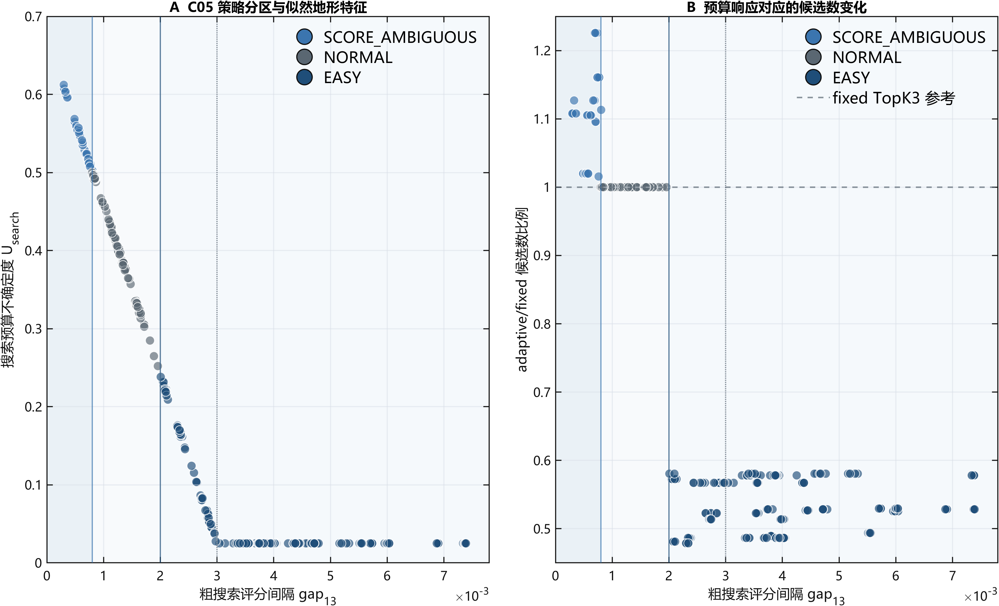

## 5.4 canonical beamspace manifold cache

coarse-to-fine 和 C05 减少的是进入细评分阶段的候选数量；但对于每个保留候选，仍需构造圆柱阵导向矢量与流形矩阵。当多个局部场景共享中心结构、局部角网格和 $W$ 配置时，这部分计算存在可复用性。本文引入 shared-center 圆柱阵旋转等价 canonical beamspace manifold cache，旨在降低重复构造导向矢量与流形矩阵的计算开销。

shared-center canonical beamspace manifold cache 的基本思想是利用圆柱阵绕 $z$ 轴旋转时的内积不变性，将不同全局中心下重复出现的局部流形构造转化为相对角网格上的查表。设圆柱阵环向离散中心为

$$
\phi_q=\frac{q}{N_{az}}\cdot 360^\circ,\qquad q=0,\ldots,N_{az}-1 .
$$

对于请求中心 $\theta_c^{\mathrm{req}}$，选取最接近的离散中心

$$
q_c=
\arg\min_q
\left|
\operatorname{wrap}_{180}(\phi_q-\theta_c^{\mathrm{req}})
\right|,
$$

并记

$$
\theta_c=\phi_{q_c}.
$$

设 canonical 局部子阵包含 $N_{\mathrm{sub}}=65$ 个环向列和 $N_{el}$ 个俯仰层，其阵元数为

$$
M_{\mathrm{sub}}=N_{\mathrm{sub}}N_{el}.
$$

在 canonical 坐标下，第 $m$ 个阵元的位置记为

$$
\mathbf r'_m=[x'_m,y'_m,z'_m]^T .
$$

绕 $z$ 轴旋转 $\theta_c$ 的矩阵为

$$
R_z(\theta_c)=
\begin{bmatrix}
\cos\theta_c & -\sin\theta_c & 0\\
\sin\theta_c & \cos\theta_c & 0\\
0 & 0 & 1
\end{bmatrix},
\qquad
R_z^T(\theta_c)R_z(\theta_c)=I .
$$

实际中心对应的局部阵元位置可写为

$$
\mathbf{r}_m(\theta_c)=R_z(\theta_c)\mathbf{r}'_m
$$

方向单位向量定义为

$$
\mathbf u(az,el)=
\begin{bmatrix}
\cos el\cos az\\
\cos el\sin az\\
\sin el
\end{bmatrix}.
$$

若目标方位相对于中心的偏移为 $\delta$，则

$$
\mathbf{u}(\theta_c+\delta,el)=R_z(\theta_c)\mathbf{u}(\delta,el)
$$

图 5-3 给出上述 shared-center 旋转等价关系的几何示意。图 5-3A 表示 canonical 局部子阵绕 $z$ 轴旋转到实际局部中心后，阵元相对顺序保持不变；图 5-3B 表示局部相对入射方向 $\mathbf u(\delta,el)$ 经同一旋转得到全局方向 $\mathbf u(\theta_c+\delta,el)$。该图仅用于说明缓存构造所依赖的几何等价性，不引入新的估计准则或实验结论。

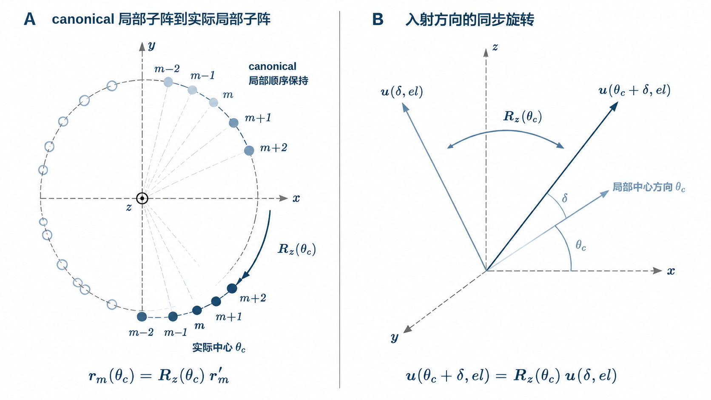

因此，阵元位置与入射方向的内积满足

$$
\begin{aligned}
\mathbf{r}_m(\theta_c)^T\mathbf{u}(\theta_c+\delta,el)
&=
\left(R_z(\theta_c)\mathbf r'_m\right)^T
\left(R_z(\theta_c)\mathbf u(\delta,el)\right)\\
&=
\mathbf r'_m{}^T R_z^T(\theta_c)R_z(\theta_c)
\mathbf u(\delta,el)\\
&=
\mathbf r'_m{}^T\mathbf u(\delta,el).
\end{aligned}
$$

沿用第2.1节的双程相位模型，单阵元导向项可写为

$$
a_m(az,el)
=
\exp\left(
j\gamma\,\mathbf r_m^T\mathbf u(az,el)
\right),
\qquad
\gamma=\eta_{\mathrm{rt}}\frac{2\pi}{\lambda},\quad
\eta_{\mathrm{rt}}=2 .
$$

由上述内积等价性可得

$$
a_m^{\mathrm{actual}}(\theta_c+\delta,el)
=
a_m^{\mathrm{canonical}}(\delta,el).
$$

在 canonical local order 与 $W$ 的阵元顺序一致时，堆叠后的导向矢量满足

$$
\mathbf a_{\mathrm{actual}}(\theta_c+\delta,el)
=
\mathbf a_{\mathrm{canonical}}(\delta,el).
$$

因此，单目标 beamspace 导向向量

$$
\mathbf g(az,el)=W^H\mathbf a_{\mathrm{cyl}}(az,el)
$$

可以在相对角网格上预存为

$$
G_{\mathrm{cache}}(\delta_{az},el)
=
W^H\mathbf a_{\mathrm{canonical}}(\delta_{az},el).
$$

设缓存方位偏移网格和俯仰网格分别为

$$
\mathcal D=\{\delta_1,\ldots,\delta_{N_\delta}\},
\qquad
\mathcal E=\{e_1,\ldots,e_{N_e}\}.
$$

当前实现中的 $\mathcal D$ 和 $\mathcal E$ 不是连续角度域，而是覆盖 coarse search、full fine search、fixed refine 和 C05 refine 可能访问到的有限 exact-grid 节点。方位方向缓存的是相对于当前 shared center 的偏移角，其节点集合可概念性写为

$$
\mathcal D
=
\mathcal D_{\mathrm{stage}}
\cup
\mathcal D_{\mathrm{coarse}}
\cup
\mathcal D_{\mathrm{fine}}
\cup
\mathcal D_{\mathrm{C05}},
$$

其中

$$
\mathcal D_{\mathrm{stage}}
=
\{-1.5^\circ:0.08^\circ:1.5^\circ\},
\qquad
\mathcal D_{\mathrm{coarse}}
=
\{-1.5^\circ:0.16^\circ:1.5^\circ\},
$$

$$
\mathcal D_{\mathrm{fine}}
=
\{-1.5^\circ:0.08^\circ:1.5^\circ\}.
$$

C05 局部细化还会围绕粗搜索方位节点生成不同窗口尺度下的细网格。令基础方位细化半宽为 $w_{az}=0.32^\circ$，窗口缩放集合为 $\mathcal A=\{0.60,1.00,1.15\}$，则其覆盖节点可表示为

$$
\mathcal D_{\mathrm{C05}}
=
\bigcup_{\delta_0\in\mathcal D_{\mathrm{coarse}}}
\bigcup_{\alpha\in\mathcal A}
\left\{
\operatorname{clip}(\delta_0-\alpha w_{az})
:0.08^\circ:
\operatorname{clip}(\delta_0+\alpha w_{az})
\right\},
$$

其中 $\operatorname{clip}(\cdot)$ 表示将局部方位范围限制在 $[-1.5^\circ,1.5^\circ]$ 内。因此，缓存命中的方位条件不是任意全局 $az$ 连续可查，而是其相对中心偏移

$$
\delta_{az}=\operatorname{wrap}_{180}(az-\theta_c)
$$

必须属于上述并集 $\mathcal D$。

俯仰方向缓存的不是 pair2d 参数中的中心俯仰 $el_c$ 本身，而是由 $el_c$ 与俯仰分离 $\Delta_{el}$ 生成的两个真实目标俯仰节点。令

$$
\mathcal P(\mathcal C,\mathcal S)
=
\left\{
e_c\pm\frac{s}{2}
\mid
e_c\in\mathcal C,\ s\in\mathcal S,\ 
e_c\pm\frac{s}{2}\in\Omega_{el}
\right\},
$$

其中 $\mathcal C$ 为俯仰中心网格，$\mathcal S$ 为俯仰分离候选列表，$\Omega_{el}$ 为当前局部俯仰有效范围。当前实现中，俯仰缓存节点可概念性写为

$$
\mathcal E
=
\mathcal E_{\mathrm{stage}}
\cup
\mathcal E_{\mathrm{coarse}}
\cup
\mathcal E_{\mathrm{C05}},
$$

$$
\mathcal E_{\mathrm{stage}}
=
\mathcal P
\left(
\{el_0-1.2^\circ:0.12^\circ:el_0+1.2^\circ\},
\{0,0.24^\circ,0.36^\circ,0.48^\circ,0.60^\circ,0.72^\circ\}
\right),
$$

$$
\mathcal E_{\mathrm{coarse}}
=
\mathcal P
\left(
\{el_0-1.2^\circ:0.24^\circ:el_0+1.2^\circ\},
\{0,0.36^\circ,0.72^\circ\}
\right).
$$

C05 俯仰细化围绕粗俯仰中心节点生成不同窗口尺度下的中心细网格。令基础俯仰中心细化半宽为 $w_{el}=0.48^\circ$，则

$$
\mathcal C_{\mathrm{C05}}
=
\bigcup_{e_0\in\{el_0-1.2^\circ:0.24^\circ:el_0+1.2^\circ\}}
\bigcup_{\alpha\in\mathcal A}
\left\{
\operatorname{clip}(e_0-\alpha w_{el})
:0.12^\circ:
\operatorname{clip}(e_0+\alpha w_{el})
\right\},
$$

$$
\mathcal E_{\mathrm{C05}}
=
\mathcal P
\left(
\mathcal C_{\mathrm{C05}},
\{0,0.24^\circ,0.36^\circ,0.48^\circ,0.60^\circ,0.72^\circ\}
\right).
$$

因此，缓存实际预存的是所有 $(\delta_{az},el)\in\mathcal D\times\mathcal E$ 上的单目标 beamspace 导向向量；若在线候选产生的 $\delta_{az}$ 或 $el_1,el_2$ 不属于这些 exact-grid 节点，则当前实现不进行插值，而应记录 cache miss 并回退到直接流形构造。

缓存数组可写为

$$
G_{\mathrm{grid}}\in\mathbb C^{B\times N_\delta\times N_e},
$$

$$
G_{\mathrm{grid}}(:,i,j)
=
W^H\mathbf a_{\mathrm{canonical}}(\delta_i,e_j).
$$

对任一候选角度，先转换为相对中心方位

$$
\delta_{az}=
\operatorname{wrap}_{180}(az-\theta_c),
$$

再在 exact-grid 条件下查表得到

$$
\mathbf g(az,el)\leftarrow
G_{\mathrm{cache}}(\delta_{az},el).
$$

对于双目标候选 $\Theta=\{(az_1,el_1),(az_2,el_2)\}$，缓存查表得到

$$
G(\Theta)=
\left[
\mathbf g(az_1,el_1),
\mathbf g(az_2,el_2)
\right].
$$

在中心、网格、canonical local order 和 $W$ 均匹配的条件下，缓存构造与直接构造满足

$$
G_{\mathrm{cached}}(\Theta)=G_{\mathrm{direct}}(\Theta),
$$

$$
J_{\mathrm{cached}}(\Theta)=J_{\mathrm{direct}}(\Theta),
$$

$$
\widehat{\Theta}_{\mathrm{cached}}
=
\widehat{\Theta}_{\mathrm{direct}}.
$$

上述等价性说明 shared-center canonical beamspace manifold cache 只改变 beamspace manifold 的构造方式，不改变候选集合、C05 搜索预算或 DML 评分准则。默认实现采用 exact-grid lookup，不使用插值；若中心、网格覆盖或顺序匹配条件不满足，则应回退到直接流形构造。第6.6节的等价性与运行时间结果用于验证该机制在当前配置下的数值一致性和计算收益。

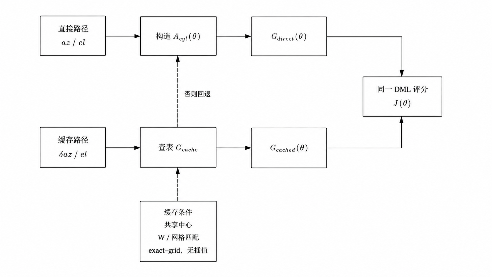

## 5.5 组合流程与回退边界

将 C05 自适应搜索预算策略与 shared-center canonical beamspace manifold cache 组合后，可形成缓存化 C05 beamspace ML 后端流程。该组合流程先根据前端局部输入构造 controlled pair2d 候选与 beamspace 观测，再由 fixed topK3/C05 决定搜索预算；若缓存覆盖条件、canonical order 和 *W* 配置满足要求，则使用缓存查表构造 $G(\Theta)$，否则回退到直接流形构造。

这一组合流程的论文角色是把前述低复杂度机制组织成一致的后端路线，而不是引入新的估计准则。对于前端状态不受支持或超出本文适用范围的输入，组合后端应给出越界或低置信输出，而不输出高置信 ML 结果；若缓存条件不满足且允许回退，则执行直接流形构造。该部分属于后端路线的边界说明和等价性验证，不作为新的算法创新点。相关输入输出约定、回退边界和诊断量可放在附录说明中。

表 5-1 低复杂度机制与验证章节对应关系

| 机制 | 作用 | 主要验证位置 |
| --- | --- | --- |
| fixed topK3 coarse-to-fine | 减少进入细评分阶段的候选数 | 6.4 搜索加速结果 |
| C05 自适应搜索预算控制 | 相对 fixed topK3 按似然地形调整 topK/window | 6.5 自适应预算结果 |
| shared-center canonical beamspace manifold cache | 减少重复导向矢量与流形矩阵构造 | 6.6 缓存等价性与运行时间验证 |
| 回退与低置信输出 | 防止越界输入或缓存未命中被误写成高置信结果 | 6.7 案例分析与边界 |

# 第6章 仿真实验与结果分析

## 6.1 实验设置

第3章至第5章已分别给出 controlled pair2d beamspace ML、波束矩阵选择、fixed topK3 coarse-to-fine 搜索、C05 自适应搜索预算控制以及 shared-center canonical beamspace manifold cache 的方法定义。本章在相同局部后端任务下报告验证结果，重点考察测角性能、候选评分负担、搜索一致性、缓存等价性和运行时间。所有实验均以前端已给出局部粗中心和搜索窗口为前提，不覆盖全空域盲多目标枚举、完整前端检测闭环或自动单双目标模型选择。

本章按“实验问题、对比对象、证据形式和结论边界”的顺序展开。首先比较 common-el、controlled pair2d 和 local full4D，以检验 controlled pair2d 的测角性能和候选复杂度；其次比较第4章定义的 *W* 选择策略与 *B*-budget 曲线，给出 greedy_combined_B7 的实验依据；随后在固定 controlled pair2d 与推荐波束矩阵条件下，分别评估 fixed topK3 coarse-to-fine 搜索和 C05 自适应搜索预算控制对候选评分数量及一致性指标的影响；最后比较 direct manifold construction 与 cached lookup，验证 shared-center canonical beamspace manifold cache 是否保持估计、评分和策略输出一致。代表性案例仅用于说明边界行为，不作为主要统计证据。

表 6-1 实验问题、对比对象与证据形式

| 实验问题 | 对比对象或固定配置 | 证据形式 |
| --- | --- | --- |
| controlled pair2d 是否适合作为主算法 | common-el、controlled pair2d、full4D | 成功率、RMSE、复杂度代理 |
| *W* 选择是否影响后端性能 | regular、greedy_projection、greedy_lowcorr、greedy_combined、SVD upper bound | 策略成功率、*B*-budget 曲线 |
| fixed topK3 是否省算且安全 | full fine 与 fixed topK3 coarse-to-fine | 候选数、一致性、安全指标 |
| C05 是否相对 fixed topK3 进一步省算 | fixed topK3 与 C05 adaptive | 候选数比例、预算策略分布、安全指标 |
| 缓存机制是否不改变结果并降低成本 | direct manifold construction 与 cached lookup | 估计一致性、评分差异、运行时间 |
| 方法在哪些条件下不应过度宣称 | 强相干、边界、ILL_CONDITIONED、前端先验偏差 | 案例分析与局限性表 |

表 6-2 评价指标与评价用途

| 指标 | 评价用途 |
| --- | --- |
| joint success / RMSE | 评价测角性能 |
| num pairs / candidate ratio | 评价搜索复杂度 |
| full-grid match / topK miss / boundary hit | 评价搜索安全性 |
| 估计一致率 / 评分一致性 / 缓存未命中 | 评价缓存机制是否改变结果 |
| 运行时间降低比例 | 评价重复流形构造成本的降低 |

本章指标分为三类：测角性能由 joint success 和 RMSE 表征；搜索压缩安全性由 candidate count、candidate ratio、full-grid match、topK miss 和 boundary hit 表征；缓存一致性由估计一致率、评分一致性、策略一致率和缓存未命中次数表征。不同实验的统计口径在对应小节中说明。

对于双目标测角实验，估计结果与真值均先按方位角排序，以消除目标编号置换对误差统计的影响。记排序后的误差为

$$
e_{az,i}^{(n)}
=
\widehat{az}_{(i)}^{(n)}-az_{(i)}^{(n)},
\qquad
e_{el,i}^{(n)}
=
\widehat{el}_{(i)}^{(n)}-el_{(i)}^{(n)},
\qquad i=1,2 .
$$

单个 trial 的方位和俯仰 RMSE 定义为

$$
\mathrm{RMSE}_{az}^{(n)}
=
\sqrt{
\frac{1}{2}
\sum_{i=1}^{2}
\left(e_{az,i}^{(n)}\right)^2
},
\qquad
\mathrm{RMSE}_{el}^{(n)}
=
\sqrt{
\frac{1}{2}
\sum_{i=1}^{2}
\left(e_{el,i}^{(n)}\right)^2
}.
$$

若图表需要单一角度误差摘要，则采用

$$
\mathrm{RMSE}_{\mathrm{ang}}^{(n)}
=
\sqrt{
\left(\mathrm{RMSE}_{az}^{(n)}\right)^2
+
\left(\mathrm{RMSE}_{el}^{(n)}\right)^2
}.
$$

joint success 要求两个目标的方位和俯仰估计同时落入容差。令容差分别为 $\tau_{az}$ 和 $\tau_{el}$，第 $n$ 个 trial 的联合成功指示量为

$$
I_{\mathrm{joint}}^{(n)}
=
\mathbf 1
\left(
\max_{i=1,2}|e_{az,i}^{(n)}|
\le
\tau_{az}
\ \land\
\max_{i=1,2}|e_{el,i}^{(n)}|
\le
\tau_{el}
\right).
$$

在 $N$ 个 trial 上，联合成功率为

$$
P_{\mathrm{joint}}
=
\frac{1}{N}
\sum_{n=1}^{N}
I_{\mathrm{joint}}^{(n)}.
$$

搜索复杂度由实际进入 DML 评分的候选数量衡量。candidate ratio 定义为

$$
\mathrm{candidate\ ratio}
=
\frac{
N_{\mathrm{cand}}^{\mathrm{compressed}}
}{
N_{\mathrm{cand}}^{\mathrm{reference}}
}.
$$

不同实验的 reference 不完全相同：fixed topK3 实验以 full fine reference 为候选数参考；C05 实验以 fixed topK3 为 candidate ratio 的参考，但 full-grid match、topK miss 和 boundary hit 仍以完整细网格 full grid / full fine reference 作为安全参照。

full-grid match 表示待检验方法是否返回与完整细网格参考一致的估计。记第 $n$ 个 trial 中待检验方法和完整细网格参考的估计分别为 $\widehat{\Theta}_{\mathrm{test}}^{(n)}$ 和 $\widehat{\Theta}_{\mathrm{full}}^{(n)}$，且两个目标均按方位角排序，则

$$
I_{\mathrm{match}}^{(n)}
=
\mathbf 1
\left(
\max_{i=1,2}
\left|
\widehat{az}_{\mathrm{test},(i)}^{(n)}
-
\widehat{az}_{\mathrm{full},(i)}^{(n)}
\right|
\le
\tau_{az}^{\mathrm{grid}}
\ \land\
\max_{i=1,2}
\left|
\widehat{el}_{\mathrm{test},(i)}^{(n)}
-
\widehat{el}_{\mathrm{full},(i)}^{(n)}
\right|
\le
\tau_{el}^{\mathrm{grid}}
\right).
$$

本文 fixed topK3 与 C05 验证中，$\tau_{az}^{\mathrm{grid}}=0.04^\circ$、$\tau_{el}^{\mathrm{grid}}=0.06^\circ$。一致率为

$$
P_{\mathrm{match}}
=
\frac{1}{N}
\sum_{n=1}^{N}
I_{\mathrm{match}}^{(n)}.
$$

topK miss 用于判断粗搜索保留的 topK 候选是否覆盖完整细网格参考峰值附近的细化区域。记第 $k$ 个粗候选诱导的细化窗口为 $\mathcal W_k^{(n)}$，则

$$
I_{\mathrm{cover}}^{(n)}
=
\mathbf 1
\left(
\widehat{\Theta}_{\mathrm{full}}^{(n)}
\in
\bigcup_{k=1}^{K}
\mathcal W_k^{(n)}
\right),
\qquad
I_{\mathrm{topK\ miss}}^{(n)}
=
1-I_{\mathrm{cover}}^{(n)}.
$$

覆盖检查要求完整细网格参考解的两个有序方位角、俯仰中心和俯仰分离值均落入相应细化搜索范围。topK 漏检率为

$$
P_{\mathrm{topK\ miss}}
=
\frac{1}{N}
\sum_{n=1}^{N}
I_{\mathrm{topK\ miss}}^{(n)}.
$$

boundary hit 表示最终估计贴近局部搜索窗口边界。记 $d_{\mathrm{az}}^{(n)}$ 和 $d_{\mathrm{el}}^{(n)}$ 分别为最终有序方位估计、俯仰估计到对应搜索边界的最小距离，则

$$
I_{\mathrm{boundary}}^{(n)}
=
\mathbf 1
\left(
d_{\mathrm{az}}^{(n)}\le 0.02^\circ
\ \lor\
d_{\mathrm{el}}^{(n)}\le 0.05^\circ
\right),
$$

对应 boundary hit rate 为

$$
P_{\mathrm{boundary}}
=
\frac{1}{N}
\sum_{n=1}^{N}
I_{\mathrm{boundary}}^{(n)}.
$$

缓存实验不以测角 RMSE 为主指标，而比较 cached lookup 与 direct manifold construction 在估计结果、C05 策略输出和 DML 分数上的一致性；缓存未命中次数用于记录 exact-grid lookup 是否无法覆盖候选点并触发回退。

表 6-3 给出各实验的配置与统计口径。不同实验服务于不同验证目的，因此样本数和统计集合不完全相同；正文中的 success、match、miss 和 boundary hit 均应在相应口径下解释。

表 6-3 实验配置与统计口径

| 实验项 | 主要配置或统计集合 | 样本口径与判据 |
| --- | --- | --- |
| 模型参数化对比 | common-el、controlled pair2d 与 local full4D；双程相位因子 $\eta_{\mathrm{rt}}=2$；记录 10 类局部场景，并覆盖 az5_el3 与 az5_el5 两类 beam layout | 每类模型 40 个 trial；joint success 由方位与俯仰联合容差判定；RMSE 单位为 degree |
| *W* 选择与 *B*-budget | controlled pair2d 后端；比较 regular、greedy_projection、greedy_lowcorr、greedy_combined 与 SVD upper bound；推荐配置为 greedy_combined_B7 | greedy_combined_B7 覆盖 5 类代表性场景、共 15 个 trial；success 与 RMSE 按该验证集合统计 |
| fixed topK3 coarse-to-fine 搜索加速 | W=greedy_combined_B7；coarse_az_step=0.16 degree，coarse_el_step=0.24 degree；fine_az_step=0.08 degree，fine_el_step=0.12 degree；coarse_el_sep=[0,0.36,0.72] degree，fine_el_sep=[0,0.24,0.36,0.48,0.6,0.72] degree | 5 类代表性场景、每类 10 个 trial；full fine 与 coarse-to-fine 各 50 个 trial；full-grid match、topK miss 和 boundary hit 均在该确认集合内统计 |
| C05 自适应搜索预算控制 | 固定 controlled pair2d 与 greedy_combined_B7；C05 仅调节 topK/window，不改变 DML 评分准则 | 主验证统计 fixed/adaptive 平均候选数与安全指标，验证口径为 50 个 trial；多随机种子复验采用 3 个 seed group、每组 150 个 trial，共 450 个 trial |
| shared-center canonical beamspace manifold cache 等价性 | direct manifold construction 与 cached lookup；exact-grid lookup；canonical order 与 *W* 匹配 | 缓存等价性验证在 300 个 trial 下比较估计、评分与策略一致性；跨中心复用验证在 6 个离散中心下检验 canonical cache 的复用条件；缓存后端一致性验证在 200 个 trial 下比较估计、策略和评分一致率 |
| 边界案例 | 强相干、弱次目标、低信噪比、前端偏差和缓存条件失配 | 仅用于说明适用边界，不作为 6.2--6.6 节主统计结论 |

上述表 6-1 至表 6-3 限定了本章结论的证据范围。joint success 和 RMSE 用于评价测角结果，num pairs 与 candidate ratio 用于评价候选评分负担，full-grid match、topK miss 和 boundary hit 用于判断搜索压缩是否破坏验证集一致性。运行时间降低比例仅表示 MATLAB 后端运行与重复流形构造成本下降，不等同于 FPGA 部署或完整实时闭环完成。

## 6.2 模型参数化方法对比

三类候选集合的定义见第3.3节。本节在相同局部后端任务下比较 common-el、controlled pair2d 和 local full4D 的测角性能与候选复杂度，其中 full4D 仅作为局部上界参考。

图 6-1 给出场景拆分成功率、角度 RMSE 和成本-成功率关系。本节 joint success 按双目标方位和俯仰联合容差统计，角度 RMSE 采用 $\mathrm{RMSE}_{\mathrm{ang}}$，候选复杂度采用 mean candidates。该图用于检验 controlled pair2d 在记录场景中是否达到 local full4D 上界参考的联合成功率，并以较低候选复杂度完成后端估计；该结果不外推为二者在任意条件下等价。

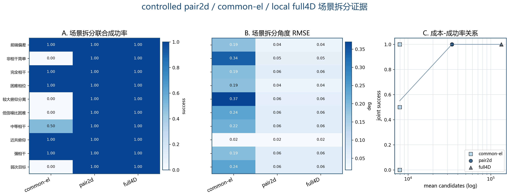

表 6-4 模型参数化对比关键结果

| 对比项 | 关键结果 | 分析结论 |
| --- | --- | --- |
| common-el | 最佳联合成功率 0.5625 | 可作为 baseline，但受共俯仰约束限制 |
| controlled pair2d | 最佳联合成功率 1；主 trial 口径为 40/40 | 本文默认后端参数化 |
| full4D | 最佳联合成功率 1；主 trial 口径为 40/40 | 上界参考，不作为默认工程方案 |
| 复杂度 | full4D/pair2d 约 3.9589 | pair2d 更适合后端默认搜索 |

表 6-4 中的复杂度为同一局部后端任务下进入 DML 评分的候选数量代理。记 local full4D 与 controlled pair2d 的平均候选评分数分别为 $N_{\mathrm{cand}}^{\mathrm{full4D}}$ 和 $N_{\mathrm{cand}}^{\mathrm{pair2d}}$，复杂度代理比定义为

$$
R_{\mathrm{full4D/pair2d}}
=
\frac{N_{\mathrm{cand}}^{\mathrm{full4D}}}
{N_{\mathrm{cand}}^{\mathrm{pair2d}}}.
$$

该指标反映候选集合规模差异，不展开单次评分的矩阵维度、MATLAB 实现细节或缓存开销。

表 6-4 显示，common-el 的最佳联合成功率为 0.5625，controlled pair2d 与 local full4D 的最佳联合成功率均为 1；主 trial 口径下，二者均达到 40/40。full4D/pair2d 复杂度代理比约为 3.9589。因此，当前证据支持 controlled pair2d 作为默认后端参数化，而 full4D 应保留为局部上界参考。

## 6.3 *W* 选择与 *B*-budget 结果

第4章已给出 *W* 选择策略。本节固定 controlled pair2d 后端和相同场景集，比较 regular 3dB grid、greedy_projection、greedy_lowcorr、greedy_combined 和 SVD upper bound，并在 greedy_combined 下扫描波束数 *B*。本节仅报告 success/RMSE 与 *B*-budget 对推荐配置的支持程度。

图 6-2A 给出各 *W* 策略在相同验证场景上的总体 joint success。图 6-2B 针对 greedy_combined 扫描不同 *B*；左轴为 joint success，右轴为合成 RMSE

$$
\mathrm{RMSE}_{\mathrm{comb}}
=
\sqrt{
\mathrm{RMSE}_{az}^{2}
+
\mathrm{RMSE}_{el}^{2}
}.
$$

joint success 为无量纲比例，RMSE 单位为 degree，因此图 6-2B 采用左右双纵轴。左图用于比较候选策略的总体表现，*B*=7 的采用主要由右侧 *B*-budget 曲线和表 6-5 支撑。本节结论限定于当前波束池、场景集和后端估计器；SVD upper bound 仅作为上界参考，不与工程可实现策略混同。

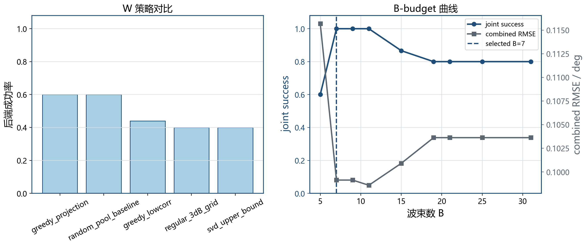

表 6-5 *W* 选择推荐依据

| 指标 | 数值或结论 |
| --- | --- |
| 推荐 *W* 策略 | greedy_combined |
| 推荐波束数 *B* | 7 |
| 推荐配置成功率 | 15/15 |
| 推荐配置 RMSE | 约 0.0991 |
| 最差场景通过情况 | 5/5 类场景通过 |
| 回退策略 | greedy 不可用时参考 regular 3dB grid |

表 6-5 表明，greedy_combined_B7 在 5 类代表性场景、共 15 个 trial 的验证口径下成功率为 15/15，RMSE 约为 0.0991。结合 *B*-budget 曲线，增加波束数未呈现单调收益，因此本文将 greedy_combined_B7 作为当前实验条件下的推荐波束矩阵输入，而不声明其为任意阵列、场景或波束池下的全局最优 *W*。

## 6.4 coarse-to-fine 搜索加速结果

fixed topK3 的构造见第5.2节。本节在固定 controlled pair2d 与 greedy_combined_B7 的条件下，比较 full fine reference 与 fixed topK3 coarse-to-fine，以检验固定搜索压缩是否在降低候选评分数的同时保持完整细网格参考的一致性。full fine reference 指同一局部窗口和同一 controlled pair2d 参数化下的完整细网格 DML 搜索；C05 不纳入本节对比。

图 6-3 给出 full fine 与 fixed topK3 的成功率、一致性和候选数。图 6-3A 中，full fine success 与 TopK3 success 均为 joint success，full-grid match 表示 fixed topK3 的最终估计是否与 full fine reference 一致。图 6-3B 的候选评分数指实际计算 $J(\Theta)$ 的候选个数。对于 fixed topK3，该数量包含粗搜索评分次数和围绕 topK 粗候选进行局部细化的评分次数：

$$
N_{\mathrm{cand}}^{\mathrm{topK3}}
=
N_{\mathrm{cand}}^{\mathrm{coarse}}
+
\sum_{k=1}^{3}
N_{\mathrm{cand}}^{\mathrm{refine}}(k).
$$

本节 candidate ratio 或压缩倍数以 full fine reference 为分母；full-grid match、topK miss 和 boundary hit 均相对于完整细网格参考解释。表 6-6 中，full fine 成功率与 fixed topK3 成功率均为 $P_{\mathrm{joint}}$；与 full fine 一致率为 $P_{\mathrm{match}}$；topK 漏检率为 $P_{\mathrm{topK\ miss}}$，其中 $K=3$；boundary hit rate 为 fixed topK3 最终估计的 $P_{\mathrm{boundary}}$。full fine 与 fixed topK3 的平均候选数分别为

$$
\overline{N}_{\mathrm{cand}}^{\mathrm{full}}
=
\frac{1}{N}
\sum_{n=1}^{N}
N_{\mathrm{cand,full}}^{(n)},
\qquad
\overline{N}_{\mathrm{cand}}^{\mathrm{topK3}}
=
\frac{1}{N}
\sum_{n=1}^{N}
N_{\mathrm{cand,topK3}}^{(n)}.
$$

因此，表中的 $131461$ 和 $19161.9$ 表示 50 个 trial 上实际 DML 候选评分次数的均值，而非似然分数值。

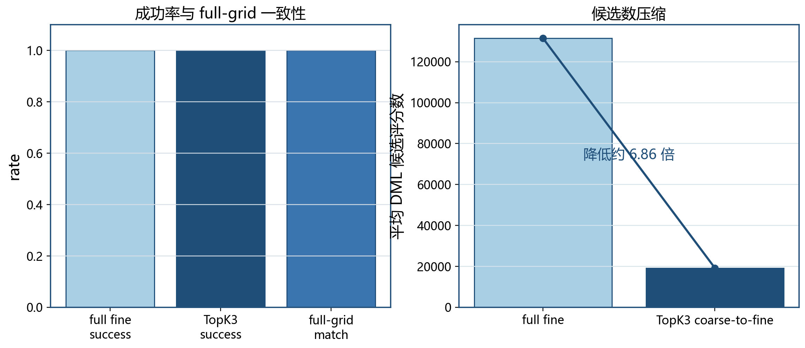

表 6-6 fixed topK3 coarse-to-fine 搜索加速关键指标

| 指标 | 数值或结论 |
| --- | --- |
| 推荐 topK | 3 |
| full fine 成功率 | 50/50 |
| fixed topK3 成功率 | 50/50 |
| 与 full fine 一致率 | 50/50 |
| topK 漏检率 | 0/50 |
| boundary hit rate | 0/50 |
| full fine 平均候选数 | 131461 |
| fixed topK3 平均候选数 | 19161.9 |
| 候选数压缩倍数 | 约 6.86 |

表 6-6 显示，在 5 类代表性场景、每类 10 个 trial 的确认集合中，full fine 与 fixed topK3 均达到 50/50 成功，二者一致数为 50/50，topK 漏检数和 boundary hit 数均为 0/50；平均候选数由 131461 降至 19161.9，压缩倍数约为 6.86。该结果支持 fixed topK3 在当前验证集上降低候选评分负担且保持 full fine 一致性，但其仍为固定预算策略。

## 6.5 C05 自适应搜索预算控制验证结果

C05 的不确定度计算和预算分支见第5.3节。本节固定 controlled pair2d 与 greedy_combined_B7，比较 fixed topK3 与 C05 adaptive 的候选数比例和安全指标，以检验 C05 是否能在 fixed topK3 基础上进一步降低候选评分负担。

图 6-4 展示 C05/fixed 候选数比例分布、策略分层候选比例和安全指标矩阵。本节 candidate ratio 以 fixed topK3 为分母：

$$
r_{\mathrm{C05/fixed}}^{(n)}
=
\frac{
N_{\mathrm{cand,C05}}^{(n)}
}{
N_{\mathrm{cand,fixed}}^{(n)}
}.
$$

其中

$$
N_{\mathrm{cand,C05}}^{(n)}
=
N_{\mathrm{cand,coarse}}^{(n)}
+
N_{\mathrm{cand,adaptive\ refine}}^{(n)},
\qquad
N_{\mathrm{cand,fixed}}^{(n)}
=
N_{\mathrm{cand,coarse}}^{(n)}
+
N_{\mathrm{cand,fixed\ refine}}^{(n)}.
$$

图 6-4A 给出逐 trial 比例 $r_{\mathrm{C05/fixed}}^{(n)}$ 的经验 CDF，$r=1$ 表示 C05 与 fixed topK3 候选数相同。图 6-4B 按实际触发的 C05 策略标签统计候选数比例。图 6-4C 统计各策略下的 success、full-grid match、topK miss 和 boundary hit，其中 success 与 full-grid match 越高越好，topK miss 与 boundary hit 越低越好。若 C05 在减少候选数的同时降低 full-grid match 或增加 topK miss / boundary hit，则不能视为可靠的预算机制。

表 6-7 的主验证口径为 50 个 trial。fixed topK3 平均候选数和 C05 adaptive 平均候选数分别为 $\overline{N}_{\mathrm{cand}}^{\mathrm{fixed}}$ 与 $\overline{N}_{\mathrm{cand}}^{\mathrm{C05}}$，表中的 adaptive/fixed 候选数比例采用平均候选数之比：

$$
\overline r_{\mathrm{C05/fixed}}
=
\frac{
\overline{N}_{\mathrm{cand}}^{\mathrm{C05}}
}{
\overline{N}_{\mathrm{cand}}^{\mathrm{fixed}}
}.
$$

与 full grid 一致率、topK 漏检率和 boundary hit rate 分别为 C05 adaptive 相对于完整细网格参考的 $P_{\mathrm{match}}$、$P_{\mathrm{topK\ miss}}$ 和 $P_{\mathrm{boundary}}$。其中 topK miss 使用 C05 实际选择的候选集合及其缩放后的细化窗口判断覆盖性。多随机种子复验采用同一组指标，样本集合扩展为 3 个 seed group、每组 150 个 trial，共 450 个 trial。

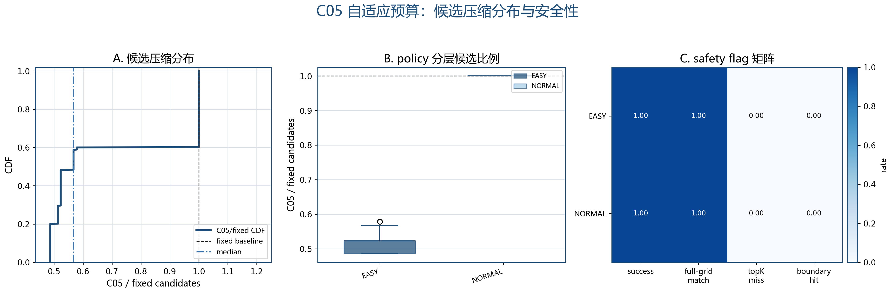

图 6-4A 显示，C05 的逐 trial 候选比例整体位于 fixed topK3 基线以下，说明自适应预算在多数样本中减少了进入 DML 评分的候选数。图 6-4B 进一步按实际触发的策略分支给出候选比例分布，其中 EASY 分支的候选比例集中在约 0.49 至 0.58，而 NORMAL 分支保持在 fixed topK3 基线附近。图 6-4C 显示，各策略分支下 success 和 full-grid match 均为 1，topK miss 与 boundary hit 均为 0。由此可见，在当前验证样本中，C05 的候选压缩主要来自 EASY 分支，同时未破坏与 full-grid reference 的一致性和搜索安全性。

表 6-7 C05 自适应搜索预算控制关键结果

| 指标 | 数值或结论 |
| --- | --- |
| C05 配置 | C05_easy_very_aggressive |
| fixed topK3 平均候选数 | 18558 |
| C05 adaptive 平均候选数 | 13242.6 |
| adaptive/fixed 候选数比例 | 约 0.7136 |
| 与 full grid 一致率 | 50/50 |
| topK 漏检率 | 0/50 |
| boundary hit rate | 0/50 |
| 多随机种子复验样本数 | 450 |
| 多随机种子最大候选数比例 | 约 0.7151 |
| 多随机种子一致率 / topK 漏检率 / boundary hit rate | 450/450 / 0/450 / 0/450 |

表 6-7 显示，在 50 个 trial 的验证配置下，fixed topK3 与 C05 adaptive 的平均候选数分别为 18558 和 13242.6，adaptive/fixed 候选数比例约为 0.7136；与 full grid 的一致数为 50/50，topK 漏检数和 boundary hit 数均为 0/50。Metkl30 多随机种子复验进一步给出 450 个样本，最大候选数比例约为 0.7151，一致数、topK 漏检数和 boundary hit 数分别为 450/450、0/450 和 0/450。该结论限定于当前零偏验证与复验口径，其他前端偏差条件应作为边界或补充分析单独解释。

ILL_CONDITIONED 在当前主验证样本中未触发，补充防御性探测仅说明该分支逻辑可执行。因此，本文不将 ILL_CONDITIONED 作为主要性能收益来源。

C05 的结论应限定为当前验证与复验口径下的候选数降低和安全指标保持；实际工程应用中，阈值和预算策略分布仍需随信噪比、相干性、目标间隔和前端偏差范围重新复验。

## 6.6 缓存等价性与运行时间结果

shared-center canonical beamspace manifold cache 的构造、旋转等价性和 exact-grid 条件见第5.4节。本节比较 direct manifold construction 与 cached lookup，检验缓存机制是否在不改变后端结果的前提下降低重复流形构造成本。评价指标包括估计一致性、评分差异、缓存命中情况和运行时间。

图 6-5A 的误差为相位对齐后的相对 beamspace manifold 误差：

$$
E_G
=
\min_{\phi}
\frac{
\left\|
G_{\mathrm{cached}}
-
e^{j\phi}G_{\mathrm{direct}}
\right\|_F
}{
\left\|G_{\mathrm{direct}}\right\|_F
}.
$$

图 6-5B 中每个散点对应一个 trial 的 direct/cached 后端总运行时间，虚线 $y=x$ 表示两者耗时相同。

图 6-5C 的 runtime reduction ratio 定义为
$$
\rho_t
=
\frac{
T_{\mathrm{direct}}-T_{\mathrm{cached}}
}{
T_{\mathrm{direct}}
}.
$$

其中 search cache 曲线侧重流形构造与搜索阶段的缓存收益，cached backend 曲线侧重缓存化 C05 后端的整体运行时间收益。本节不以测角 RMSE 为主要指标，而检验 cached lookup 与 direct manifold construction 在估计、DML 评分和 C05 策略输出上的一致性。只有等价性成立后，运行时间降低才可解释为重复流形构造成本下降。

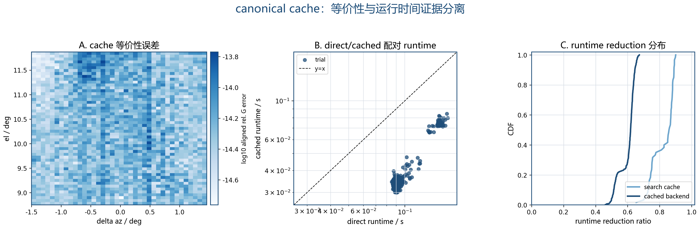

图 6-5A 显示，缓存流形与直接构造流形的相位对齐相对误差保持在 $10^{-14}$ 量级，说明 shared-center canonical cache 在当前 exact-grid 条件下与 direct manifold construction 数值等价。图 6-5B 中 cached runtime 散点整体位于 $y=x$ 参考线下方，表明缓存后端在逐 trial 运行时间上低于直接构造后端。图 6-5C 进一步给出运行时间降低比例的分布，其中 search cache 曲线对应流形构造与搜索阶段的缓存收益，cached backend 曲线对应完整 C05 后端的总运行时间收益；前者整体更靠右，说明缓存对重复流形构造阶段的加速更显著，而完整后端收益受到其他固定计算开销的稀释。结合表 6-8 的一致性结果，缓存机制在当前配置下保持估计、评分和策略输出一致，同时降低了后端运行时间。

表 6-8 缓存等价性与运行时间结果

| 指标 | 数值或结论 |
| --- | --- |
| 流形等价性 | 通过；最大相对 *G* 误差约 3.23e-14 |
| 搜索一致性 | 300/300 |
| 跨中心复用 | 6/6 |
| 最大相对 *G* 误差 | 约 3.23e-14 |
| 估计一致率 | 300/300 |
| 策略一致率 | 300/300 |
| 最大相对评分差异 | 约 8.30e-16 |
| 缓存未命中数 | 0/300 |
| manifold 时间降低比例中位数 | 约 0.9977 |
| search 时间降低比例中位数 | 约 0.8604 |
| 缓存内存占用 | 约 2.08 MB |
| 缓存后端估计 / 策略 / 评分一致率 | 200/200 / 200/200 / 200/200 |
| 缓存后端运行时间降低比例中位数 | 约 0.6184 |

表 6-8 显示，缓存机制通过流形等价性、搜索一致性和跨中心复用验证；最大相对 *G* 误差约为 $3.23\times10^{-14}$，估计一致数和策略一致数均为 300/300，缓存未命中数为 0/300，最大相对评分差异约为 $8.30\times10^{-16}$。在缓存后端一致性验证中，估计、策略和评分一致数均为 200/200，运行时间降低比例中位数约为 0.6184。该结果说明缓存机制可在当前 exact-grid 与 shared-center canonical 条件下降低重复流形构造和后端运行时间，但不表示支持任意网格插值、改变估计器或完成实时硬件部署。

## 6.7 案例分析与边界讨论

本节用于归纳适用边界，不引入新的统计结论。6.2 至 6.6 节已分别给出模型参数化、*W* 选择、fixed topK3 coarse-to-fine 搜索、C05 自适应搜索预算控制和 shared-center canonical beamspace manifold cache 的主要证据；本节的作用是说明这些证据可以支持到什么范围，以及在哪些情形下不能直接外推。

图 6-6 不是整体性能统计图，而是代表性案例与边界行为说明图。该图展示代表性困难或边界样本中的似然地形、候选预算、中心误差和策略标记；正常样本仅作对照，边界样本用于说明强相干、低信噪比或局部窗口边界附近仍可能存在风险。因此，图 6-6 只用于解释方法行为和外推边界，不提供新的统计分布或统计保证。

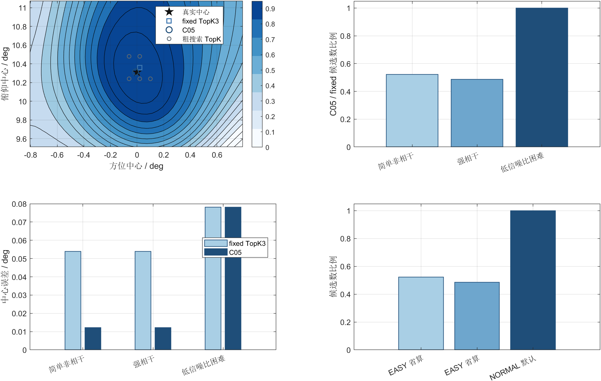

图 6-6 左上给出 EASY 样本的局部 DML 评分地形及真实中心、fixed TopK3、C05 和粗搜索 TopK 的相对位置；右上比较三个代表性样本的 C05/fixed 候选数比例；左下比较 fixed TopK3 与 C05 的中心误差幅度；右下按 C05 实际触发策略标记候选数比例。该图的重点是展示 C05 在简单样本中可以压缩候选数，而在困难样本中可能回退到默认预算。

综合前述实验，本文结论仅适用于前端检测后的局部未分辨双目标簇。强相干边界条件、前端先验偏差、C05 阈值迁移和 cache 条件失配均可能削弱当前结果；这些情形不纳入 6.2 至 6.6 节的主统计结论，也不应由图 6-6 的代表性案例外推为一般性保证。表 6-9 汇总相应边界。

表 6-9 本文方法适用范围与局限性汇总

| 项目 | 当前处理方式 | 边界说明 |
| --- | --- | --- |
| 研究对象 | 局部双目标后端 ML | 不覆盖全空域盲搜 |
| 前端先验 | 已有粗中心和局部窗口 | 不等于完整前端闭环 |
| 强相干边界 | 保留 stress 结果 | worst-case 仍可能失败 |
| C05 | 代表性场景有效 | 阈值需随工程场景复验 |
| ILL_CONDITIONED | 防御性探测通过 | 当前主验证样本中未触发 |
| 缓存机制 | exact-grid lookup | 需要 canonical order 与 *W* 匹配 |
| 缓存后端 | 后端处理路线 | 不等于 FPGA 下板或系统闭环 |

因此，第6章支持的结论应限定为：在当前局部窗口、场景集、波束池和后端配置下，controlled pair2d beamspace ML 可作为默认后端参数化，greedy_combined_B7 可作为推荐波束矩阵输入，fixed topK3 coarse-to-fine 搜索与 C05 自适应搜索预算控制可压缩候选评分负担并保持验证集一致性，shared-center canonical beamspace manifold cache 可在结果一致的条件下降低重复流形构造成本。上述结果不外推为全空域闭环、多目标盲搜、任意场景安全保证或实时硬件部署结论。

# 第7章 总结与展望

## 7.1 工作总结

本文针对前端已给出局部粗中心和搜索窗口后的圆柱阵局部未分辨双目标测角问题，提出 controlled pair2d beamspace ML 后端方法。该方法在 beamspace 中保留真实圆柱阵流形，并用中心角、方位分离、俯仰分离和方向变量描述局部双目标结构，从而在 common-el 基线和 local full4D 上界参考之间取得更适合作为默认后端的复杂度-表达能力折中。

围绕该主算法，本文给出三类支撑机制。波束矩阵选择实验表明，greedy_combined_B7 在当前条件下可作为推荐波束矩阵输入，且波束数增加并不必然带来单调收益；fixed topK3 coarse-to-fine 搜索与 C05 自适应搜索预算控制实验表明，在当前验证与复验口径下，候选搜索预算可以在保持一致性指标的同时被压缩；缓存等价性与运行时间验证表明，在 shared-center canonical order、匹配 *W* 和 exact-grid lookup 条件下，shared-center canonical beamspace manifold cache 可保持估计、评分和搜索策略输出一致，并降低重复流形构造与后端运行时间。上述结果共同支持本文主线：在不改变 DML 准则和真实圆柱阵流形的前提下，降低局部双目标后端 ML 估计的计算负担。

## 7.2 主要创新点

本文的创新点可归纳为一条主贡献和三个支撑机制。主贡献是提出基于圆柱阵真实流形的 controlled pair2d beamspace ML 后端建模方法，以 common-el 作为基线、local full4D 作为局部上界参考，明确局部未分辨双目标后端估计的主算法路径。

三个支撑机制分别对应后端输入设计、候选搜索预算控制和重复流形构造加速。第一，采用 greedy_combined_B7 作为当前实验条件下的推荐波束矩阵输入，使 beamspace 降维服务于 controlled pair2d beamspace ML 的流形保持需求。第二，将 fixed topK3 coarse-to-fine 搜索与 C05 自适应搜索预算控制作为统一的候选预算机制，在不改变 DML 评分的前提下降低候选评分负担。第三，构建 shared-center canonical beamspace manifold cache，并通过等价性和运行时间验证说明，缓存机制可在不改变估计、评分和搜索策略输出的条件下降低重复流形构造成本。上述机制均服务于 controlled pair2d beamspace ML 主贡献，而不是彼此并列的独立算法主线。

## 7.3 局限性

本文仍有明确边界。首先，方法依赖前端提供局部粗中心和搜索窗口，不覆盖全空域盲搜、完整前端闭环或自动单双目标模型选择。其次，强相干、弱次目标、小角度间隔和边界命中等组合条件仍可能造成性能退化，图 6-6 只能作为代表性案例和边界解释，不能作为统计保证。再次，C05 当前证据仅支持当前验证与复验口径下的候选预算降低与一致性保持，不构成任意场景下的安全保证。最后，缓存等价性依赖 shared-center canonical local order、严格匹配的 *W* 与 exact-grid lookup；本文尚未完成 FPGA/SoC 定点实现、完整实时链路验证或实测数据验证。这些内容应作为后续工作，而不应写入当前主结论。

## 7.4 后续工作展望

后续工作包括：第一，与完整前端检测链路联合验证；第二，扩展更强边界场景和模型阶数判别；第三，开展 FPGA/SoC 定点量化、资源估算和流水线仿真；第四，研究缓存插值、多网格和失配回退策略；第五，引入实测数据或硬件码本验证。

# 参考文献

[1] Capon J. High-resolution frequency-wavenumber spectrum analysis[J]. Proceedings of the IEEE, 1969, 57(8): 1408-1418. DOI: 10.1109/PROC.1969.7278.

[2] Schmidt R O. Multiple emitter location and signal parameter estimation[J]. IEEE Transactions on Antennas and Propagation, 1986, 34(3): 276-280. DOI: 10.1109/TAP.1986.1143830.

[3] Roy R, Kailath T. ESPRIT-estimation of signal parameters via rotational invariance techniques[J]. IEEE Transactions on Acoustics, Speech, and Signal Processing, 1989, 37(7): 984-995. DOI: 10.1109/29.32276.

[4] Krim H, Viberg M. Two decades of array signal processing research: the parametric approach[J]. IEEE Signal Processing Magazine, 1996, 13(4): 67-94. DOI: 10.1109/79.526899.

[5] Pesavento M, Trinh-Hoang M P, Viberg M. Three more decades in array signal processing research: an optimization and structure exploitation perspective[J]. IEEE Signal Processing Magazine, 2023, 40(4): 92-106. DOI: 10.1109/MSP.2023.3255558.

[6] Godara L C. Application of antenna arrays to mobile communications. II. Beam-forming and direction-of-arrival considerations[J]. Proceedings of the IEEE, 1997, 85(8): 1195-1245. DOI: 10.1109/5.622504.

[7] Zoltowski M D, Lee T S. Maximum likelihood based sensor array signal processing in the beamspace domain for low angle radar tracking[J]. IEEE Transactions on Signal Processing, 1991, 39(3): 656-671. DOI: 10.1109/78.80885.

[8] Zoltowski M D, Kautz G M, Silverstein S D. Beamspace Root-MUSIC[J]. IEEE Transactions on Signal Processing, 1993, 41(1): 344-364. DOI: 10.1109/TSP.1993.193151.

[9] Xu G, Silverstein S D, Roy R H, Kailath T. Beamspace ESPRIT[J]. IEEE Transactions on Signal Processing, 1994, 42(2): 349-356. DOI: 10.1109/78.275607.

[10] Van Trees H L. Optimum Array Processing: Part IV of Detection, Estimation, and Modulation Theory[M]. New York: Wiley, 2002.

[11] 陈生, 熊竹林, 许波, 庞晓宇. 米波 MIMO 雷达波束空间精确最大似然算法[J]. 系统工程与电子技术, 2022, 44(5): 1520-1527. DOI: 10.12305/j.issn.1001-506X.2022.05.24.

[12] Ziskind I, Wax M. Maximum likelihood localization of multiple sources by alternating projection[J]. IEEE Transactions on Acoustics, Speech, and Signal Processing, 1988, 36(10): 1553-1560. DOI: 10.1109/29.7543.

[13] Stoica P, Nehorai A. MUSIC, maximum likelihood, and Cramer-Rao bound[J]. IEEE Transactions on Acoustics, Speech, and Signal Processing, 1989, 37(5): 720-741. DOI: 10.1109/29.17564.

[14] Stoica P, Sharman K C. Maximum likelihood methods for direction-of-arrival estimation[J]. IEEE Transactions on Acoustics, Speech, and Signal Processing, 1990, 38(7): 1132-1143. DOI: 10.1109/29.57542.

[15] Stoica P, Nehorai A. MUSIC, maximum likelihood, and Cramer-Rao bound: further results and comparisons[J]. IEEE Transactions on Acoustics, Speech, and Signal Processing, 1990, 38(12): 2140-2150. DOI: 10.1109/29.61541.

[16] Shan T J, Wax M, Kailath T. On spatial smoothing for direction-of-arrival estimation of coherent signals[J]. IEEE Transactions on Acoustics, Speech, and Signal Processing, 1985, 33(4): 806-811. DOI: 10.1109/TASSP.1985.1164649.

[17] Pillai S U, Kwon B H. Forward/backward spatial smoothing techniques for coherent signal identification[J]. IEEE Transactions on Acoustics, Speech, and Signal Processing, 1989, 37(1): 8-15. DOI: 10.1109/29.17496.

[18] Lee H B, Wengrovitz M S. Resolution threshold of beamspace MUSIC for two closely spaced emitters[J]. IEEE Transactions on Acoustics, Speech, and Signal Processing, 1990, 38(9): 1545-1559. DOI: 10.1109/29.60074.

[19] Wang J, Yao F L, Zhang S H, Xiong X Y. 基于 FFT 和波束空间 MUSIC 的快速超分辨算法[J]. Image and Signal Processing, 2022, 11(1): 1-8. DOI: 10.12677/JISP.2022.111001.

[20] Mathews C P, Zoltowski M D. Eigenstructure techniques for 2-D angle estimation with uniform circular arrays[J]. IEEE Transactions on Signal Processing, 1994, 42(9): 2395-2407. DOI: 10.1109/78.317861.

[21] Belloni F, Koivunen V. Beamspace transform for UCA: error analysis and bias reduction[J]. IEEE Transactions on Signal Processing, 2006, 54(8): 3078-3089. DOI: 10.1109/TSP.2006.877664.

[22] Belloni F, Richter A, Koivunen V. DoA estimation via manifold separation for arbitrary array structures[J]. IEEE Transactions on Signal Processing, 2007, 55(10): 4800-4810. DOI: 10.1109/TSP.2007.896115.

[23] Golub G H, Van Loan C F. Matrix Computations[M]. 4th ed. Baltimore: Johns Hopkins University Press, 2013.

[24] Hansen P C. The truncated SVD as a method for regularization[J]. BIT, 1987, 27(4): 534-553. DOI: 10.1007/BF01937276.

[25] Balanis C A. Antenna Theory: Analysis and Design[M]. 4th ed. Hoboken: Wiley, 2016.

[26] Anderson S. On optimal dimension reduction for sensor array signal processing[J]. Signal Processing, 1993, 30(3): 245-256. DOI: 10.1016/0165-1684(93)90150-9.

[27] Hassanien A, Elkader S A, Gershman A B, Wong K M. Convex optimization based beam-space preprocessing with improved robustness against out-of-sector sources[J]. IEEE Transactions on Signal Processing, 2006, 54(5): 1587-1595. DOI: 10.1109/TSP.2006.870564.

[28] Hyberg P, Jansson M, Ottersten B. Array interpolation and bias reduction[J]. IEEE Transactions on Signal Processing, 2004, 52(10): 2711-2720. DOI: 10.1109/TSP.2004.834402.

[29] Donoho D L, Elad M. Optimally sparse representation in general (nonorthogonal) dictionaries via l1 minimization[J]. Proceedings of the National Academy of Sciences, 2003, 100(5): 2197-2202. DOI: 10.1073/pnas.0437847100.

[30] Tropp J A. Greed is good: Algorithmic results for sparse approximation[J]. IEEE Transactions on Information Theory, 2004, 50(10): 2231-2242. DOI: 10.1109/TIT.2004.834793.

[31] Malioutov D, Cetin M, Willsky A S. A sparse signal reconstruction perspective for source localization with sensor arrays[J]. IEEE Transactions on Signal Processing, 2005, 53(8): 3010-3022. DOI: 10.1109/TSP.2005.850882.

[32] Kilic B, Gungor A, Kalfa M, Arikan O. Adaptive measurement matrix design in direction of arrival estimation[J]. IEEE Transactions on Signal Processing, 2022, 70: 4745-4760. DOI: 10.1109/TSP.2022.3209880.

[33] Kautz G M, Zoltowski M D. Beamspace DOA estimation featuring multirate eigenvector processing[J]. IEEE Transactions on Signal Processing, 1996, 44(7): 1765-1778. DOI: 10.1109/78.510623.

[34] Khabbazibasmenj A, Hassanien A, Vorobyov S A, Morency M W. Efficient transmit beamspace design for search-free based DOA estimation in MIMO radar[J]. IEEE Transactions on Signal Processing, 2014, 62(6): 1490-1500. DOI: 10.1109/TSP.2014.2299513.

[35] Ibrahim M, Ramireddy V, Lavrenko A, Koenig J, Roemer F, Landmann M, Grossmann M, Del Galdo G. Design and analysis of compressive antenna arrays for direction of arrival estimation[J]. Signal Processing, 2017, 138: 35-47. DOI: 10.1016/j.sigpro.2017.03.013.

[36] Gurbuz A C, Cevher V, McClellan J H. Bearing estimation via spatial sparsity using compressive sensing[J]. IEEE Transactions on Aerospace and Electronic Systems, 2012, 48(2): 1358-1369. DOI: 10.1109/TAES.2012.6178067.

[37] Zotkin D N, Duraiswami R. Accelerated speech source localization via a hierarchical search of steered response power[J]. IEEE Transactions on Speech and Audio Processing, 2004, 12(5): 499-508. DOI: 10.1109/TSA.2004.832990.

[38] Burnham K P, Anderson D R. Multimodel inference: Understanding AIC and BIC in model selection[J]. Sociological Methods & Research, 2004, 33(2): 261-304. DOI: 10.1177/0049124104268644.

[39] Wagenmakers E J, Farrell S. AIC model selection using Akaike weights[J]. Psychonomic Bulletin & Review, 2004, 11(1): 192-196. DOI: 10.3758/BF03206482.

[40] Hendrycks D, Gimpel K. A baseline for detecting misclassified and out-of-distribution examples in neural networks[C]//International Conference on Learning Representations, 2017. arXiv: 1610.02136.

[41] Lakshminarayanan B, Pritzel A, Blundell C. Simple and scalable predictive uncertainty estimation using deep ensembles[C]//Advances in Neural Information Processing Systems, 2017, 30. arXiv: 1612.01474.
