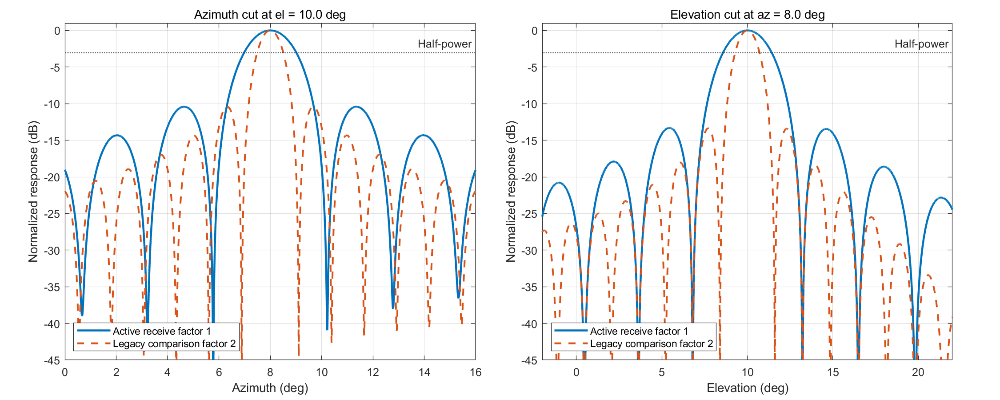

# 圆柱阵顺序数字波束形成后局部未分辨目标簇测角：接收单程模型修订稿

> **版本：v0.19 Step12.5 阶段 7 修订，2026-07-18**
> **活跃空间相位：`phase_factor=1`**  
> **证据状态：v0.18/Step11 的圆柱阵数值结果由 `phase_factor=2` 产生，已失效并冻结为 legacy，不构成本稿结论。**  
> **完成状态：本稿已完成接收模型、真实先俯仰后方位 DBF、稳定白化/SVD-DML 数值后端，以及 oracle-Q/Kq、统一注册局部角域下的俯仰组恢复、条件方位 DML、原始完整顺序观测上的经典坐标联合修正和等域基线比较。阶段 5 通过技术门与 Pareto 方案 1；所有有噪声输出仍为 `NOT_CALIBRATED_STAGE5`。阶段 6 在固定物理顺序测量和有效子空间白化下完成近双目标局部几何的确定性验证，理论状态为 `THEORY_SUPPORTED_AS_SCENARIO_SPECIFIC_COROLLARY`，冻结 bundle hash 为 `0c1f444603398e03865043af4e4c6e4a414dd15a3cc90e0539b19c56e990c839`。阶段 7 完整枚举冻结 5x5 父池的 961 个矩形子集；唯一通过 FIM 门的 `EXACT_ETA_080` 与最强固定 `FIXED_RECT_3X5` 完全相同，有限样本 Pareto 为 0/3，故定位为 `PASS_SYSTEM_ANALYSIS_ONLY`。K1/K2 模型阶数 bootstrap、自动 Q/K、K=3、cache 与硬件映射均未完成，阶段 8 未获授权。**

## 版本说明与术语账本

v0.19 是从物理模型重新起步的修订源稿，不继承 v0.18 的波束宽度、W/B 选择、搜索网格、成功率、RMSE、候选数或运行时间结论。旧正文和结果继续保存在 v0.18 与 Step11 目录中用于审计，但不得作为本稿的新证据。后续章节只有在相应阶段测试通过后才能由“计划”改写为“方法”或“结果”。

| 规范术语 | 本稿含义 | 不再使用的含混表述 |
|---|---|---|
| 阵元数字接收链路 | 射频接收、下变频、ADC、数字下变频和脉压，输出阵元复数据 | 用一个词同时指硬件、检测和测角 |
| 常规顺序 DBF 与检测处理 | 俯仰/方位数字波束形成、MTD、CFAR 和常规测角 | 人工提供局部窗口的未定义模块 |
| 局部未分辨目标簇超分辨测角 | 对同一距离–多普勒单元和局部角分辨单元进行 K1/K2 与精细二维角估计 | 无系统位置定义的精估计模块 |
| 常规测角置信域 | 由常规测角估计及其误差统计形成的局部角域 | 固定且来源不明的人工窗口 |
| 常规波束角分辨单元 | 由检测波束及相邻波束边界形成的局部角域 | 被误写成硬件直接输出的窗口 |
| 接收阵列单程空间相位 | `phase_factor=1` 的接收流形 | 将目标距离双程公共相位再次乘入空间流形 |
| legacy evidence | v0.18/Step11 的 factor=2 源码配置和结果 | 可直接迁移到 v0.19 的性能证据 |
| 注册局部 full reference | 预先固定的局部角网格及其全部 Q1/Q2 候选 | 自动目标分组或连续域全局搜索 |
| 注册模型确定性认证 | oracle-Q、无噪声/精确结构证据和有限注册候选库下的认证 | 统计置信、后验概率或连续域全局唯一性 |
| 未校准结构支持 | 有噪声注册模型返回候选但未完成统计校准 | 已完成目标数或分辨概率校准 |
| 评分/恢复双坐标 | 行列白化评分坐标与保留物理环向列的恢复坐标 | 将右白化列直接解释为物理方位列 |
| exact rectangular subset | 冻结 5x5 父池内 961 个非空 `I_e x I_a` 矩形之一 | 任意 25 通道组合或一般全局最优 |
| FIM gate | design、validation 与冻结 FIM holdout 的 eta 约束同时成立 | 只在 design 上通过 |
| system-design analysis only | 技术实现有效但未超过最强固定矩形，不保留算法贡献 | 贡献通过或允许进入下一阶段 |

# 中文摘要

圆柱阵同时具有环向孔径和垂直孔径，适合三维测角，但局部近邻目标的接收流形同时依赖方位、俯仰和阵元几何。本文修订稿面向常规顺序数字波束形成与检测之后的局部未分辨目标簇，重新定义接收阵列空间相位和后续研究边界。对于只建模接收阵列的远场窄带系统，目标距离引起的单站双程相位对接收阵元近似为公共项，应吸收到目标复包络；接收空间导向矢量因而固定采用 `phase_factor=1`。

当前阶段实现了不接受相位因子参数的单程圆柱阵导向函数及其相对于弧度方位角、俯仰角的解析导数。基于 10 GHz、192×32 圆柱阵及 65×32 工作子阵的确定性验证表明，导向函数与逐元素公式的最大误差为 0；9 个方位/俯仰中心上的方位和俯仰导数最大相对误差分别为 $1.020\times10^{-9}$ 和 $1.476\times10^{-9}$。在均匀加权单目标切面中，factor=1 的方位和俯仰 3 dB 波束宽度分别为 $2.0275^\circ$ 和 $2.8378^\circ$，约为隔离 factor=2 历史对照的 2 倍。

在此基础上，本稿建立了显式阵元 permutation、逐方位列俯仰 DBF、逐俯仰通道条件方位 DBF 及其等效 Kronecker 波束矩阵。随机复数据、factor=1 单目标和双目标快拍的逐级输出与等效矩阵输出相对误差均低于 $2\times10^{-15}$；20,000 个阵元白噪声样本的输出协方差相对 $W_{\rm seq}^{H}W_{\rm seq}$ 的误差为 0.02195。进一步建立的有效子空间白化器返回 $\operatorname{rank}(C)\times B$ 坐标；rank-deficient 协方差案例的白化误差为 $8.306\times10^{-16}$。良态 SVD-DML 与 `pinv` 参考的最大相对误差为 $1.681\times10^{-15}$，流形整体缩放 $10^{-8}/1/10^8$ 时评分相对展宽为 $5.937\times10^{-16}$。阶段 4 对指定的 matrix-normal 可分协方差分别构造波束行白化器和环向列白化器，并将 DML 评分坐标与物理恢复坐标分离；白化单元测试最大行/列误差为 $1.059\times10^{-15}$ 和 $1.136\times10^{-15}$，小型显式 Kronecker 对照的数据、评分和 RSS 相对误差分别为 $1.199\times10^{-16}$、0 和 0。在 oracle-Q、注册局部网格下，9 个 factor=1 物理场景和 1 个结构反例通过全部验收；7 个无噪声主场景获得注册模型确定性认证，2 个有噪声主场景只返回未校准结构支持。满足 $N_\phi=8>Q=2$ 但 $\operatorname{rank}(C_e)=1$ 的反例返回 `ESTIMATE_NOT_RUN_STRUCTURAL_RANK_FAILURE` 与 `GROUP_MMV_RANK_UNCERTIFIED`。该反例只否定当前注册 Q 组 MMV 分组/恢复链的结构认证，不构成一般物理不可辨识证明。同俯仰 Q1/K2 场景的组内叠加恢复相对误差为 $3.891\times10^{-15}$。

阶段 5 进一步以稳定 SVD 传播完整组恢复噪声 $R_{\rm group}=G_e^\dagger(G_e^\dagger)^H$，在固定俯仰条件下构造含 $\cos\eta$ 的环向流形，并回到原始阵元数据、真实 $W_{\rm seq}$ 和固定完整白化器执行经典坐标修正。条件流形公式、弧度导数和白化 Monte Carlo 误差分别为 $3.606\times10^{-15}$、$5.618\times10^{-10}$ 和 $4.862\times10^{-3}$；完整顺序流形误差为 0，确定性主链相对局部 full-grid reference 的归一化 score gap 为 $8.106\times10^{-16}$，单调违规为 0。两个核心有噪声场景对每种方法各使用 200 个配对 realization。正常 holdout 中主链成功率为 1.000（Wilson 95% 区间 $[0.9816,1]$），stress holdout 为 0.180（$[0.1373,0.2324]$）。在全部 455 个 holdout 配对中，主链与两初值直接 AP 的成功率差及 95% 配对重采样区间均为 0，而端到端 score calls 平均减少 44.95%；相对 local full reference 减少 74.95%。该结果支持一种工程初始化和数据组织收益，不构成条件 DML、AP、坐标上升或 SVD 投影的新颖性主张。相干且弱的核心 stress 场景中，主链、直接 AP 和 local full 均为 0/200，是保留的失败边界；PR-DML 与 Kim 2012 的精确复现仍不可用。Q/Kq 仍由 oracle 给定，所有噪声结果未完成模型阶数或置信校准。

阶段 6 固定 $W_{\rm seq}$、$C_{\rm seq}=W_{\rm seq}^{H}R_nW_{\rm seq}$、有效子空间白化器 $T_{\rm seq}$ 和白化秩，只令候选角改变接收流形 $g(\phi,\theta)=T_{\rm seq}W_{\rm seq}^{H}a_{\rm receive}(\phi,\theta)$。在 4 个主测量配置、9 个中心、4 个固定弧度方向和 9 级分离尺度组成的 1296 个预注册 case 中，第二奇异值、归一化相关性和列归一化 Gram 条件数三条渐近式的注册尾区最大 ratio 误差分别为 $4.010\times10^{-6}$、$1.042\times10^{-5}$ 和 $6.118\times10^{-6}$。一、二、三阶导数最大相对误差分别为 $5.890\times10^{-9}$、$3.212\times10^{-5}$ 和 $6.583\times10^{-4}$；未饱和两列 Gram 精确恒等式和三类几何不变性的最大误差分别为 $1.398\times10^{-12}$ 和 $9.434\times10^{-13}$。解析 synthetic exact-null fixture 的拟合阶数为 6，六阶 ratio 最大误差为 $2.220\times10^{-16}$。四个主物理配置均未出现 exact tangent null；单通道配置只记为测量完全塌缩。该结果是确定性流形几何验证，不提供统计置信区间，也不证明低 SNR、强相干或有限快拍下的双目标可分辨性。

阶段 7 在由 25 个 factor=1 顺序输出构成的冻结 5x5 父池上，完整评估了 961 个非空矩形子集以及 640/288/256 个 design/validation/FIM-holdout 场景。完整父池的最坏 design 信息保真率为 0.823237。`eta0=0.80` 的最小 exact 子集为中心 3 个俯仰波束与全部 5 个方位波束，其 design、validation 和 FIM-holdout 保真率分别为 0.812182、0.854926 和 0.816395，MAC 为 7215，较完整父池低 40%。但该子集与最强固定 3x5 矩形完全相同；在 29 个 oracle-K 有限样本场景、每场景 200 次配对 realization 上，两者指标逐项一致，有限样本 Pareto 门为 0/3。相干弱目标 stress 场景中完整父池、exact 子集和最强固定矩形均为 0/200。该结果只支持相关顺序波束的系统设计分析，不支持新的波束选择算法贡献；本阶段未执行模型阶数、bootstrap 或 resolved/unresolved 指标。

**关键词：** 圆柱阵；接收阵列；单程空间相位；顺序数字波束形成；Fisher 信息；波束子集选择；局部未分辨目标；方向估计

# Abstract

Cylindrical arrays provide both circumferential and vertical apertures for three-dimensional direction finding, but their receive manifolds jointly depend on azimuth, elevation and element geometry. This revision defines the receive-array model and the scope of a future local super-resolution estimator operating after conventional sequential digital beamforming and detection. In a far-field narrowband receive-array model, the monostatic round-trip range phase is approximately common to all receive elements and is absorbed into the complex source envelope. The receive spatial manifold therefore uses `phase_factor=1`.

We implemented a six-input receive-only cylindrical steering function and analytic derivatives with respect to azimuth and elevation in radians. Deterministic validation for a 10 GHz, 192-by-32 cylindrical array with a 65-by-32 work subarray produced zero elementwise formula error. Across nine azimuth/elevation centers, the maximum relative derivative errors were $1.020\times10^{-9}$ for azimuth and $1.476\times10^{-9}$ for elevation. Under uniform weighting, the factor-1 azimuth and elevation 3 dB beamwidths were $2.0275^\circ$ and $2.8378^\circ$, approximately twice those of an isolated factor-2 legacy comparison.

We further implemented the explicit element permutation, column-preserving elevation DBF, elevation-conditioned azimuth DBF, and the equivalent Kronecker beam matrix. For random complex data and factor-1 single- and two-target snapshots, staged and equivalent-matrix outputs agreed to relative errors below $2\times10^{-15}$. The stable backend and phase-4 grouped model use effective-subspace whitening, economy-SVD projection, separate matrix-normal row/column whitening, and distinct score and physical-recovery coordinates. The maximum row and column whitening errors were $1.059\times10^{-15}$ and $1.136\times10^{-15}$, and all nine factor-1 physical cases plus one structural counterexample passed under oracle $Q$.

Phase 5 propagated the full correlated recovery-noise matrix, formed an elevation-conditioned circumferential manifold containing the required $\cos\eta$ dependence, and returned to the original element snapshots, true $W_{\rm seq}$, and fixed full whitener for classical coordinate correction. Conditional-manifold formula, derivative, and Monte Carlo whitening errors were $3.606\times10^{-15}$, $5.618\times10^{-10}$, and $4.862\times10^{-3}$, respectively. The full sequential manifold error was zero; the deterministic grouped chain had a normalized score gap of $8.106\times10^{-16}$ to the local full-grid reference and no monotonicity violations. Each of two core noisy scenarios used 200 paired realizations per method. Main-chain success was 1.000 on the normal holdout (Wilson 95% interval $[0.9816,1]$) and 0.180 on the stress holdout ($[0.1373,0.2324]$). Across 455 holdout pairs, the main and two-start direct alternating-projection baseline had identical success, with a paired 95% difference interval of $[0,0]$, while the main chain used 44.95% fewer end-to-end score calls; it used 74.95% fewer calls than the local full-grid reference. This evidence supports an engineering initialization and data-organization benefit, not novelty of conditional DML, alternating projection, coordinate ascent, or SVD projection. The coherent weak-target core stress case failed for the main, direct, and local-full methods alike (0/200). Exact PR-DML and Kim-2012 reproductions remain unavailable, $Q/K_q$ are oracle inputs, and all noisy outputs remain uncalibrated for model order or confidence.

Phase 6 fixed $W_{\rm seq}$, $C_{\rm seq}$, the effective-subspace whitener $T_{\rm seq}$ and whitening rank while varying only the receive-manifold angle. Across 1,296 preregistered cases formed by four primary measurement configurations, nine centers, four fixed directions in radian coordinates and nine separation scales, the maximum registered-tail ratio errors for the second singular value, normalized-coherence deficit and normalized-Gram condition were $4.010\times10^{-6}$, $1.042\times10^{-5}$ and $6.118\times10^{-6}$, respectively. The maximum first-, second- and third-derivative relative errors were $5.890\times10^{-9}$, $3.212\times10^{-5}$ and $6.583\times10^{-4}$. An analytic exact-null fixture yielded a fitted order of six and a maximum sixth-order ratio error of $2.220\times10^{-16}$. No exact tangent null occurred in the four primary physical configurations; the single-channel case was retained only as an exact measurement collapse. These deterministic results support a scenario-specific corollary of classical projected-FIM/manifold geometry, not finite-sample resolution or a new Fisher-information theory. The evidence was independently reproduced and frozen in a deterministic bundle with hash `0c1f444603398e03865043af4e4c6e4a414dd15a3cc90e0539b19c56e990c839`.

Phase 7 then evaluated all 961 nonempty rectangular subsets of a frozen factor-1 sequential 5-by-5 parent pool over 640 design, 288 validation and 256 FIM-holdout scenarios. The full-parent worst-case design retention was 0.823237. At the only feasible operating point, $\eta_0=0.80$, the minimum exact subset retained the central three elevation beams and all five azimuth beams, with design, validation and FIM-holdout retentions of 0.812182, 0.854926 and 0.816395. Its 7,215 complex MACs per sample were 40% below the full parent. However, this exact subset was identical to the strongest fixed 3-by-5 rectangle. Across 29 oracle-$K$ finite-sample scenarios with 200 paired realizations each, their metrics were identical and none of the three preregistered finite-sample Pareto operating points passed. The coherent weak-target stress case remained a common failure boundary at 0/200 for the full parent, exact subset and strongest fixed rectangle. Thus, Phase 7 supports system-design analysis rather than a new beam-selection contribution; model-order bootstrap and resolved/unresolved calibration were not performed.

**Keywords:** cylindrical array; receive manifold; one-way spatial phase; sequential digital beamforming; Fisher information; beam-subset selection; locally unresolved targets; direction finding

# 第1章 系统层级、研究问题与证据状态

## 1.1 系统层级

本文采用四层系统划分，以避免把硬件接收、常规处理和局部超分辨混为同一接口。

| 层级 | 名称 | 输入与输出 |
|---|---|---|
| 1 | 阵元数字接收链路 | 从射频接收到脉压，输出阵元复数据 |
| 2 | 常规顺序 DBF 与检测处理 | 输出距离–多普勒检测、常规波束索引、粗角度及误差描述 |
| 3 | 局部未分辨目标簇超分辨测角 | 在局部角域中判定 K1/K2 状态并估计精细二维角度 |
| 4 | 航迹与资源管理 | 数据关联、跟踪、跨 CPI 处理和波束调度 |

候选算法位于第 3 层。其输入应来自第 2 层可审计的检测与测角量，而不是人工构造且没有物理来源的固定窗口。第 1 层只描述射频、ADC 和阵元数字数据形成，不负责给出双目标搜索域。

## 1.2 局部角域的物理来源

局部角域允许有两种来源。第一种是常规测角置信域。若常规角估计为 $\widehat{\boldsymbol\xi}_c$、估计协方差为 $C_c$，则可定义

\[
\Omega_\alpha=\left\{\boldsymbol\xi:
(\boldsymbol\xi-\widehat{\boldsymbol\xi}_c)^T C_c^{-1}
(\boldsymbol\xi-\widehat{\boldsymbol\xi}_c)
\le \chi^2_{2,1-\alpha}\right\}.
\]

第二种是常规波束角分辨单元。它可由检测波束的相邻交点、3 dB 边界或经独立数据估计的常规测角误差区域近似。两种定义都必须把覆盖率、边界命中和出域情形作为显式测试对象。

## 1.3 研究问题

当多个近邻目标落入同一距离–多普勒单元和常规角分辨单元时，单目标波束峰值或比幅测角可能表现为合并响应。候选研究问题是：在保留实际顺序 DBF 复数输出、相关噪声和完整圆柱阵接收流形的条件下，能否以受控计算预算完成 K1/K2 判定与局部二维精估计，并对不可分辨状态作出校准输出。

该问题不覆盖全空域盲搜、任意多目标、宽带近场、未知互耦、未经校准的阵列误差或完整跟踪闭环。主范围固定为 $K\in\{1,2\}$；$K=3$ 只允许在主链全部通过后作为可选有限扩展。

## 1.4 当前完成状态

当前已完成接收模型、严格顺序 DBF、稳定数值后端、oracle-Q 俯仰组恢复、oracle-Kq 条件方位、固定完整顺序流形联合修正、近双目标确定性渐近验证，以及相关顺序波束的 exact rectangular-subset FIM 系统分析。阶段 5 使用互斥 DESIGN、VALIDATION、NORMAL_HOLDOUT 和 STRESS_HOLDOUT，固定角域、网格、迭代与匹配规则后运行 455 个 holdout 配对，并通过技术门与 Pareto 方案 1。阶段 6 的 1296 个预注册 secant case 和 144 个注册尾区全部保留并通过。阶段 7 完整枚举 961 个矩形子集；唯一 FIM-qualified exact 子集与最强固定矩形相同，有限样本 Pareto 为 0/3，故该部分只保留为系统设计分析。有噪声输出仍未完成模型阶数或置信校准。以下内容尚未形成可引用结果：

- K1/K2 bootstrap 及 resolved/unresolved 校准；
- 自动 Q/K、K=3、持久 cache 与硬件映射。

# 第2章 接收单程圆柱阵模型

## 2.1 圆柱阵几何

圆柱阵第 $m$ 个环向位置、第 $n$ 个垂直阵元的位置向量为

\[
\mathbf r_{m,n}=
\begin{bmatrix}
R\cos\psi_m & R\sin\psi_m & z_n
\end{bmatrix}^{T}.
\]

方位角 $\phi$ 和俯仰角 $\theta$ 的方向单位矢量定义为

\[
\mathbf u(\phi,\theta)=
\begin{bmatrix}
\cos\theta\cos\phi &
\cos\theta\sin\phi &
\sin\theta
\end{bmatrix}^{T},
\qquad k_0=\frac{2\pi}{\lambda}.
\]

外部配置和结果表中的角度使用 degree；解析导数、局部渐近式和 Fisher 信息内部统一使用 radian。

## 2.2 接收阵列空间相位

只考虑接收阵列时，单阵元导向项为

\[
\boxed{
a_{m,n}(\phi,\theta)
=\exp\left(jk_0\mathbf r_{m,n}^{T}\mathbf u(\phi,\theta)\right)
},
\qquad \eta_{\mathrm{phase}}=1.
\]

目标距离 $R_k$ 对应的单站双程传播相位为

\[
\exp\left(-j\frac{4\pi R_k}{\lambda}\right).
\]

在远场窄带接收模型中，该项对所有接收阵元近似相同，因此吸收到目标复包络 $s_{k,l}$ 中。本文不显式研究发射阵列流形，不能把该公共距离相位再次乘入接收空间导向矢量。

## 2.3 阵元域模型

令 $M=N_\phi N_z$，第 $l$ 个快拍满足

\[
\mathbf y_l=A(\Theta)\mathbf s_l+\mathbf n_l,
\qquad
A(\Theta)=[\mathbf a(\phi_1,\theta_1),\ldots,\mathbf a(\phi_K,\theta_K)].
\]

堆叠 $L$ 个快拍后有

\[
Y=A(\Theta)S+N.
\]

阵元白噪声只作为基础对照，$\mathbf n_l\sim\mathcal{CN}(0,\sigma^2I)$。一般相关噪声应写为 $\mathbf n_l\sim\mathcal{CN}(0,R_n)$，并在选取物理波束子集后重新构造对应协方差和白化器。

## 2.4 相对于弧度角的解析导数

令

\[
\frac{\partial\mathbf u}{\partial\phi}=
\begin{bmatrix}
-\cos\theta\sin\phi & \cos\theta\cos\phi & 0
\end{bmatrix}^{T},
\]

\[
\frac{\partial\mathbf u}{\partial\theta}=
\begin{bmatrix}
-\sin\theta\cos\phi & -\sin\theta\sin\phi & \cos\theta
\end{bmatrix}^{T}.
\]

则

\[
\frac{\partial a_{m,n}}{\partial\phi}
=jk_0\mathbf r_{m,n}^{T}\frac{\partial\mathbf u}{\partial\phi}a_{m,n},
\qquad
\frac{\partial a_{m,n}}{\partial\theta}
=jk_0\mathbf r_{m,n}^{T}\frac{\partial\mathbf u}{\partial\theta}a_{m,n}.
\]

两个导数均相对于 radian。实现接口中的输入仍为 degree，函数内部只在构造解析导数时转换为 radian。

## 2.5 条件可分解结构及边界

阵元内积可展开为

\[
\mathbf r_{m,n}^{T}\mathbf u(\phi,\theta)
=R\cos\theta\cos(\phi-\psi_m)+z_n\sin\theta.
\]

因此接收导向项可写成环向因子与垂直因子的乘积，但环向因子仍依赖俯仰角。阶段 2 已验证该条件分解在统一阵元顺序下与完整 factor=1 几何流形等价；这不等于方位/俯仰完全解耦，也不证明分组 DML 可辨识。

## 2.6 阵元张量与显式排列

`arr_cyl` 的工作子阵坐标矩阵形状为 $[N_{az},N_{el}]$，旧向量由 `XAct(:)` 形成，因而方位索引变化最快。顺序 DBF 的 canonical 张量固定为

\[
Y_{\rm elem}\in\mathbb C^{N_{el}\times N_{az}\times N_r\times L},
\]

其向量化顺序为俯仰索引最快、方位索引次之。实现从 `array_meta.XAct` 推导 permutation，并提供严格逆映射；随机复向量和多维复张量的 roundtrip、permutation 及坐标映射误差均为 0。

## 2.7 真实先俯仰后方位 DBF 模型

令俯仰波束矩阵 $V=[v_1,\ldots,v_{B_e}]\in\mathbb C^{N_{el}\times B_e}$。第一级只沿俯仰维计算

\[
Z_{el}=V^H Y_{\rm elem},
\qquad
Z_{el}\in\mathbb C^{B_e\times N_{az}\times N_r\times L},
\]

并完整保留 $N_{az}$ 个方位列。对第 $b$ 个俯仰通道，方位权 $u_{c|b}$ 使用对应条件俯仰角 $\theta_b$，其相位包含 $\cos\theta_b$。第二级为

\[
z_{b,c}=u_{c|b}^{H}[Z_{el}]_{b,:}^{T},
\qquad
Z_{seq}\in\mathbb C^{B_e\times B_a\times N_r\times L}.
\]

canonical 阵元向量上的等效权为

\[
w_{b,c}=u_{c|b}\otimes v_b.
\]

`Wseq` 的列顺序固定为 $b$ 最快、$c$ 次之，与单个观测单元的 `Zseq(:)` 完全一致。阵元白噪声下，顺序输出理论协方差为

\[
C_{seq}=W_{seq}^{H}W_{seq}.
\]

该关系只描述顺序波束形成与噪声传播；本阶段没有执行白化或 DML。

# 第3章 严格顺序 DBF 证据与后续阶段边界

## 3.1 已验证的数据流

阶段 2 的活跃数据流为：receive-only factor=1 快拍生成、显式排列、逐方位列俯仰 DBF、逐俯仰通道条件方位 DBF，以及完整流形经 `Wseq^H` 的投影。旧 `bf_elevation`、`bf_azimuth` 与直接二维波束函数仍属于 legacy 路径；新实现不调用这些函数，也不调用逐阵元双程回波生成器。

## 3.2 等价性与噪声证据

| 验证对象 | 结果 | 阈值/判定 |
|---|---:|---:|
| 随机复阵元张量：逐级/`Wseq^H` | $1.705\times10^{-15}$ | $<10^{-12}$，通过 |
| factor=1 单目标：逐级/`Wseq^H` | $1.840\times10^{-15}$ | $<10^{-12}$，通过 |
| factor=1 双目标：逐级/`Wseq^H` | $1.609\times10^{-15}$ | $<10^{-12}$，通过 |
| 完整/条件因子化流形最大误差 | $9.353\times10^{-15}$ | $<10^{-12}$，通过 |
| 方位条件公式最大误差 | $6.707\times10^{-15}$ | $<10^{-12}$，通过 |
| 20,000 样本噪声协方差误差 | 0.02195 | $<0.04$，通过 |

白噪声协方差误差由 1,000 样本时的 0.08570 降至 5,000 样本时的 0.03868，再降至 20,000 样本时的 0.02195，符合向理论协方差收敛的预注册门。该 Monte Carlo 工程验证没有置信区间，不外推到一般有色噪声。

## 3.3 稳定白化与 DML 数值后端

对半正定波束域协方差采用有效子空间分解

\[
C=U_r\Lambda_rU_r^H,
\qquad
T=\Lambda_r^{-1/2}U_r^H,
\]

因此 $T\in\mathbb C^{r_C\times B}$ 且 $TCT^H\approx I_{r_C}$。实现不返回奇异的 $B\times B$ 坐标并把投影协方差误报为单位阵。对白化后的候选流形 $G_w=U\Sigma V^H$，评分与残差为

\[
J=\|U_r^HZ_w\|_F^2,
\qquad
RSS=\|Z_w\|_F^2-J.
\]

数值秩阈值使用 $\max(m,n)\epsilon_{\rm mach}\sigma_1$。当 $\operatorname{rank}(G_w)<K$ 时仍返回列空间评分，但状态为 `RANK_DEFICIENT`。集中复高斯方差采用最大似然分母

\[
\widehat\sigma^2=RSS/(r_CL),
\]

不进行无偏自由度修正。

| 验证对象 | 结果 | 阈值/判定 |
|---|---:|---:|
| 良态 SVD/`pinv` 最大相对误差 | $1.681\times10^{-15}$ | $<10^{-10}$，通过 |
| 良态 SVD/QR 最大相对误差 | $7.202\times10^{-16}$ | $<10^{-10}$，通过 |
| $G$ 缩放 $10^{-8}/1/10^8$ 的评分展宽 | $5.937\times10^{-16}$ | $<10^{-12}$，通过 |
| rank-deficient $C_b$ 的白化器 | $4\times5$ | 有效行数等于秩，通过 |
| rank-deficient $C_b$ 白化误差 | $8.306\times10^{-16}$ | $<10^{-12}$，通过 |
| 一般 PSD 噪声白化误差 | $2.198\times10^{-14}$ | $<10^{-12}$，通过 |
| 精确重复流形列 | 有效秩 1 | `RANK_DEFICIENT`，通过 |
| $B<K$ | 有效秩 2、请求秩 3 | `RANK_DEFICIENT`，通过 |

近秩亏、精确重复列和 $B<K$ 案例均未产生 NaN/Inf；RSS 没有出现明显负值。阶段 3 没有执行角度网格搜索、俯仰分组或模型阶数判定。SVD/QR 投影是经典数值实现，不作为独立创新主张。

## 3.4 已知 Q 的俯仰组 DML、可分白化与注册模型支持

阶段 4 使用 matrix-normal 可分噪声模型。令 $R_z$ 和 $R_\phi$ 分别为垂直行协方差与环向列协方差，固定俯仰 DBF 后构造

\[
C_{\rm row}=V^H R_zV,\qquad
R_{\phi,\rm sel}=R_\phi(\mathcal I_\phi,\mathcal I_\phi),
\]

并在各自有效子空间中满足

\[
T_{\rm row}C_{\rm row}T_{\rm row}^H=I_{r_{\rm row}},\qquad
T_{\rm col}R_{\phi,\rm sel}T_{\rm col}^H=I_{r_{\rm col}}.
\]

对每个时间 snapshot，定义 $Z_{\rm left}=T_{\rm row}Z_{\rm raw}$ 和 $Z_{\rm score}=Z_{\rm left}T_{\rm col}^H$。因此评分与恢复使用不同但固定的坐标：

\[
Z_{\rm score}^{\rm MMV}=G_e C_e^{\rm score}+N_{\rm white},
\qquad
Z_{\rm recovery}^{\rm MMV}=G_e C_e^{\rm recovery}+N_{\rm left},
\]

其中 $Z_{\rm score}^{\rm MMV}\in\mathbb C^{r_{\rm row}\times r_{\rm col}L}$ 只用于 DML 评分，$Z_{\rm recovery}^{\rm MMV}\in\mathbb C^{r_{\rm row}\times N_\phi L}$ 保留物理环向列并只用于组恢复。$G_e=T_{\rm row}V^HA_z(\boldsymbol\eta)$ 不包含右白化器；右白化只改变 nuisance coefficient 的列坐标。

Q1 使用一维注册网格，Q2 对小局部网格中的全部无序角对执行 full reference。搜索不使用俯仰间隔列表、候选截断、分数差或场景修复分支。候选期间俯仰波束、两侧协方差、两侧白化器和注册候选域保持固定。状态输出分为估计执行、注册模型结构支持和统计校准三层。`GROUP_REGISTERED_MODEL_CERTIFIED` 只用于无噪声或精确结构证据下的确定性认证；有噪声正常场景只能返回 `GROUP_REGISTERED_MODEL_SUPPORTED_UNCALIBRATED`，且统计校准状态固定为 `NOT_CALIBRATED_STAGE4`。有噪声数据的数值秩只作诊断，不参与确定性认证。

| 验证对象 | 结果 | 判定 |
|---|---:|---:|
| 行/列白化单元测试最大误差 | $1.059\times10^{-15}$ / $1.136\times10^{-15}$ | 通过 |
| separable/Kronecker data、score、RSS 误差 | $1.199\times10^{-16}$ / 0 / 0 | 通过 |
| factor=1 物理场景 | 9/9 通过 | 7 个无噪声 certified，2 个有噪声 supported uncalibrated |
| 结构支持场景无噪声真值残差最大值 | $1.158\times10^{-14}$ | 通过 |
| $10.00^\circ/10.05^\circ$ 的 $\sigma_{\min}(G_e)/\sigma_{\max}(G_e)$ | $1.413\times10^{-2}$ | 相对秩为 2，角误差 $1.776\times10^{-15}$ 度 |
| $N_\phi=8>Q=2,\operatorname{rank}(C_e)=1$ 结构反例 | `GROUP_MMV_RANK_UNCERTIFIED` | 估计不返回，当前注册 MMV 链未认证 |
| 相关行/列噪声 | 行/列误差 $7.941\times10^{-13}$ / $3.052\times10^{-15}$ | 使用 $T_{\rm row}$ 与 $T_{\rm col}$，角误差 0 |
| 同俯仰 Q1/K2 组内叠加恢复误差 | $3.891\times10^{-15}$ | 通过 |
| 最大测试私有恢复 Frobenius/chordal 误差 | $1.042\times10^{-3}$ / $1.038\times10^{-3}$ | 通过注册门 |

$L=1$ 时的 $N_\phi$ 列只称为共享俯仰流形的 MMV 系数观测，不称为独立时间快拍。结构反例说明 $N_\phi>Q$ 本身不能替代 $\operatorname{rank}(C_e)=Q$；它只否定当前注册 Q 组 MMV 分组/恢复链的结构认证，不证明所有非线性参数化方法下的物理目标均不可辨识。有限注册候选库的 exact subspace alias 检查也不是连续全局唯一性证明。Q 由 oracle 给定，真值角主要用于 grid-aligned 实现验证；本阶段不包含自动合并、统计模型阶数判定或 off-grid 超分辨结论。公共估计与恢复 API 不读取真值，Frobenius、子空间和 mixing 指标只在测试私有评价器中计算。

## 3.5 条件方位初始化与固定完整顺序流形修正

阶段 4 在行白化恢复坐标中满足 $Z_{\rm recovery}=G_eC_e+N$。令 $H_e=G_e^\dagger$，则组恢复数据为 $\widehat C_e=H_eZ_{\rm recovery}$，完整组噪声混合矩阵为

\[
R_{\rm group}=H_eH_e^H.
\]

实现通过稳定 SVD 求解 $H_e$，不构造 $(G_e^HG_e)^{-1}$。第 $q$ 组的边缘噪声尺度为 $\alpha_q=[R_{\rm group}]_{qq}$，但 $[R_{\rm group}]_{qr}$ 的组间相关项完整保留用于诊断。20,000 个 Monte Carlo 样本对联合组/环向协方差的相对误差为 $1.448\times10^{-2}$。

对恢复的物理环向组数据 $X_{\phi,q}\in\mathbb C^{N_\phi\times L}$，固定条件俯仰 $\eta_q$ 后使用

\[
[a_\phi(\phi\mid\eta_q)]_m=
\exp\left\{jk_0R\cos\eta_q\cos(\phi-\psi_m)\right\}.
\]

预注册物理波束矩阵 $U_q$、组内波束协方差和有效子空间白化器分别满足

\[
Z_{\phi,q}^{\rm raw}=U_q^HX_{\phi,q},\qquad
C_{\phi,q}=\alpha_qU_q^HR_{\phi,\rm sel}U_q,
\]

\[
T_{\phi,q}C_{\phi,q}T_{\phi,q}^H=I,qquad
G_{\phi,q}=T_{\phi,q}U_q^HA_\phi(\boldsymbol\phi\mid\eta_q).
\]

$U_q$、$T_{\phi,q}$ 和 $\eta_q$ 在一次候选搜索中固定。Kq=1 扫描全部一维注册点；Kq=2 枚举全部无序方位对，不使用候选截断、固定间隔列表或 score-gap 分支。条件流形公式误差、相对于弧度方位角的导数误差和 30,000 样本白化误差分别为 $3.606\times10^{-15}$、$5.618\times10^{-10}$ 和 $4.862\times10^{-3}$。

条件路径只产生初始化。最终修正回到原始 factor=1 阵元数据 $Y$，使用真实固定顺序波束矩阵和完整噪声白化：

\[
Z_{\rm seq}^{\rm raw}=W_{\rm seq}^HY,qquad
C_{\rm seq}=W_{\rm seq}^HR_nW_{\rm seq},
\]

\[
T_{\rm seq}C_{\rm seq}T_{\rm seq}^H=I,qquad
G_{\rm seq}(\Theta)=T_{\rm seq}W_{\rm seq}^HA_{\rm receive}(\Theta).
\]

联合更新是经典逐目标、逐方位/俯仰坐标上升，不作为新优化器主张。所有子问题使用固定候选轴；每次更新后按俯仰、再按组内方位 canonicalize。数值单调容差只由机器精度、score scale 和观测规模确定。完整顺序 staged/direct 误差为 $3.697\times10^{-15}$，5,000 样本协方差误差为 $1.490\times10^{-2}$，完整接收流形误差为 0。确定性 grid-aligned 场景中，主链与局部 full-grid reference 的归一化 score gap 为 $8.106\times10^{-16}$，单调违规为 0，标签交换后的目标集合差异为 0。

注册角域只由常规中心 $(8^\circ,10^\circ)$ 与冻结偏移构造：方位轴为 $7.4^\circ{:}0.2^\circ{:}8.6^\circ$，俯仰轴为 $9.8^\circ{:}0.2^\circ{:}10.2^\circ$。所有方法使用同一物理域；真值只在测试层标记是否在域和是否落网格。部分出域样本不扩窗，直接计入无条件失败。条件链分别验证 oracle、阶段 4 估计和六个预注册俯仰扰动；三类链均返回，当前设计案例的方位 RMSE 退化为 0，但该离散结果不等于一般误差传播定理。

| 阶段 5 证据 | 主链 | 两初值直接 AP | local full reference |
|---|---:|---:|---:|
| NORMAL_HOLDOUT 成功率，$N=205$ | 1.000 | 1.000 | 1.000 |
| NORMAL Wilson 95% 区间 | $[0.9816,1]$ | $[0.9816,1]$ | $[0.9816,1]$ |
| STRESS_HOLDOUT 成功率，$N=250$ | 0.180 | 0.180 | 0.180 |
| STRESS Wilson 95% 区间 | $[0.1373,0.2324]$ | $[0.1373,0.2324]$ | $[0.1373,0.2324]$ |
| 全 holdout 主链减直接 AP 成功率差，95% 区间 | 0，$[0,0]$ | reference | reference |
| 主链 score-call 降幅 | reference | 44.95% | 74.95% |

两个核心有噪声场景对每种方法各使用 200 个相同噪声 realization。端到端主链成本包含阶段 4 搜索、组恢复、噪声传播、条件搜索和联合修正；直接 AP 的两个预注册初值全部计费。由此满足 Pareto 方案 1：成功率差区间下界不低于 $-0.02$，score calls 降幅超过 20%。但是，相干且弱的核心 stress 场景中，主链、直接 AP 和 local full 均为 0/200；该结果是方法边界，不得用 oracle 链或删除困难样本掩盖。PR-DML 与 Kim 2012 因缺少已审计的精确复现而记为 `EXACT_REPRODUCTION_UNAVAILABLE`，没有用自定义简化版本替代。

## 3.6 固定白化顺序流形的近双目标局部渐近验证

对每个注册测量配置，固定物理顺序波束、元素噪声协方差、有效白化坐标和白化秩：

\[
g(\boldsymbol\xi)=T_{\rm seq}W_{\rm seq}^{H}a_{\rm receive}(\boldsymbol\xi),
\qquad
T(\mathbf c)=\operatorname{Re}\{J_g^H\Pi_g^\perp J_g\}.
\]

令 $\boldsymbol\xi_\pm=\mathbf c\pm r\mathbf v/2$，其中 $\|\mathbf v\|_2=1$ 且 $r$ 使用 radian。对 $q_{\mathbf v}=\mathbf v^{T}T(\mathbf c)\mathbf v>0$ 的非退化方向，验证对象为

\[
\sigma_2^2([g_-,g_+])\sim\frac12r^2q_{\mathbf v},
\]

\[
1-|\rho|^2\sim\frac{r^2q_{\mathbf v}}{\|g(\mathbf c)\|_2^2},
\qquad
\kappa(\bar G_2^H\bar G_2)\sim
\frac{4\|g(\mathbf c)\|_2^2}{r^2q_{\mathbf v}}.
\]

两列归一化 Gram 还精确满足 $\kappa=(1+|\rho|)/(1-|\rho|)$；未归一化 Gram 的条件数另受列范数不对称影响，因此没有套用等范数公式。注册 numeric floor 只用于分类是否进入 ratio 验收尾区，不作为分母修复。每个配置、中心和固定方向按最小的 3 个有效分离尺度形成注册尾区，不根据结果更换尺度或重新拟合 $1/2$、1 和 4 三个常数。

| 阶段 6 确定性证据 | 结果 | 门限 |
|---|---:|---:|
| 主物理 secant case | 1296 | 全部保留 |
| 注册尾区 | 144/144 通过 | 每组至少 3 点 |
| $\sigma_2^2$ ratio 最大误差 | $4.010\times10^{-6}$ | $\le 0.02$ |
| coherence ratio 最大误差 | $1.042\times10^{-5}$ | $\le 0.02$ |
| normalized-Gram ratio 最大误差 | $6.118\times10^{-6}$ | $\le 0.05$ |
| 未饱和精确恒等式最大误差 | $1.398\times10^{-12}$ | $\le10^{-10}$ |
| 三类不变性最大误差 | $9.434\times10^{-13}$ | $\le10^{-10}$ |
| synthetic exact-null 阶数 / ratio 误差 | 6 / $2.220\times10^{-16}$ | $|p-6|\le0.25$ / $\le0.02$ |

若 $\Pi_g^\perp g_1=0$，注册的高阶候选为

\[
\alpha=\frac{g_0^Hg_1}{g_0^Hg_0},\qquad
v_{3,\rm eff}=\Pi_g^\perp\left(\frac{g_3}{24}-\frac{\alpha g_2}{8}\right),
\]

\[
\sigma_2^2\sim\frac12r^6\|v_{3,\rm eff}\|_2^2.
\]

该六阶式在 $g(x,y)=[1,x,y^3]^T$ 的解析 fixture 上通过。四个主物理配置的 $T$ 均非退化，没有发现 exact tangent null；因此六阶式尚未获得物理流形实例验证。单通道配置只报告 `EXACT_MEASUREMENT_COLLAPSE`，不包装为高阶物理分辨结论。本节状态为 `THEORY_SUPPORTED_AS_SCENARIO_SPECIFIC_COROLLARY`，统计范围为 `DETERMINISTIC_GEOMETRIC_VALIDATION`。

## 3.7 相关顺序波束的 exact rectangular-subset FIM 系统分析

阶段 7 使用 factor=1 的先俯仰后方位 5x5 父池。俯仰中心为
$[9.2,9.6,10.0,10.4,10.8]^\circ$，方位中心为
$[6.8,7.4,8.0,8.6,9.2]^\circ$，形成 $W_0\in\mathbb C^{2080\times25}$。
主设计族是 961 个非空 $I_e\times I_a$ 矩形。对白噪声和 Stage-5
Toeplitz 相关噪声，每个物理子集均独立构造

\[
C_I=W_I^H R_n W_I,\qquad
T_I C_I T_I^H=I_{\operatorname{rank}(C_I)},
\]

并重新计算白化流形、弧度导数和消去确定性复幅度后的 effective FIM。
相对信息保真率只在阵元域 FIM 的稳定可辨识子空间上计算。冻结计划 hash
为 `e630a084e68108a1604527afe7a81db7150b045454b3f54b05e6cfd389259a3b`；
640 个 design、288 个 validation 和 256 个 FIM holdout 场景均在选择前注册。

| 指标 | `EXACT_ETA_080` | 完整 5x5 父池 |
|---|---:|---:|
| 子集 | `RECT_E14_A31`，3x5 | `RECT_E31_A31`，5x5 |
| design eta | 0.812182 | 0.823237 |
| validation eta | 0.854926 | 0.865789 |
| FIM-holdout eta | 0.816395 | 0.837110 |
| complex MAC / sample | 7215 | 12025 |
| 输出通道 | 15 | 25 |

完整父池的 design eta 上限低于 0.90，因此 `eta0=0.90/0.95` 均按注册规则
记为不可行，没有放宽阈值。`eta0=0.80` 的 exact 解相对完整父池减少 40%
MAC，但它正是预注册的最强固定 `FIXED_RECT_3X5`。Greedy 在相同成本下
返回 `RECT_E28_A31`，design eta 为 0.818362，与 exact 解不同，因而没有
被表述为穷举最优。

有限样本验证固定 Q/K/Kq 为 oracle，包含 6 个 normal、18 个 threshold、
4 个 mismatch 和 1 个 coherent-weak stress 场景，每个场景 `Nmc=200`。
在全部 5800 个注册 realization 上，`EXACT_ETA_080` 与
`FIXED_RECT_3X5` 的成功率 0.655690、错误局部峰率 0.034828 和无条件惩罚
误差 0.281384 均逐项相同。两个 threshold profile 的 `SNR_80` 分别为
7.286 dB 和 3.656 dB。M0-M3 下的成功率为 1.000、0.995、0.995 和
1.000；coherent-weak stress 下 exact、固定 3x5 和完整父池均为 0/200
（Wilson 95% 上界 0.01885）。由于相对最强固定矩形的成本降幅和配对性能
差均为 0，三个有限样本 Pareto operating point 均未通过。该结果将本节
定位为 `PASS_SYSTEM_ANALYSIS_ONLY`，而不是波束选择算法贡献。模型阶数、
bootstrap 和 resolved/unresolved 指标未在本阶段执行。

## 3.8 后续阶段的强制门

| 阶段 | 必须回答的问题 | 当前状态 |
|---|---|---|
| Step12.1 | 逐级输出是否与等效权严格一致，且保留正确噪声协方差 | 已通过 |
| 稳定 DML | SVD/QR 投影是否与参考最小二乘一致，病态候选是否可诊断 | 已通过 |
| 俯仰组 | 固定行/列白化、注册流形秩、精确 MMV 秩证据和有限候选库 exact alias 是否满足 | 已通过 oracle-Q 阶段 4 修订门 |
| 条件方位与联合修正 | 是否相对直接 AP/local full 满足性能-复杂度 Pareto 门，且坐标更新单调 | 已通过阶段 5 技术门与 Pareto 方案 1 |
| 局部渐近理论 | 固定白化条件、常数和零方向是否由公式及数值验证共同支持 | 已通过，场景化显式推论；主物理配置无 exact null |
| exact-subset FIM | 每个物理子集重构协方差后是否满足保真与 holdout 风险门 | 技术门通过；未超过最强固定矩形，系统分析限定 |
| K1/K2 | 独立 K1 holdout 是否控制 false resolved，K2 是否区分 resolved/unresolved | 阶段 7 未授权进入 |

任何一项失败都必须保留失败记录，不允许靠增加场景专用阈值、超大 topK 或人工分支掩盖。

# 第4章 Prior-art 边界与候选贡献合同

## 4.1 已有方法

集中 deterministic ML、beamspace ML、SVD/QR 正交投影、alternating projection、投影 Jacobian FIM、归一化 FIM、FIM 约束最少选择、bootstrap source enumeration 和 unresolved 判定均有直接或高度相似的既有工作[1–12]。这些对象不能单独声明为新算法。

Kim 等研究了三维 beamspace 中的双目标低角跟踪[5]；Pakrooh 等研究了压缩前后的归一化 Fisher 信息和 threshold effects[7,8]；Chepuri 与 Leus 已将最少选择与全参数域 FIM 约束结合[6]；刘旗等给出了低仰角 beamspace CRB 等价条件、波束形成器设计和 ML 验证[9]。这些工作是后续公平比较必须覆盖的直接边界。

## 4.2 保留的工程贡献与理论候选

阶段 7 后，第一项获得了受限工程证据，第二项获得了确定性场景化理论证据，第三项已完成但触发降级条件：

1. 在实际 factor=1 顺序 DBF 接口上，将可辨识俯仰组、组内多方位条件估计和固定完整流形修正组织为一条工程链；其证据是相对两初值直接 AP 保持配对成功率并减少 44.95% score calls，而不是声称条件 DML 或 AP 本身新颖；
2. 固定白化顺序二维流形上的显式近双目标局部渐近特化；非退化三式和 synthetic 六阶 exact-null 候选已通过，四个主物理配置未出现 exact null；
3. 相关物理顺序波束、exact-subset 重白化和乘积通道成本下的 FIM 最少选择系统分析；其 exact 解与最强固定 3x5 矩形相同，不能保留为算法贡献。

“尚未发现完全相同工作”不构成新颖性证明。第一、二项仍需与最近工作及失败边界共同重写；第三项只能作为负结果和系统成本边界报告，不得因 exact 枚举或相关噪声实现本身重新升级为核心贡献。

# 第5章 Step12.0 接收模型验证

## 5.1 实现与测试设置

活跃配置采用 10 GHz 载频、0.03 m 波长、192 个环向位置和 32 个垂直阵元，圆柱半径为 0.4 m，垂直间距为 17 mm。工作子阵包含 65 个环向位置和全部 32 个垂直阵元，共 2080 个阵元。单目标方向图中心为 $(az,el)=(8^\circ,10^\circ)$，使用均匀幅度权以隔离空间相位因子的影响。

新导向函数只有 `(x,y,z,az_deg,el_deg,lambda)` 六个输入，不接受 `PhaseFactor`。解析导数在 3 个方位中心 $[-40^\circ,8^\circ,55^\circ]$ 和 3 个俯仰中心 $[-5^\circ,20^\circ,50^\circ]$ 的笛卡尔组合上验证，共 9 个中心。中心有限差分步长为 $10^{-6}$ rad，验收阈值为相对误差不超过 $10^{-6}$。

factor=2 只在测试文件的局部历史对照公式中出现。它不调用新公共函数，不进入活跃配置，也不构成可复用模型。

## 5.2 公式与导数结果

| 指标 | 结果 | 验收 |
|---|---:|---:|
| 逐元素公式案例数 | 9 | 通过 |
| 最大逐元素绝对误差 | 0 | 通过 |
| 方位导数最大相对误差 | $1.0198\times10^{-9}$ | 通过 |
| 俯仰导数最大相对误差 | $1.4759\times10^{-9}$ | 通过 |

解析导数误差比预设 $10^{-6}$ 门限低约三个数量级。该结果支持公式与实现的一致性，不构成估计精度或统计有效性证据。

## 5.3 单目标方向图和 3 dB 波束宽度



| 模型角色 | 切面 | 3 dB 宽度 | 峰值偏移 |
|---|---|---:|---:|
| active factor=1 | 方位 | $2.027503^\circ$ | $0^\circ$ |
| active factor=1 | 俯仰 | $2.837839^\circ$ | $0^\circ$ |
| legacy factor=2 comparison | 方位 | $1.013714^\circ$ | $0^\circ$ |
| legacy factor=2 comparison | 俯仰 | $1.418815^\circ$ | $0^\circ$ |

factor1/factor2 的方位和俯仰宽度比分别为 2.000075 和 2.000147。结果与相位梯度减半后主瓣约加宽一倍的局部预期一致。该对比只用于说明为什么 v0.18 的波束宽度、网格和后续统计量必须重算。

## 5.4 可复现文件

阶段 1 的源代码、CSV、验证报告和方向图位于：

```text
beamspace_ml_v18/source/stepwise_signal_model/steps/
  step_12_0_receive_model_correction/
```

关键结果源为 `phase_model_keypoints.csv`、`old_vs_new_beamwidth.csv`、`derivative_validation.csv` 和 `receive_model_validation.md`。所有活跃结果 metadata 均为 `phase_factor=1`。

# 第6章 新证据计划与旧结果隔离

## 6.1 v0.18/Step11 结果边界

v0.18/Step11 的圆柱阵实验按 factor=2 生成。factor 从 2 改为 1 会改变空间相位梯度、波束宽度、候选网格、局部 Fisher 信息、W/B 选择和有限样本性能。因此旧图、旧表和旧 CSV 只能用于追溯原开发过程，不能在 v0.19 中作为性能、复杂度或创新性结论。

本稿不报告旧 success、RMSE、候选数、cache 或 runtime 数值。后续每个阶段必须写入新的 factor=1 metadata，并使用互斥的 design、validation 和 holdout 划分。

## 6.2 后续实验合同

| 证据层 | 最低要求 | 禁止替代物 |
|---|---|---|
| 顺序数据流 | direct/sequential/equivalent 无噪声等价和噪声协方差验证 | 旧直接二维波束演示 |
| 稳定评分 | SVD/QR、rank/status、病态和零矩阵测试 | 固定 `1e-10` 岭或 2×2 Gram 除法 |
| 注册模型支持 | 行/列白化、`rank(Ge)`、精确 MMV 秩证据、有限候选库 exact alias 和三层状态 | 把有噪声数值秩当作统计认证，或把环向列当独立时间快拍 |
| 算法性能 | 同输入、同通道、同计算预算 baseline | 不等预算或使用真值的比较 |
| 理论 | 固定白化解析式、有限差分和零方向验证 | 经验拟合常数 |
| FIM 设计 | 每个子集重构协方差、白化器和 FIM | 假设逐束 FIM 可加 |
| K1/K2 | 独立 K1 false-resolved 校准和 K2 resolved/unresolved 报告 | 在 holdout 调参 |

阶段 7 已满足 FIM 设计层的重构合同，但没有满足相对最强固定矩形的贡献门。该负结果不改变 K1/K2 合同，也不授权提前执行其 calibration。

# 第7章 当前结论、限制与下一步

## 7.1 当前结论

当前已依次验证 factor=1 接收圆柱阵流形及弧度解析导数、真实先俯仰后方位 DBF 数据流、有效子空间白化和稳定 SVD-DML 数值评分。阶段 4 在 oracle-Q 注册局部网格下验证了 matrix-normal 行/列白化、评分/恢复双坐标、俯仰组 DML、注册模型支持诊断和物理环向组恢复；$\operatorname{rank}(C_e)<Q$ 反例正确停止当前注册 MMV 链。阶段 5 在 oracle-Kq 和统一注册物理域内验证了完整组噪声传播、含 $\cos\eta$ 的条件方位流形、固定完整顺序观测上的经典联合修正，以及主链、两初值直接 AP、局部 full-grid reference 和常规 DBF 的同数据比较。技术测试、351 个 Step11 冻结结果哈希和 Pareto 方案 1 均通过。正常 holdout 主链成功率为 1.000，stress holdout 为 0.180；全 holdout 相对直接 AP 的成功率差区间为 $[0,0]$，score calls 减少 44.95%。阶段 6 的固定测量合同、导数、投影几何、精确恒等式、144 个非退化尾区和 synthetic exact-null 六阶式全部通过；理论状态为场景化显式推论。旧 factor=2 数值未迁移。

阶段 7 在冻结计划下完成 961/961 个矩形子集、1184 个 FIM 场景和 29x200 个 oracle-K 有限样本场景。`eta0=0.80` 是唯一通过 design/validation/FIM-holdout 的 operating point，但 exact 解等于最强固定 3x5 矩形，有限样本 Pareto 为 0/3。因而阶段 7 只保留为相关顺序波束的系统设计分析，不构成第三项算法贡献。

## 7.2 当前限制

Q、K 和 Kq 在相应验证阶段仍由 oracle 给定；Wilson 区间和配对性能统计只描述固定方法的有限样本性能，不是目标数、置信或 posterior 校准。有限注册候选库的 exact alias 和阶段 7 的 exact enumeration 都不是连续参数域或任意波束族的一般全局最优证明。相关噪声证据只覆盖注册协方差模型，给定协方差的数值白化也不代表已解决协方差估计。相干弱目标核心 stress 场景仍是共同失败边界。阶段 6 是无随机噪声性能含义的确定性流形验证；主物理配置没有 exact tangent null，六阶式仅由解析 fixture 支持。阶段 7 的完整父池 design eta 上限为 0.823237，且唯一可行 exact 解没有超过最强固定矩形；FIM 保真也不等于有限样本成功。PR-DML、Kim 2012 和刘旗 2026 的精确同条件复现仍不可用。模型阶数 bootstrap、自动 Q/K、K=3、持久 cache 与硬件映射尚未实现。

## 7.3 阶段门

阶段 5 的技术门和 Pareto 方案 1 已通过，第一项贡献可保留为“俯仰组初始化、同组条件方位处理与固定完整顺序流形修正的工程组织和效果”，不能改名为新 DML 或新 AP。阶段 6 的固定测量合同、非退化三式、prior-art 边界和 null 分类均通过，第二项只能保留为经典投影 FIM/流形几何在当前固定顺序 DBF 场景中的显式推论。阶段 7 的技术门通过，但有限样本 Pareto 0/3，第三项降级为系统设计分析。阶段 8 未获技术授权；本稿停在阶段 7，不执行 K1/K2 模型阶数校准、自动 Q、K=3、cache 或硬件映射。

# 参考文献

[1] Ziskind I, Wax M. Maximum likelihood localization of multiple sources by alternating projection. IEEE Transactions on Acoustics, Speech, and Signal Processing, 1988, 36(10): 1553–1560. DOI: 10.1109/29.7543.

[2] Stoica P, Nehorai A. MUSIC, maximum likelihood, and Cramer-Rao bound. IEEE Transactions on Acoustics, Speech, and Signal Processing, 1989, 37(5): 720–741. DOI: 10.1109/29.17564.

[3] Stoica P, Sharman K C. Maximum likelihood methods for direction-of-arrival estimation. IEEE Transactions on Acoustics, Speech, and Signal Processing, 1990, 38(7): 1132–1143. DOI: 10.1109/29.57542.

[4] Zoltowski M D, Lee T S. Maximum likelihood based sensor array signal processing in the beamspace domain for low angle radar tracking. IEEE Transactions on Signal Processing, 1991, 39(3): 656–671. DOI: 10.1109/78.80885.

[5] Kim, Yang and Kwak. Low-angle tracking of two objects in a three-dimensional beamspace domain. IET Radar, Sonar & Navigation, 2012. DOI: 10.1049/IET-RSN.2010.0163.

[6] Chepuri S P, Leus G. Sparsity-promoting sensor selection for non-linear measurement models. IEEE Transactions on Signal Processing, 2014. arXiv: 1310.5251.

[7] Pakrooh P, et al. Analysis of Fisher information and the Cramer-Rao bound for nonlinear parameter estimation after compressed sensing. IEEE Transactions on Signal Processing, 2015. DOI: 10.1109/TSP.2015.2464183.

[8] Pakrooh P, Scharf L L, Pezeshki A. Threshold effects in parameter estimation from compressed data. IEEE Transactions on Signal Processing, 2016. DOI: 10.1109/TSP.2016.2521617.

[9] 刘旗, 郭瑞, 王佳佳, 等. 低仰角目标高精度波束空间 DOA 估计方法. 雷达学报, 2026. DOI: 10.12000/JR25173.

[10] A source enumeration method based on subspace orthogonality and bootstrap technique. Signal Processing, 2013. DOI: 10.1016/j.sigpro.2012.11.007.

[11] Self S G, Liang K-Y. Asymptotic properties of maximum likelihood estimators and likelihood ratio tests under nonstandard conditions. Journal of the American Statistical Association, 1987. DOI: 10.1080/01621459.1987.10478472.

[12] Golub G H, Van Loan C F. Matrix Computations. 4th ed. Johns Hopkins University Press, 2013.
