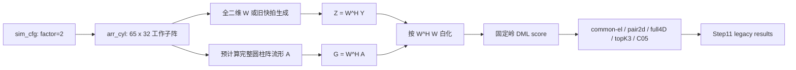
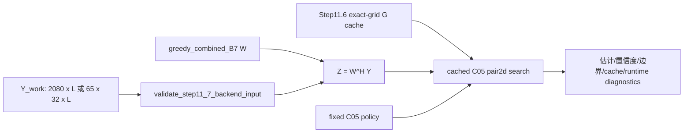
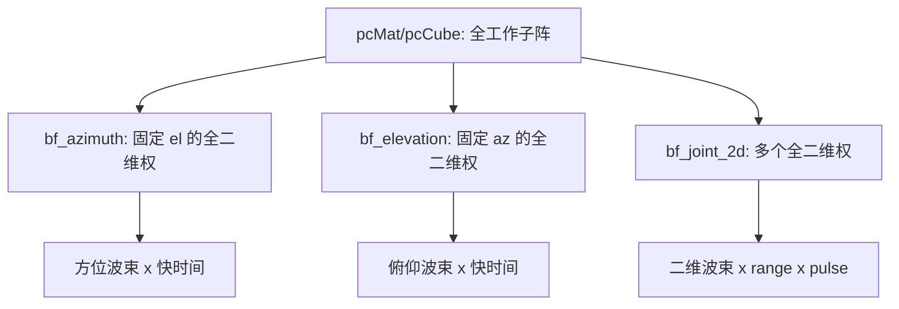

# Step12 预实现盘点与旧证据冻结

> 阶段：0（仓库重新盘点和旧证据冻结）  
> 盘点日期：2026-07-17（Asia/Shanghai）  
> 状态：阶段 0 技术验收通过；本文件完成后停止，不自动执行阶段 1。  
> 规则：本文件只做定位、映射、冻结和风险登记，不修改算法，不重跑大规模实验，不改写旧 CSV、MAT、PNG 或论文结论。

## 1. 本阶段结论与冻结边界

1. Step12 的权威 MATLAB 根目录是 `beamspace_ml_v18/source/stepwise_signal_model`。`code/thesis_mainline_beamspace_ml` 是不含完整旧证据的精简副本，且存在 10 个同路径不同内容文件，两个根目录不得混用。
2. 当前圆柱阵 Step11 活跃配置为 `cfg.beam.spatialPhaseFactor = 2`。所有已检查且带 `phase_factor` 字段的圆柱阵 Step11 trial/metadata CSV 均为 2；Step11.5 运行器继承同一配置。因此全部现有圆柱阵 Step11 数值结果只冻结为 **legacy factor=2 evidence**，不得作为 Step12 的 factor=1 新证据。
3. 当前 `bf_elevation.m`、`bf_azimuth.m` 都从完整工作子阵的扁平阵元向量直接形成全孔径二维权并求和，二者互不调用；`bf_joint_2d.m`/`bf_joint_2d_step5.m` 直接构造完整二维波束。它们均未实现“先俯仰 DBF、保留方位列，再按俯仰组执行条件方位 DBF”的真实级联数据流。
4. 当前旧 DML 路径用固定 `1e-10` 岭和 `G'G` 逆式构造投影，旧白化路径用固定 `1e-10` 特征值截断。它们可用于复现 Step11，但不能直接成为 Step12 稳定 SVD/QR DML 的实现。
5. Step11.1--11.7 共冻结 351 个结果文件、117,091,926 bytes。`beamspace_ml_v18/FILE_SHA256.csv` 的 709 项全包清单已逐项复核：缺失 0、大小错误 0、哈希错误 0、额外文件 0。
6. 本阶段没有产生 MATLAB 分数调用、SVD/QR、multi-start 或新实验结果；唯一新增文件是本 inventory。

## 2. Git、仓库根和工作树基线

| 项目 | 冻结值 |
|---|---|
| 仓库根 | `E:/bs_innovation` |
| 远端 | `origin = https://github.com/makabaka165/bs_innovation.git` |
| 远端默认分支 | `main`（由 `git ls-remote --symref origin HEAD` 核实） |
| 当前分支 | `main`，跟踪 `origin/main` |
| 当前 commit | `bd22f61ab5cd4e07eee2b9c96b9a304e8ddafe59` |
| 阶段 0 开始前已修改 | `innovation-mining/11_sequential_beamspace_ml_innovations_theory.md`；`innovation-mining/12_experiment_system_code_structure_roadmap.md` |
| 阶段 0 开始前未跟踪 | `innovation-mining/13_next_step_execution_prompts.md` |
| 阶段 0 新增 | `innovation-mining/14_step12_preimplementation_inventory.md` |

上述 11、12、13 的工作树状态属于阶段 0 开始前的用户基线。本阶段不回退、不覆盖，也不把它们纳入“本阶段修改”。未提交、未推送、未创建 PR。

### 2.1 真实路径映射

| 角色 | 真实路径 | 判定 |
|---|---|---|
| Step12 权威代码与 Step11 全证据根 | `beamspace_ml_v18/source/stepwise_signal_model` | 后续新建 `step_12_*` 的唯一目标根；包含 `core/`、`steps/step_11_*` 和完整旧结果 |
| 精简代码副本 | `code/thesis_mainline_beamspace_ml` | 仅作参考，不作为 Step12 编辑根或证据根 |
| 旧论文与审计 | `beamspace_ml_v18/paper`；`beamspace_ml_v18/review/technical_audit` | 冻结旧声明、图表和代码映射 |
| 独立 EI 演示 | `EI_paper/code/run_cyl_beamspace_ml_demo.m` | 8 GHz、144 x 32、49 x 32 子阵、固定方位的俯仰波束演示；不是 Step11/Step12 顺序 DBF 证据 |
| 设计与执行约束 | `innovation-mining/06_*`、`10_*`、`11_*`、`12_*`、`13_*` | 后续阶段的术语、创新性和否决门来源 |

精简副本中排除 `evidence/` 后共有 48 个文件：38 个与权威根同路径文件逐字节相同，10 个不同：

- `core/config/sim_cfg.m`
- `steps/step_11_1_beamspace_ml_validation/common/apply_beamspace_whitening.m`
- `steps/step_11_1_beamspace_ml_validation/common/beamspace_dml_score.m`
- `steps/step_11_6_shared_center_rotatable_beamspace_manifold_cache/common/build_step11_6_canonical_beamspace_cache.m`
- `steps/step_11_6_shared_center_rotatable_beamspace_manifold_cache/common/build_step11_6_canonical_geometry.m`
- `steps/step_11_7_final_cached_c05_beamspace_ml_route/run_step11_7_final_cached_c05_beamspace_ml_route.m`
- `steps/step_11_7_final_cached_c05_beamspace_ml_route/common/build_step11_7_runtime_context.m`
- `steps/step_11_7_final_cached_c05_beamspace_ml_route/common/step11_7_build_cache_union_grid.m`
- `steps/step_11_7_final_cached_c05_beamspace_ml_route/common/step11_7_direct_reference_c05_backend.m`
- `steps/step_11_7_final_cached_c05_beamspace_ml_route/common/write_step11_7_docs.m`

`beamspace_ml_v18/source/stepwise_signal_model/README.md` 仍提到 `setup_paths.m` 和 Step01--10 demo，但本次提取的两个 MATLAB 根中均不存在这些入口。后续不得根据 README 的叙述凭空复制或新建第二套根目录。

## 3. 已读文件、术语账本和 prior-art 边界

### 3.1 强制依赖文件

阶段 0 已完整检查：

- `innovation-mining/06_formula_prior_art.md`
- `innovation-mining/06_algorithm_prior_art.md`
- `innovation-mining/06_closest_work_matrix.md`
- `innovation-mining/10_current_paper_innovation_audit.md`
- `innovation-mining/11_sequential_beamspace_ml_innovations_theory.md`
- `innovation-mining/12_experiment_system_code_structure_roadmap.md`
- `innovation-mining/13_next_step_execution_prompts.md`
- `innovation-mining/FAILED_likelihood_discriminative_adaptive_wb.md`
- `beamspace_ml_v18/review/technical_audit/code_manifest.md`
- `beamspace_ml_v18/paper/full_manuscript_v0.18_引用文献支撑修订稿.md`
- `beamspace_ml_v18/source/stepwise_signal_model/README.md`
- Step11.1、11.2、11.3、11.5、11.6、11.7 的 `README.md`

### 3.2 术语冻结

| 概念 | Step12 采用的无歧义称呼 | 禁止或仅限 legacy 的称呼 |
|---|---|---|
| 接收空间相位 | 接收阵列单程空间相位，`factor=1` | 把目标距离双程公共相位再次乘入接收阵列流形 |
| 系统位置 | 常规顺序 DBF 与检测之后的局部未分辨目标簇超分辨测角 | 无接口定义的“前端给窗口/后端算法” |
| 第一级 DBF | 先俯仰 DBF，输出仍保留每个方位列 | 把全阵直接压成若干俯仰波束后称为“第一级” |
| 第二级 DBF | 按俯仰组执行条件方位 DBF | 与第一级无数据依赖的独立方位演示 |
| 二维联合波束 | 一个权向量同时依赖 `(az,el)` 并对全阵求和 | 顺序级联 DBF |
| 外部角度 | degree，变量名含 `_deg` | 无单位的 `az/el` 新接口 |
| 解析导数和 FIM | radian，变量名含 `_rad` | 对 degree 直接求导却按 radian FIM 解释 |
| snapshot | 独立/相关时间快拍或明确定义的统计样本 | 把同一时刻的方位列 `L=1` 当成独立时间快拍 |
| unresolved | 模型选择/分辨状态之一 | 单独包装成新算法 |

### 3.3 不得声明为单独创新的既有方法

- Stoica--Sharman 的 deterministic ML/DML 及其投影评分；
- Ziskind--Wax 的 alternating projection/coordinate ascent；
- SVD/QR 正交投影、投影 Jacobian FIM、归一化 FIM；
- Kim 2012 的 3D beamspace two-target 邻近工作；
- Pakrooh 等 2015 的 normalized FIM 与 2016 的 threshold-effect 分析；
- Chepuri--Leus 的 FIM 约束最少选择；
- 刘旗等 2026 的 CRB-preserving BML；
- 2013 bootstrap source enumeration、统计分辨限和 Self--Liang 型边界推断；
- cache/memoization、fixed topK、C05 规则本身。

当前只保留三类候选贡献边界：

1. 实际先俯仰后条件方位的顺序 DBF 接口、可辨识俯仰组、组内多方位 DML 与联合流形修正的完整组合；
2. 固定白化顺序二维流形上的显式局部渐近推导和零方向边界；
3. 已有 FIM 最少选择框架在相关噪声、物理顺序波束、exact-subset 重白化和结构化系统成本下的特化。

“尚未找到完全相同工作”不是新颖性证明。后续论文必须主动引用并公平比较上述最近工作。

## 4. 已定位的配置、函数、入口和结果根

以下路径均相对于权威根 `beamspace_ml_v18/source/stepwise_signal_model/`。

| 对象 | 真实路径 | 当前作用/判定 |
|---|---|---|
| 活跃配置 | `core/config/sim_cfg.m` | 第 49 行为 `spatialPhaseFactor=2`；Step12 阶段 1 才允许处理 |
| 圆柱阵几何 | `core/array/arr_cyl.m` | 产生 `[Naz,Nel]` 坐标和 `[subNaz,Nel]` 工作子阵；向量化为 MATLAB 列优先 |
| 俯仰演示 | `core/beamforming/bf_elevation.m` | 固定方位但使用全 2080 阵元二维导向并直接求和；不保留方位列 |
| 方位演示 | `core/beamforming/bf_azimuth.m` | 固定俯仰但使用全 2080 阵元二维导向并直接求和；不消费俯仰级输出 |
| 二维联合波束 | `core/beamforming/bf_joint_2d.m` | 真正的全孔径二维权；`beamWeights' * pcFlat`，不是顺序级联 |
| Step5 二维联合波束 | `core/beamforming/bf_joint_2d_step5.m` | 同类全孔径二维权实现 |
| 旧圆柱流形 | `steps/step_11_1_beamspace_ml_validation/common/build_cyl_steering_vec.m` | 支持可变 `PhaseFactor`/`PhaseSign`；旧结果显式传 factor=2 |
| 旧全二维波束变换 | `steps/step_11_1_beamspace_ml_validation/common/build_cyl_azel_beam_transform.m` | 每列为全阵二维波束 |
| 旧白化 | `steps/step_11_1_beamspace_ml_validation/common/apply_beamspace_whitening.m` | 仅按阵元白噪声假设使用 `Cb=W'W`，固定特征值 floor |
| 旧 DML score | `steps/step_11_1_beamspace_ml_validation/common/beamspace_dml_score.m` | 固定岭的 `G'G` 逆式投影，不是 Step12 稳定实现 |
| common-el baseline | `steps/step_11_1_beamspace_ml_validation/common/search_pair_grid_common_el_precomputed.m` | 旧受限 baseline |
| controlled pair2d | `steps/step_11_1_beamspace_ml_validation/common/search_pair_grid_el_separation_precomputed.m` | 旧候选参数化/搜索 |
| local full4D | `steps/step_11_1_beamspace_ml_validation/common/search_pair_grid_full4d_precomputed.m` | 旧局部上界参考 |
| 旧二维波束池 | `steps/step_11_2_beamspace_w_design/common/build_existing_2d_beam_pool.m` | 全阵二维 W 池；不能直接复用为顺序波束 |
| fixed topK | `steps/step_11_3_beamspace_ml_search_acceleration/common/search_pair2d_coarse_grid_topk.m` | 旧 factor=2 搜索预算机制 |
| C05 | `steps/step_11_5_likelihood_uncertainty_adaptive_beamspace_ml_search/common/search_pair2d_adaptive_topk_window_v2.m` | 固定旧策略，不恢复、不调参 |
| canonical cache | `steps/step_11_6_shared_center_rotatable_beamspace_manifold_cache/common/build_step11_6_canonical_beamspace_cache.m` | 与旧 W、排列、factor 和 exact grid 绑定 |
| Step11.7 context | `steps/step_11_7_final_cached_c05_beamspace_ml_route/common/build_step11_7_runtime_context.m` | 固定 B7、C05、旧 W/cache，继承 factor=2 |
| Step11.7 backend | `steps/step_11_7_final_cached_c05_beamspace_ml_route/common/step11_7_final_cached_c05_beamspace_ml_backend.m` | `Z=context.W' * Y` 后进入旧 cached C05 |
| EI 独立入口 | `../../../EI_paper/code/run_cyl_beamspace_ml_demo.m` | factor=1 公式的俯仰-only 全孔径演示；配置和链路均不兼容 |

## 5. 当前调用图

### 5.1 Step11 旧实验主链



### 5.2 Step11.7 旧集成链



这条链只是在一个全二维 W 投影后执行旧 pair2d DML；没有俯仰级输出 `Zel`，也没有条件方位级输出 `Zseq`。

### 5.3 三个旧 beamformer 的实际关系



`bf_elevation` 没有输出“俯仰波束 x 方位列 x range x snapshot”，`bf_azimuth` 也没有读取这种张量；所以把两段说明文字顺序排列不等于物理级联。

## 6. 数据维度、阵元顺序和物理约定

### 6.1 旧配置与现有张量

| 量 | 冻结值/形状 | 来源 |
|---|---|---|
| 载频、波长 | 10 GHz，0.03 m | `sim_cfg.m:8-10` |
| 全阵 | `Naz=192`，`Nel=32`，6144 阵元 | `sim_cfg.m:11-12` |
| 圆柱半径、层间距 | `R=0.4 m`，`dz=17 mm` | `sim_cfg.m:13-14` |
| 工作子阵 | `subNaz=65`，`65 x 32 = 2080` 阵元 | `sim_cfg.m:37` |
| 快时间样本 | `numel(tFast)=3000` | `Fs=60 MHz`、`PRI=50 us` |
| 脉冲数 | `Np=32` | `sim_cfg.m:23` |
| `echoCube` | `[2080,3000,32]` | 阵元 x 快时间 x pulse |
| `pcCube` | `[2080,N_range,32]`，默认 `N_range=3000` | 阵元 x range x pulse |
| Step11.7 `Y_work` | `[2080,L]` 或 `[65,32,L]`，默认 `L=64` | 验证器会扁平化后者 |
| Step11.7 `W` | `[2080,7]` | `greedy_combined_B7` |
| Step11.7 `Z` | `[7,64]`（默认） | `Z=W^H Y_work` |

### 6.2 当前阵元顺序

`arr_cyl.m` 先创建 `X/Y/Z` 的 `[Naz,Nel]` 矩阵，再取 `XAct/YAct/ZAct` 的 `[65,32]` 工作子阵，最后用 `XAct(:)` 等列优先向量化。因此旧扁平索引为

\[
m_{\mathrm{old}}=i_{az}+(i_{el}-1)N_{az},
\]

即方位索引最快、俯仰层最慢。旧 `Y_work` 的 `[65,32,L] -> [2080,L]` reshape 使用同一顺序。

Step12 规定的阵元张量是 `[N_el,N_az,N_range,N_snapshot]`。从一个旧扁平向量恢复单个 `[N_el,N_az]` 矩阵必须使用

```matlab
Ymat = reshape(yvec, [N_az, N_el]).';
yvec = reshape(Ymat.', [], 1);
```

这个顺序不等同于直接按 `a_phi kron a_z` 写出的默认 Kronecker 顺序。Step12 必须从 `array_meta` 生成、保存并测试显式 permutation；任何旧 W、旧 cache 或旧预计算流形若没有施加同一 permutation，均不得复用。

### 6.3 Step12 目标接口（本阶段只冻结，不实现）

| 张量 | 目标形状 | 不变量 |
|---|---|---|
| `Yelem` | `[N_el,N_az,N_range,N_snapshot]` | 原始/脉压后的阵元数据，俯仰维在前 |
| `Zel` | `[B_el,N_az,N_range,N_snapshot]` | 第一级只沿俯仰维求和，必须保留所有方位列 |
| `Zseq` | `[B_el,B_az,N_range,N_snapshot]` | 第二级按俯仰组执行条件方位 DBF |

对应的顺序关系应为

\[
Z_{el}(b_e,i_{az},r,l)=\sum_{i_{el}}W_{el}^{*}(i_{el},b_e)Y(i_{el},i_{az},r,l),
\]

\[
Z_{seq}(b_e,b_a,r,l)=\sum_{i_{az}}W_{az}^{*}(i_{az},b_a\mid b_e)Z_{el}(b_e,i_{az},r,l).
\]

第二式中的方位权允许依赖俯仰组；若实现把所有俯仰组无条件共用同一方位权，必须明确证明这是模型约束而非悄然简化。

### 6.4 相位、白化和角度约定

旧导向函数实际计算

\[
\mathbf a(az,el)=\exp\!\left(j\,s\,f\,\frac{2\pi}{\lambda}\mathbf p^{T}\mathbf u(az,el)\right),
\quad
\mathbf u=[\cos el\cos az,\cos el\sin az,\sin el]^T,
\]

其中旧 Step11 使用 `f=2`、`s=+1`。Step12 新活跃模型只能使用接收单程 `f=1`；目标距离的单站双程公共相位吸收到复包络中。

旧白化只覆盖阵元白噪声经 W 投影后的 `Cb=W^H W`。后续固定白化顺序必须冻结物理观测、波束索引、噪声协方差估计集和白化器；候选搜索期间不得按候选角重算白化器。外部角度/报告用 degree，解析导数与 FIM 用 radian。

## 7. 公式到当前代码的映射与数值风险

| 数学对象 | 当前代码 | 风险/Step12 边界 |
|---|---|---|
| 圆柱阵导向 `a=exp(j s f 2pi/lambda p^T u)` | `build_cyl_steering_vec.m:21-25` | 函数默认 factor=1，但旧调用链显式传入活跃配置 factor=2；不能只看函数默认值判断证据 |
| 工作子阵坐标向量化 | `arr_cyl.m:34-36,64-66` | `[65,32]` 列优先；Step12 必须显式转为 `[32,65]` |
| 旧俯仰投影 | `bf_elevation.m:43-46` | `wNow^H pcMat` 对 2080 元全部求和，不保留方位列 |
| 旧方位投影 | `bf_azimuth.m:33-36` | `wNow^H pcMat` 对 2080 元全部求和，不读取俯仰级结果 |
| 旧二维联合投影 | `bf_joint_2d.m:213-223` | `beamWeights^H pcFlat`；是真二维联合波束，不是顺序波束 |
| beamspace 观测 | Step11.7 backend 第 57 行 | `Z=context.W' * validation.Y`，W 是旧二维 B7 |
| 旧白化 `C_b^{-1/2}` | `apply_beamspace_whitening.m:32-41` | `eig(W'W)` 后 `max(eig,1e-10)`；只对应元素白噪声假设，固定 floor 影响秩判定 |
| 旧 DML 投影 | `beamspace_dml_score.m:27-29` | `G/(G'G+1e-10 I)G'`；与论文“精确正交投影”不完全一致，近奇异时会改变目标函数 |
| 旧 W 条件诊断 | `compute_w_condition_metrics.m:23` | `cond(W'W+1e-10I)` 只作数值/硬件诊断；精确白化后不能继续作为统计最优目标 |
| Step12 稳定 DML | 尚无代码 | 阶段 3 必须用 rank-revealing SVD/QR 正交基，禁止固定 ridge 和 2 x 2 Gram 行列式除法 |

`1e-10` 的语义必须分类：旧 active score/whitening 中的固定岭或 floor 是待替换的数值建模选择；网格相等、索引查找等代码中的 `1e-10` 可能只是无害容差，不能机械全局替换。

## 8. Step11 入口、结果目录和关键 CSV 冻结

以下所有目录都位于 `steps/` 下，全部为 legacy。每个大阶段的 README 是配置与运行说明入口。

| 阶段 | 运行入口 | 结果目录/关键 CSV | 冻结结论 |
|---|---|---|---|
| Step11.1 | `step_11_1_beamspace_ml_validation/stage1_*` 至 `stage7_*` 下 7 个 `run_stage*.m` | 7 个 `results_step11_1_*`；最终 `results_step11_1_final_paper_evidence_summary/step11_1_final_key_metrics.csv` | pair2d/full4D 最佳 success 均 1；common-el 0.5625；复杂度比 3.958904；强相干最差子组 success 0，最大 false-high-like 1 |
| Step11.2 | `step_11_2_beamspace_w_design/stage1_*` 至 `stage4_*` 下 4 个 runner | 4 个 `results_step11_2_*`；`results_step11_2_b_budget_strategy_tradeoff/step11_2_b_budget_keypoints.csv` | `greedy_combined_B7`；success 1；RMSE 0.099139 deg；仅旧工程 baseline |
| Step11.3 | `step_11_3_beamspace_ml_search_acceleration/stage1_*` 至 `stage4_*` 下 4 个 runner | 4 个 `results_step11_3_*`；最终 `step11_3_final_key_metrics.csv` | topK3；coarse 0.16/0.24 deg；fine 0.08/0.12 deg；131461 -> 19161.9，6.86054 x |
| Step11.5 | 目录根的 4 个 `run_step11_5_*.m` | 4 个 `results_step11_5_*`；Stage2 `step11_5_stage2_keypoints.csv`；supplementary `step11_5_stage3_supp_keypoints.csv` | Stage1 复杂度失败；Stage2 固定 C05 通过；supplementary 总门失败，不得继续调 C05 |
| Step11.6 | `step_11_6_.../run_step11_6_shared_center_manifold_cache_validation.m` | `results_step11_6_.../step11_6_keypoints.csv`、`step11_6_cache_metadata.csv` | 旧 exact-grid cache 等价；与旧 W/factor/排列绑定 |
| Step11.7 | `step_11_7_.../run_step11_7_final_cached_c05_beamspace_ml_route.m` | `results_step11_7_.../step11_7_context_metadata.csv`、`step11_7_keypoints.csv` | 旧 B7+C05+cache 包装通过；并非真实顺序 DBF |

### 8.1 关键旧数值

- Step11.3：coarse elevation separation list `[0,0.36,0.72]` deg；fine list `[0,0.24,0.36,0.48,0.6,0.72]` deg；full-grid match 1，topK miss 0。
- Step11.5 Stage1：fixed topK3 平均 19126.26 pairs，adaptive 38749.86，复杂度门失败。
- Step11.5 Stage2 C05：validation fixed/adaptive 平均 18558/13242.6 pairs，比值 0.713579；success 均 1。
- Step11.5 supplementary：120 个 ill-conditioned stress trials 中自然 ILL trigger 为 0；pair ratio 1.086286；supplementary pass 为 0。
- Step11.6：最大相对 G 误差 `3.2267e-14`；cache 2.081543 MB；median search time reduction 0.860407。
- Step11.7：context 为 factor=2、B=7、N=2080、lambda=0.03；重建 cache 20.954819 MB；median total runtime reduction 0.618403。
- 失败的在线 adaptive W/B：success 差 `-0.001786`，95% CI `[-0.008929,0.005357]`；平均 B 差 `-0.228571`，95% CI `[-0.296429,-0.164196]`；runtime ratio `2.935`，95% CI `[2.843,3.023]`；困难场景误差恶化 `+0.006737 deg`，95% CI `[+0.004191,+0.009399]`。状态保持“失败，停止推进”。

这些数值只用于说明旧仓库里有什么，不可在 factor=1 的 v0.19/Step12 中当成新结论继续引用。

### 8.2 phase factor=2 覆盖清单

对包含 `phase_factor` 列的圆柱阵旧 CSV 检查，唯一值均为 2：

| 证据集 | 行数 |
|---|---:|
| Step11.1 cylindrical az-only trial | 6480 |
| Step11.1 coherence stress trial | 15552 |
| Step11.1 common-el trial | 960 |
| Step11.1 el-separated trial | 1296 |
| Step11.1 full4D trial | 120 |
| Step11.2 B-budget trial | 810 |
| Step11.2 W robustness trial | 900 |
| Step11.2 W selection trial | 375 |
| Step11.3 stage1 trial | 75 |
| Step11.3 stage2 confirmation trial | 500 |
| Step11.3 stage2 screening trial | 2880 |
| Step11.3 stage3 trial | 600 |
| Step11.6 cache metadata | 1 |
| Step11.7 context metadata | 1 |

Step11.5 C05 多数 CSV 没有 `phase_factor` 列，但其 runner 调用同一 `sim_cfg.m`，因此仍属于 factor=2 legacy。Step11.1 ULA prior ablation 是独立 ULA 阶段，不得用来稀释圆柱阵 factor=2 边界。

## 9. 旧结果 SHA-256 冻结

### 9.1 官方全包清单

| 项目 | 值 |
|---|---|
| 清单 | `beamspace_ml_v18/FILE_SHA256.csv` |
| 清单记录数 | 709 |
| 清单文件自身 SHA-256 | `004178512A38A1EAC28781291CD17B12DA2FA63486FE3FFA80AF4D6B1C2E9BD4` |
| 复核结果 | missing=0；size mismatch=0；hash mismatch=0；extra=0 |

### 9.2 Step11 结果目录聚合摘要

聚合摘要算法：按相对路径排序，为每个文件拼接 `relative_path<TAB>size<TAB>file_sha256`，以 LF 连接、UTF-8 编码后再求 SHA-256。它是额外审计指纹，不替代官方 709 项清单。

| 阶段 | 文件数 | bytes | 聚合 SHA-256 |
|---|---:|---:|---|
| Step11.1 | 93 | 11,817,610 | `add076ff0b5be707fc8a3e791427b6b82f43444dd50b881b2a0f3f4427bbfa17` |
| Step11.2 | 47 | 49,845,601 | `07c70c4a0a4b2332c490dd7de0d5be669d66e4c9090a78e668cca17e75274ae4` |
| Step11.3 | 72 | 4,845,328 | `a5e4ec6b0774b895955313f1bd6221744029197e87904963aa21fd78f54a7571` |
| Step11.5 | 84 | 2,672,476 | `b0338e91396d85bc842db6c6588c8ecf663104c3c8e246933ef4df54a69476c3` |
| Step11.6 | 27 | 4,406,696 | `4d36c55e8a1d399beb1314b4779522ec1d57c6e45f3a1f2c1b30e155222e98c0` |
| Step11.7 | 28 | 43,504,215 | `634bd31ab50b456728eaa6b48e94dc6599c006b4078a4dc8281c3d74b84a7396` |
| 合计 | 351 | 117,091,926 | 分阶段见上 |

## 10. 全仓字符串搜索账本

计数口径为新增本 inventory 前的仓库快照（即明确排除本文件），使用仓库根下 `rg -l` 的去重文件数和 `rg -o` 的字符串出现次数；生成结果也计入总数。排除本文件可避免搜索账本自引用后改变计数。后续修改必须按语义分类，不能做无差别替换。

| 字符串 | 文件数 | 出现次数 | 代表性锚点 | 语义 |
|---|---:|---:|---|---|
| `spatialPhaseFactor` | 36 | 44 | `core/config/sim_cfg.m:49`；`bf_azimuth.m:24`；`bf_elevation.m:14` | 活跃旧配置及旧 beamformer 传播 |
| `PhaseFactor` | 81 | 174 | `build_cyl_steering_vec.m:60-61` | 旧函数 name-value 接口、实验调用和 metadata |
| `phase_factor` | 99 | 443 | `build_step11_7_runtime_context.m:20,91,122` | snake_case 运行上下文和结果列 |
| `双程` | 14 | 35 | `sim_cfg.m:48`；v0.18 正文第 7、67、78 行 | 旧物理表述和新路线纠正说明 |
| `前端` | 25 | 111 | v0.18 第 5、33、45 行；`11_*:131` | 旧系统位置描述，阶段 1 要消歧 |
| `后端` | 29 | 188 | v0.18 第 5、29、49 行；`12_*:509` | 旧 DML/系统位置描述 |
| `topK` | 213 | 6348 | Step11.3 README 第 93--94 行 | 大量旧配置、结果和文档；禁止仅因命中而修改 |
| `C05` | 116 | 1868 | Step11.5 README 第 267 行；Step11.7 README 第 8、40 行 | 固定旧搜索预算策略，保持冻结 |
| `1e-10` | 78 | 114 | `beamspace_dml_score.m:41`；`apply_beamspace_whitening.m:49`；`build_left_aligned_beam_grid.m:11` | 前两者是固定岭/floor；后者是网格容差，语义不同 |
| `cond(W` | 26 | 31 | `compute_w_condition_metrics.m:23`；W theory doc 第 48 行 | 旧 W 数值诊断/经验目标 |
| `G' * G` | 11 | 11 | `beamspace_dml_score.m:27` | 旧 Gram 投影路径，阶段 3 禁止沿用 |

## 11. 论文、代码和结果的已知不一致

1. **新旧相位模型冲突**：新路线要求接收 factor=1；活跃配置、v0.18 正文和全部圆柱阵 Step11 数值证据为 factor=2。factor=2 的波束宽度、W/B、网格、FIM 和性能数值都必须失效重算。
2. **系统术语含混**：v0.18 使用“前端给出窗口/后端精估计”，但仓库没有真实检测到该接口的闭环；Step11.7 只生成 `frontend-like input`。阶段 1 必须改成具体链路位置和输入责任。
3. **“降维”表述过强**：中心/分离/方向变量是重参数化加候选限制，不是无条件降低连续四角参数维数；需给覆盖条件和候选集边界。
4. **投影公式与代码不一致**：论文按正交 projector 解释 DML，代码用 `G'G+1e-10I`；近秩亏候选时不是同一目标函数。
5. **白化范围被高估**：旧实现只处理元素白噪声经 W 后的 `W'W` 相关性，没有一般有色元素噪声、校准误差或子集重白化证据。
6. **旧 W score 是经验工程量**：权重 1/1/0.05 和 square-root projection loss 不是已证明的统计最优准则；精确白化后 `cond(W^H W)` 仅保留诊断角色。
7. **C05 正常集与 stress 结果不闭合**：Stage2 为正，但 supplementary 的自然 ill-conditioned trigger 为 0 且总门失败；不得将 guard probe 写成真实场景已覆盖。
8. **图 6-1 曾有硬编码证据错位**：二轮审计记录 common-el candidate proxy 曾写死为 18000，而源 summary 为 7905；后续 fix log/figure manifest 声称脚本已改为读取 CSV。旧审计记录和修复声明都保留，任何新稿引用图前仍需从当前脚本和源 CSV 复核。
9. **README 与提取包不一致**：README 描述的 Step01--10 demo、`setup_paths.m` 及“azimuth then elevation”叙述在当前提取包中没有对应真实级联入口。
10. **两个代码根不一致**：精简 `code/` 根与完整包有 10 个文件不同；从一个根运行、从另一个根取结果会破坏可复现性。
11. **EI demo 不可移植为证据**：其 factor=1 公式是有用参考，但频率、阵列、子阵和 fixed-azimuth elevation-only 链均不同，不能声称已经实现 Step12。

## 12. Step12 复用与禁用矩阵

| 资产 | 处理 | 条件/原因 |
|---|---|---|
| `arr_cyl.m` 的几何参数和工作列选择 | 条件复用 | 只复用几何事实；必须生成 `[N_el,N_az]` metadata 和显式 permutation 测试 |
| `echo_elem_cube.m`、`pc_range_cube.m` 的阵元级 cube | 条件复用 | 输入物理与 factor=1 统一后，显式 reshape 到新张量；不可依赖隐式 `(:)` |
| Step11 测试组织、CSV metadata 写法 | 模式复用 | 新文件只放 `step_12_*`；新 metadata 必须写 factor=1、排列、白化和配置 hash |
| `build_cyl_steering_vec.m` | legacy 保留，不作新主入口 | 可用于等价测试；Step12 新 receive-only 函数不接受 factor 分支 |
| `bf_elevation.m`、`bf_azimuth.m` | 不复用为顺序链 | 都提前对全阵求和，缺少级间维度 |
| `bf_joint_2d*.m`、旧二维 W/pool | baseline/legacy | 可作等预算 baseline，但不能冒充顺序 DBF |
| 旧 `apply_beamspace_whitening.m` | 不复用为新活跃白化 | 固定 floor、只支持 `W'W`；后续必须固定顺序并支持显式协方差 |
| 旧 `beamspace_dml_score.m` 及 2 x 2 Gram 快速搜索 | 不复用 | 阶段 3 要求 SVD/QR 正交投影和秩诊断 |
| Step11.3 topK3、Step11.5 C05 | 不复用为新主算法 | 不恢复、不调参；新路线先完成稳定/可辨识基线 |
| Step11.6/11.7 cache | 不复用数据 | 与旧 factor、W、元素排列和网格绑定；阶段 10B 只能重新构建新 cache |
| 旧 Step11 CSV/MAT/PNG | 只读 legacy | SHA 冻结，禁止覆盖；新结果进入各自 `step_12_* /results` |
| FAILED adaptive W/B | 不复活 | 已有带 CI 的否决证据；除非以全新问题、基线和预注册判据重新立项 |
| EI demo | 公式交叉检查 | 不复用其配置、W、结果或论文证据 |

## 13. 实际执行的检查与复杂度

本阶段执行的检查类别：

- `git status --short --branch`、`git rev-parse`、`git remote -v`、远端 HEAD 符号引用检查；
- `rg --files`、`rg -n` 对指定函数、入口、结果和 11 个关键词做全仓定位；
- PowerShell `Get-ChildItem` 对 Step11 结果文件数、字节数、CSV/PNG/MAT 分布做只读统计；
- `Get-FileHash -Algorithm SHA256` 对 709 项官方清单逐项复核，并对 48 个精简根文件做同路径比较；
- `Import-Csv`/只读内容检查确认带 `phase_factor` 的旧圆柱阵 CSV 唯一值为 2；
- 对 Step11 各结果阶段计算额外聚合 SHA-256。

阶段 0 复杂度：

| 项目 | 本阶段新增负担 |
|---|---:|
| MATLAB score calls | 0 |
| SVD/QR calls | 0 |
| multi-start runs | 0 |
| Monte Carlo trials | 0 |
| 新 CSV/MAT/PNG | 0 |
| 官方清单 SHA 文件检查 | 709 |
| 精简根同路径文件比较 | 48 |
| 旧结果只读扫描 | 351 files / 117,091,926 bytes |

因此本阶段没有可报告的新算法 runtime、内存、置信区间或性能收益。第 8 节中的数值和 CI 均是冻结的旧证据，不是本阶段重跑结果。

## 14. 阶段 0 验收、风险和阶段 1 门

### 14.1 验收项

- [x] 已确认默认分支、当前 commit、目录结构和权威 MATLAB 根。
- [x] 已定位规定的配置、几何、beamformer、流形、白化、DML、pair2d/full4D/topK3/C05/cache/Step11.7 入口和结果目录。
- [x] 已给出当前调用图、数据维度、阵元顺序和新旧 reshape 映射。
- [x] 已区分真正二维联合波束、两个分开演示和缺失的真实顺序级联。
- [x] 已冻结 factor=2 旧证据、失败 adaptive W/B 和论文/代码/结果不一致。
- [x] 已复核官方 SHA-256 清单，未覆盖旧结果。
- [x] 没有算法源码改动，没有旧 CSV、MAT 或图片改动，没有大规模实验。

### 14.2 未通过项和持续风险

阶段 0 自身无未通过验收项，但后续仍有四个不能绕过的实质风险：

1. factor=1 会使旧波束宽度、W/B、搜索网格和所有性能数字失效，不能通过改 metadata 继承旧结果；
2. 新 `[N_el,N_az,...]` 顺序与旧 MATLAB 向量化/Kronecker 顺序不一致，permutation 错误会产生“尺寸正确但物理错误”的静默失败；
3. 真实顺序 DBF 可能在俯仰组内导致 `rank(Ge)` 或 `rank(Ce)` 不足，阶段 4 是强制可辨识性否决门；
4. 固定白化局部理论、exact-subset FIM 和 bootstrap K1/K2 都尚无新代码或新证据，不能提前写成论文结论。

### 14.3 下一阶段判定

阶段 0 技术验收通过，**可以在用户审阅本文件并明确继续后的下一轮进入阶段 1**。本轮在此停止；不得自动修改 `spatialPhaseFactor`、新建 Step12 代码、重写 v0.19 或进入阶段 2--10B。
