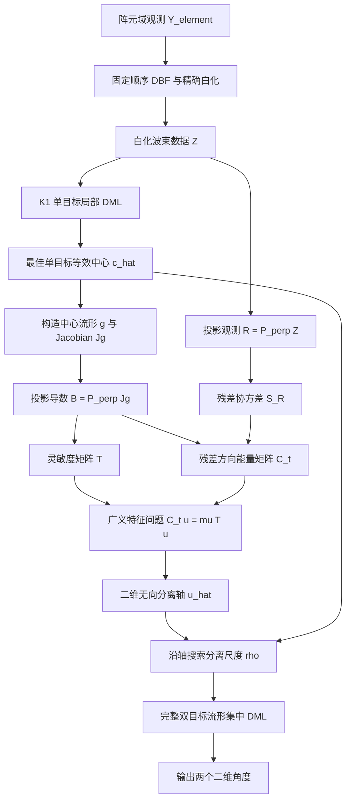

# Tangent-Profile 算法答辩理解版  
## 从物理直觉、变量含义到完整公式与代码实现

> **适用对象**：希望真正理解 Tangent 算法、但不以复杂数学推导为主要基础的硕士答辩准备者。  
> **核心目标**：不仅知道公式“是什么”，还要理解每个变量从哪里来、为什么这样构造、它在物理上表示什么，以及各公式怎样首尾相接。  
> **文档范围**：重点解释 **Tangent Core**。固定网格回退只作为最后的可选工程包装 **Tangent Safe** 单独说明；不展开 Core-Plus、Full4D、MUSIC、ESPRIT 等外部比较算法。  
> **代码核对基线**：`makabaka165/bs_innovation`，当前稳定主线 `main`，核对提交 `c5a76f19824bdbc2d34dd80f107bdf0050874da3`。  
> **重要说明**：本文中的“一维”指最终双目标连续似然搜索只剩一个标量参数，不表示完整算法只进行一次简单的一维计算。

---

# 0. 建议怎样使用本文准备答辩

可以按三层阅读。

## 0.1 第一层：只准备 30 秒回答

只记住下面这句话：

> Tangent 算法面向同一距离–多普勒单元内的已知双目标局部测角。它先用单目标模型找到目标簇的等效中心，再把该单目标能够解释的公共成分从观测中投影掉；随后利用圆柱阵白化波束流形对方位和俯仰的局部导数，从剩余残差中估计两个目标的分离轴；最后只沿该轴搜索两目标的分离尺度，并用完整双目标流形的集中最大似然确定两个角度。

可以记忆为：

```text
白化 → 找中心 → 去公共成分 → 找分离方向 → 搜分离尺度 → 输出两个角度
```

---

## 0.2 第二层：准备 2 分钟回答

> 两个近邻目标在波束域中的主要能量往往很像一个单目标，因此首先用 K1 单目标 DML 得到目标簇的最佳等效中心。围绕该中心对完整圆柱阵白化流形求方位、俯仰导数，得到角度微扰会引起的波束响应变化。由于导数中有一部分可以被未知复幅度变化解释，所以先投影掉中心流形方向，得到有效导数矩阵 $B$，同时把观测投影后得到单目标解释不了的残差 $R$。  
> 然后用 $T=\operatorname{Re}(B^HB)$ 表示阵列对各二维角方向的天然灵敏度，用 $C_t=\operatorname{Re}(B^HS_RB)$ 表示实际残差在这些角方向上的能量，其中 $S_R=RR^H/L$。通过最大化归一化残差能量
> $$
> \frac{u^TC_tu}{u^TTu},
> $$
> 得到双目标分离轴 $u$。最后令两个目标位于
> $$
> \widehat c\mp \frac{\rho}{2}\widehat u
> $$
> 上，只搜索一个分离尺度 $\rho$，但每个候选仍使用完整圆柱阵流形和双目标集中 DML 评分。

---

## 0.3 第三层：完整理解

完整理解需要掌握四件事：

1. **$g(\xi)$** 是某个角度在 15 个白化波束通道中的“空间指纹”；
2. **复幅度 $p$** 是对该空间指纹的整体强度和公共相位调节；
3. **$B=P_g^\perp J_g$** 是角度变化中不能被复幅度变化冒充的有效响应变化；
4. **广义 Rayleigh 商**是在寻找“实际残差中最突出、但又不是因为阵列天然敏感而虚高”的角度方向。

后文将逐步推导。

---

# 1. 一张图看懂 Tangent Core

## 1.1 总体数据流

```text
同一距离–多普勒单元的阵元复数据 Y_element
                         │
                         ▼
        固定工作子阵、固定波束矩阵、噪声白化
                         │
                         ▼
              白化顺序波束数据 Z
                         │
                         ▼
          单目标局部 DML 得到等效中心 ĉ
                         │
                         ▼
       在 ĉ 处计算流形 g 和角度 Jacobian Jg
                         │
                         ▼
        去掉“只调整复幅度就能解释”的方向
              R = P⊥Z，B = P⊥Jg
                         │
                         ▼
       系统天然灵敏度 T  与  实际残差能量 Ct
                         │
                         ▼
       解 Ct u = μ T u，得到无向分离轴 û
                         │
                         ▼
          沿 û 搜索唯一剩余尺度参数 ρ
                         │
                         ▼
     每个 ρ 都使用完整双目标流形和集中 DML
                         │
                         ▼
       输出 ξ̂1 = ĉ - ρ̂û/2，ξ̂2 = ĉ + ρ̂û/2
```

---

## 1.2 Mermaid 流程图

支持 Mermaid 的 Markdown 阅读器可以直接渲染：



---

# 2. 算法到底解决什么问题

## 2.1 输入场景

Tangent 当前解决的是：

```text
单个 CPI
同一个距离–多普勒单元
上游已经限定局部角域
已知该模块按 K = 2 处理
需要输出两个近邻目标的二维角度
```

两个目标的二维角度写为：

$$
\boldsymbol{\xi}_1=
\begin{bmatrix}
\phi_1\\
\theta_1
\end{bmatrix},
\qquad
\boldsymbol{\xi}_2=
\begin{bmatrix}
\phi_2\\
\theta_2
\end{bmatrix}.
$$

其中：

- $\phi$：方位角；
- $\theta$：俯仰角。

它不是：

```text
目标检测器
未知目标数估计器
跨 CPI 航迹算法
全空域盲搜索器
```

---

## 2.2 为什么两个目标会需要这种算法

两个目标距离和多普勒非常接近时，经过距离–多普勒处理后可能落在同一个单元中。

普通波束扫描可能只看到一个合并主峰，但阵元之间仍存在由两个不同到达方向造成的细微复幅相差异。

Tangent 的任务就是利用这些细微空间差异，把一个“看起来像单目标簇”的观测进一步解释为两个角度。

---

# 3. 先认识所有关键变量

## 3.1 核心变量总表

| 符号 | 尺寸 | 一句话解释 |
|---|---:|---|
| $Y_e$ | $M\times L$ | 当前距离–多普勒单元中的阵元复数据 |
| $W_I$ | $M\times r$ | 把工作子阵数据压缩成固定接收波束通道的矩阵 |
| $T_I$ | $r\times r$ | 消除波束通道噪声相关性的白化矩阵 |
| $Z$ | $r\times L$ | Tangent 真正处理的白化波束数据 |
| $\boldsymbol{\xi}$ | $2\times1$ | 一个目标的 `[方位, 俯仰]` |
| $g(\boldsymbol{\xi})$ | $r\times1$ | 该角度在 $r$ 个白化波束通道中的空间响应 |
| $p_\ell$ | 复标量 | 第 $\ell$ 个快拍中目标的整体复幅度 |
| $\widehat{\mathbf c}$ | $2\times1$ | K1 最佳单目标等效中心 |
| $J_g$ | $r\times2$ | 流形对方位、俯仰的局部变化率 |
| $P_g^\perp$ | $r\times r$ | 去掉中心单目标流形方向的投影 |
| $R$ | $r\times L$ | K1 单目标解释不了的观测残差 |
| $B$ | $r\times2$ | 不能被复幅度变化冒充的角度导数 |
| $S_R$ | $r\times r$ | 多快拍残差能量与相关结构 |
| $T$ | $2\times2$ | 系统对二维角方向的天然灵敏度地图 |
| $C_t$ | $2\times2$ | 实际残差在二维角方向中的能量地图 |
| $\widehat{\mathbf u}$ | $2\times1$ | 两目标分离的无向轴 |
| $\rho$ | 标量 | 沿该轴的两目标间隔 |
| $G_\rho$ | $r\times2$ | 某个 $\rho$ 对应的完整双目标流形 |
| $RSS(\rho)$ | 标量 | 该双目标候选不能解释的残差能量 |

当前主配置中：

$$
M=2080,\qquad r=15,\qquad L\in\{1,4,8\}.
$$

---

## 3.2 最值得记住的物理类比

| 数学量 | 直观类比 |
|---|---|
| $g(\xi)$ | 某个角度在 15 个通道中的“空间指纹”（空间信息） |
| p$             | 对整张指纹统一调亮度和公共相位的旋钮 |
| $J_g$ | 指纹随方位、俯仰轻微移动时的变化率 |
| $P_g^\perp$ | 擦掉“只调亮度/公共相位就能解释”的部分 |
| $R$ | 一个单目标解释后剩下的异常结构 |
| $B$ | 真正必须由角度变化产生的响应变化 |
| $T$ | 系统对各角方向本来有多敏感 |
| $C_t$ | 当前残差在各角方向实际有多强 |
| $C_t/T$ | 实际异常程度相对于天然敏感度 |
| $\widehat u$ | 两目标大概沿哪个二维方向分开 |
| $\widehat\rho$ | 沿该方向到底分开多远 |

类比只用于理解，正式公式仍以后文为准。

---

# 4. 第零步：把阵元数据变成 Tangent 使用的数据

## 4.1 阵元域观测

双目标阵元域模型为：

$$
Y_e=A(\Theta)S+N_e,
$$

其中：

$$
A(\Theta)
=
\begin{bmatrix}
a(\boldsymbol{\xi}_1)&a(\boldsymbol{\xi}_2)
\end{bmatrix}.
$$

$a(\boldsymbol{\xi})$ 是当前圆柱阵工作子阵对该角度的导向矢量。

---

## 4.2 为什么先形成波束

通过固定接收波束矩阵 $W_I$：

$$
Z_{\rm raw}=W_I^HY_e.
$$

当前实际使用 15 个复合接收波束，因此：

$$
Z_{\rm raw}\in\mathbb C^{15\times L}.
$$

每一行对应一个接收波束通道，每一列对应一个快拍。

---

## 4.3 为什么必须白化

不同波束复用相同阵元，因此波束噪声通常相关。

若阵元噪声协方差是 $R_e$，波束噪声协方差是：

$$
C_I=W_I^HR_eW_I.
$$

构造白化矩阵 $T_I$，使：

$$
T_IC_IT_I^H\approx I.
$$

最终：

$$
\boxed{
Z=T_IW_I^HY_e.
}
$$

白化后的意义是：

> 各波束通道中的噪声被变换到近似同方差、互不相关的坐标中，因此后续欧氏残差能量能够公平地衡量数据拟合程度。

代码对应：

```matlab
Zseq_raw   = model.W_I' * Y_element;
Zseq_white = model.T_I * Zseq_raw;
```

文件：

```text
build_stage8_full_data_from_element.m
```

---

# 5. 第一部分：为什么先做 K1 单目标拟合

## 5.1 两个近目标为什么看起来像一个目标

两个角度很接近时：

$$
g(\boldsymbol{\xi}_1)
\approx
g(\boldsymbol{\xi}_2).
$$

因此双目标观测的大部分能量可以被一个中间方向附近的单目标近似解释。

Tangent 先求：

$$
\boxed{
\widehat{\mathbf c}
=
\arg\min_{\mathbf c}
RSS_{K=1}(\mathbf c).
}
$$

这里的 $\widehat{\mathbf c}$ 应叫：

> **最佳单目标等效中心**。

它不是通过几何公式直接取两个真值的中点，因为真实角度在线未知。

---

## 5.2 单目标模型中的复幅度是什么

对第 $\ell$ 个快拍：

$$
z_\ell=g(\mathbf c)p_\ell+n_\ell.
$$

其中：

- $g(\mathbf c)$：由角度决定的 15 通道相对复幅相形状；
- $p_\ell$：该目标在当前快拍中的整体复幅度。

写成：

$$
p_\ell=A_\ell e^{j\psi_\ell}.
$$

它可以包含：

```text
目标回波强弱
反射系数
传播公共相位
快拍相位
多普勒造成的公共相位变化
```

### 关键区别

复幅度变化：

```text
对 15 个通道整体缩放、整体旋转公共相位
```

角度变化：

```text
改变 15 个通道之间的相对幅度和相对相位形状
```

---

## 5.3 给定角度时，最优复幅度怎样得到

固定 $g$，寻找：

$$
\widehat p_\ell
=
\arg\min_{p_\ell}
\|z_\ell-gp_\ell\|_2^2.
$$

结果为：

$$
\boxed{
\widehat p_\ell
=
\frac{g^Hz_\ell}{g^Hg}.
}
$$

### 直观理解

$g^Hz_\ell$ 衡量观测与该角度空间指纹的复相关程度。

再除以 $g^Hg$，相当于去掉指纹本身的能量尺度。

所以 $\widehat p_\ell$ 是：

> 在固定角度 $g$ 下，最能让 $gp_\ell$ 接近当前观测的整体复缩放系数。

---

## 5.4 单目标能够解释的数据部分

代入：

$$
g\widehat p_\ell
=
g\frac{g^Hz_\ell}{g^Hg}.
$$

定义：

$$
P_g=\frac{gg^H}{g^Hg}.
$$

于是：

$$
\boxed{
g\widehat p_\ell=P_gz_\ell.
}
$$

因此：

- $P_gz_\ell$：该单目标空间指纹能够解释的部分；
- $(I-P_g)z_\ell$：该单目标解释不了的部分。

这就是后面投影残差的基础。

---

## 5.5 为什么 K1 中心不一定是真实几何中点

如果两个目标：

```text
等功率
相位结构对称
相关性较低
流形局部近似对称
```

那么最佳单目标等效中心可能接近几何中点。

但如果：

```text
一个目标明显更强
两个源强相关
两源近同相
噪声较强
流形存在曲率
```

则最佳单目标方向可能偏向强目标或更能解释当前观测的一侧。

因此答辩时不能说：

> K1 精确求出了两个目标的真实中点。

应说：

> K1 给出一个由当前观测决定的最佳单目标等效中心，作为局部分离分析的参考点。

---

# 6. 第二部分：流形和 Jacobian 到底是什么

## 6.1 白化流形 $g(\phi,\theta)$

定义：

$$
\boxed{
g(\phi,\theta)
=
T_IW_I^Ha(\phi,\theta).
}
$$

它是一个 $15\times1$ 复向量。

第 $i$ 个元素表示：

> 若目标位于 $(\phi,\theta)$，在单位源复幅度下，第 $i$ 个白化接收波束通道会产生怎样的复响应。

因此 $g$ 同时包含：

- 各通道幅度；
- 各通道相位；
- 圆柱阵几何；
- 波束权值；
- 噪声白化。

---

## 6.2 Jacobian 是“局部变化率”

定义：

$$
J_g
=
\begin{bmatrix}
\dfrac{\partial g}{\partial\phi}&
\dfrac{\partial g}{\partial\theta}
\end{bmatrix}
=
\begin{bmatrix}
j_\phi&j_\theta
\end{bmatrix}.
$$

其中：

$$
j_\phi=\frac{\partial g}{\partial\phi},
\qquad
j_\theta=\frac{\partial g}{\partial\theta}.
$$

### 方位导数 $j_\phi$

表示：

> 方位角增加一个很小单位时，15 个白化波束通道的复响应分别怎样变化。

### 俯仰导数 $j_\theta$

表示：

> 俯仰角增加一个很小单位时，15 个白化波束通道的复响应分别怎样变化。

---

## 6.3 为什么导数可以表示小角度变化

若角度发生小变化：

$$
\delta\boldsymbol{\xi}
=
\begin{bmatrix}
\delta\phi\\
\delta\theta
\end{bmatrix},
$$

则一阶近似：

$$
g(\boldsymbol{\xi}+\delta\boldsymbol{\xi})
\approx
g(\boldsymbol{\xi})
+
J_g\delta\boldsymbol{\xi}.
$$

展开为：

$$
J_g\delta\boldsymbol{\xi}
=
j_\phi\delta\phi+j_\theta\delta\theta.
$$

所以 Jacobian 把二维角度的小位移转换成 15 维波束响应的小变化。

---

## 6.4 方向导数

若只关心单位方向：

$$
\mathbf u=
\begin{bmatrix}
u_\phi\\
u_\theta
\end{bmatrix},
\qquad
\|\mathbf u\|_2=1,
$$

沿该方向移动小量 $\varepsilon$：

$$
\boldsymbol{\xi}(\varepsilon)
=
\boldsymbol{\xi}_0+\varepsilon\mathbf u.
$$

则：

$$
\frac{d}{d\varepsilon}
g(\boldsymbol{\xi}_0+\varepsilon\mathbf u)
\bigg|_{\varepsilon=0}
=
J_g\mathbf u.
$$

因此：

$$
J_g\mathbf u
$$

就是流形沿二维角方向 $\mathbf u$ 的方向导数。

---

# 7. 第三部分：为什么要投影掉中心流形方向

这是 Tangent 最关键的物理步骤之一。

## 7.1 角度变化中存在两类成分

角度轻微变化时：

$$
g(\boldsymbol{\xi}+\delta\boldsymbol{\xi})
\approx
g+J_g\delta\boldsymbol{\xi}.
$$

把导数变化分解成：

$$
J_g\delta\boldsymbol{\xi}
=
ga+b_\perp,
$$

其中：

$$
a=
\frac{g^HJ_g\delta\boldsymbol{\xi}}{g^Hg},
$$

$$
b_\perp
=
P_g^\perp J_g\delta\boldsymbol{\xi}.
$$

第一部分 $ga$ 与 $g$ 平行。

第二部分 $b_\perp$ 与 $g$ 正交。

---

## 7.2 为什么与 $g$ 平行的部分不能证明角度变化

原信号：

$$
gp.
$$

加上平行导数变化后：

$$
gp+pga
=
g(p+pa).
$$

右侧可以完全解释成：

```text
角度没有改变
只是复幅度从 p 变成了 p+pa
```

因此这部分在“角度变化”和“复幅度变化”之间不可辨识。

---

## 7.3 真正可用于角度判断的部分

只有：

$$
p\,b_\perp
=
pP_g^\perp J_g\delta\boldsymbol{\xi}
$$

无法通过调整一个复标量 $p$ 来重现。

所以定义：

$$
\boxed{
P_g^\perp
=
I-\frac{gg^H}{g^Hg}
}
$$

以及：

$$
\boxed{
B=P_g^\perp J_g.
}
$$

### 最准确的物理解释

> $B$ 保留了角度变化所造成的、无法被目标整体复幅度变化解释的白化波束响应导数。

---

# 8. 第四部分：残差 $R$ 是什么

## 8.1 定义

对全部快拍：

$$
\boxed{
R=P_g^\perp Z.
}
$$

由于：

$$
P_g^\perp=I-P_g,
$$

也可以写成：

$$
R=Z-P_gZ.
$$

---

## 8.2 物理意义

$P_gZ$ 是最佳单目标中心流形能够解释的部分。

因此：

$$
R
$$

是：

> 当前最佳单目标模型解释不了的白化波束观测成分。

---

## 8.3 $R$ 不是纯第二目标

实际 $R$ 可能同时包含：

```text
双目标分离信息
K1 等效中心偏差
流形二阶曲率
噪声
白化数值误差
有限快拍随机波动
```

所以不能说：

> 投影后剩下的就是第二个目标。

正确说法是：

> 投影后剩下的是单目标公共模型解释不了的成分，其中包含双目标分离信息。

---

# 9. 为什么近双目标残差会沿分离方向出现结构

## 9.1 中心–分离参数化

把两个目标写成：

$$
\boldsymbol{\xi}_1
=
\mathbf c-\frac{\mathbf d}{2},
\qquad
\boldsymbol{\xi}_2
=
\mathbf c+\frac{\mathbf d}{2}.
$$

其中：

$$
\mathbf d
=
\rho\mathbf u,
\qquad
\rho=\|\mathbf d\|_2.
$$

---

## 9.2 对两端点流形作一阶展开

$$
g\left(\mathbf c-\frac{\mathbf d}{2}\right)
\approx
g_c-\frac12J_g\mathbf d,
$$

$$
g\left(\mathbf c+\frac{\mathbf d}{2}\right)
\approx
g_c+\frac12J_g\mathbf d.
$$

双目标观测近似为：

$$
\begin{aligned}
Z
&\approx
\left(g_c-\frac12J_g\mathbf d\right)s_1^T
+
\left(g_c+\frac12J_g\mathbf d\right)s_2^T
+
N\\
&=
g_c(s_1+s_2)^T
+
\frac12J_g\mathbf d(s_2-s_1)^T
+
N.
\end{aligned}
$$

---

## 9.3 两个关键模态

### 公共模态

$$
\boxed{
g_c(s_1+s_2)^T
}
$$

表示两个近目标共同形成的“像一个目标”的主要部分。

### 分离差模

$$
\boxed{
\frac12J_g\mathbf d(s_2-s_1)^T
}
$$

包含两个目标之间的角度分离方向。

---

## 9.4 投影之后

因为：

$$
P_g^\perp g_c=0,
$$

所以公共模态被去掉：

$$
\boxed{
R
\approx
\frac12B\mathbf d(s_2-s_1)^T
+
P_g^\perp N.
}
$$

这条式子是 Tangent 方向估计的理论核心。

它表示：

> 理想一阶情况下，投影残差中的结构化信号沿 $B\mathbf d$ 展开，而 $\mathbf d$ 就是双目标真实分离向量。

---

# 10. 第五部分：$B$ 的两列到底表示什么

写成：

$$
B=
\begin{bmatrix}
b_\phi&b_\theta
\end{bmatrix}.
$$

其中：

$$
b_\phi
=
P_g^\perp\frac{\partial g}{\partial\phi},
$$

$$
b_\theta
=
P_g^\perp\frac{\partial g}{\partial\theta}.
$$

---

## 10.1 $b_\phi$

它是一个 15 维复向量。

表示：

> 单位方位角微扰在白化波束域中产生的、不能被复幅度变化解释的响应导数。

第 $i$ 个元素说明：

> 方位角略微增加时，第 $i$ 个白化波束通道中的可辨识复响应变化率。

---

## 10.2 $b_\theta$

类似地表示：

> 单位俯仰角微扰在白化波束域中产生的、不能被复幅度变化解释的响应导数。

---

## 10.3 为什么它们构成一个局部二维基

局部角度只包含两个坐标：

```text
方位
俯仰
```

任意二维小位移：

$$
\delta\boldsymbol{\xi}
=
\begin{bmatrix}
\delta\phi\\
\delta\theta
\end{bmatrix}
$$

对应的有效响应变化为：

$$
B\delta\boldsymbol{\xi}
=
b_\phi\delta\phi+b_\theta\delta\theta.
$$

所以 $b_\phi,b_\theta$ 张成了当前中心附近的有效局部角度变化空间。

---

# 11. 第六部分：$T$ 为什么是系统灵敏度地图

## 11.1 定义

$$
\boxed{
T=\operatorname{Re}(B^HB).
}
$$

展开：

$$
T=
\begin{bmatrix}
\|b_\phi\|_2^2&
\operatorname{Re}(b_\phi^Hb_\theta)\\
\operatorname{Re}(b_\theta^Hb_\phi)&
\|b_\theta\|_2^2
\end{bmatrix}.
$$

---

## 11.2 对角元素

$$
T_{\phi\phi}=\|b_\phi\|^2
$$

表示系统对方位微扰的天然灵敏度。

$$
T_{\theta\theta}=\|b_\theta\|^2
$$

表示系统对俯仰微扰的天然灵敏度。

数值越大，意味着同样大小的角度变化会在白化波束通道中产生更大的可辨识响应变化。

---

## 11.3 非对角元素

$$
T_{\phi\theta}
=
\operatorname{Re}(b_\phi^Hb_\theta).
$$

它表示方位导数响应与俯仰导数响应之间的耦合。

若归一化相关接近 0，二者变化形状较容易区分。

若绝对相关接近 1，方位和俯仰微扰产生的响应变化很相似，局部角度容易混淆。

---

## 11.4 为什么 $u^TTu$ 是某个方向的灵敏度

沿单位方向：

$$
\mathbf u=
\begin{bmatrix}
u_\phi\\u_\theta
\end{bmatrix}
$$

移动小量 $\varepsilon$：

$$
\Delta g_\perp
\approx
\varepsilon B\mathbf u.
$$

变化能量为：

$$
\begin{aligned}
\|\Delta g_\perp\|^2
&\approx
\varepsilon^2\|B\mathbf u\|^2\\
&=
\varepsilon^2\mathbf u^TB^HB\mathbf u\\
&=
\boxed{
\varepsilon^2\mathbf u^TT\mathbf u.
}
\end{aligned}
$$

因此：

$$
\boxed{
\mathbf u^TT\mathbf u
}
$$

表示：

> 每单位小角位移平方，当前工作子阵、波束配置和白化模型在方向 $\mathbf u$ 上能产生多少可辨识响应变化能量。

---

## 11.5 $T$ 与 Fisher 信息的关系

对白化高斯模型，在去掉未知复幅度后，局部角度有效 Fisher 信息具有：

$$
\mathcal I_{\xi,\rm eff}
=
\frac{2\|p\|^2}{\sigma^2}
\operatorname{Re}
\left(
J_g^HP_g^\perp J_g
\right).
$$

因为：

$$
B=P_g^\perp J_g,
$$

所以：

$$
B^HB
=
J_g^HP_g^\perp J_g.
$$

于是：

$$
\boxed{
\mathcal I_{\xi,\rm eff}
=
\frac{2\|p\|^2}{\sigma^2}T.
}
$$

因此 $T$ 是：

> 去掉源能量和噪声尺度后，系统局部角度 Fisher 信息的几何核心。

答辩时不必从 Schur complement 详细推起，只需说明：

> $T$ 来源于统计估计理论中的有效 Fisher 几何，它用于公平衡量系统对不同角方向的天然灵敏度。

---

# 12. 第七部分：残差协方差 $S_R$

## 12.1 定义

$$
\boxed{
S_R=\frac1LRR^H.
}
$$

---

## 12.2 为什么要构造它

$R$ 有 $L$ 个残差快拍：

$$
R=
\begin{bmatrix}
r_1&r_2&\cdots&r_L
\end{bmatrix}.
$$

所以：

$$
S_R
=
\frac1L
\sum_{\ell=1}^{L}
r_\ell r_\ell^H.
$$

它把多个快拍中的残差能量和通道间相关结构综合起来。

---

## 12.3 为什么除以 $L$

除以 $L$ 是求快拍平均。

这样不同快拍数下的矩阵尺度更容易比较，避免仅因为观测列数变多，矩阵整体线性放大。

---

## 12.4 物理意义

$S_R$ 回答：

> 在去掉最佳单目标公共成分后，剩余能量主要分布在哪些白化波束通道和哪些通道组合上？

它仍然是 15 维观测空间中的量，还没有转回二维角度方向。

---

# 13. 第八部分：$C_t$ 为什么表示残差的角方向能量

## 13.1 定义

$$
\boxed{
C_t
=
\operatorname{Re}(B^HS_RB).
}
$$

它是一个 $2\times2$ 实对称矩阵。

---

## 13.2 对角项

$$
b_\phi^HS_Rb_\phi
=
\frac1L\|R^Hb_\phi\|_2^2.
$$

第 $\ell$ 个元素：

$$
r_\ell^Hb_\phi
$$

是当前残差快拍与方位有效导数响应之间的复相关。

所以平方模越大，表示该残差中越明显地出现了与方位导数响应对齐的成分。

同理：

$$
b_\theta^HS_Rb_\theta
$$

表示残差在俯仰有效导数方向上的投影能量。

---

## 13.3 非对角项

$$
b_\phi^HS_Rb_\theta
$$

描述残差在方位和俯仰导数方向上的联合相关关系。

当真实分离是斜向时，方位和俯仰成分会一起出现，非对角项会帮助确定它们的组合比例。

---

## 13.4 为什么取实部

$B^HS_RB$ 是 Hermitian 矩阵。

方向 $\mathbf u$ 是实二维角方向。

对实向量 $\mathbf u$，Hermitian 矩阵虚部对应的反对称二次型为零，因此：

$$
\mathbf u^TB^HS_RB\mathbf u
=
\mathbf u^T
\operatorname{Re}(B^HS_RB)
\mathbf u.
$$

所以取实部没有丢失实角度方向的能量，而是把问题写成一个实对称二维问题。

---

# 14. 第九部分：为什么不能直接选 $C_t$ 最大方向

假设系统本来就对方位特别敏感。

即使真实目标主要沿俯仰分开，方位导数响应的能量也可能天然更大。

如果只最大化：

$$
\mathbf u^TC_t\mathbf u,
$$

结果可能偏向系统最敏感的方向，而不是真实分离方向。

因此需要除以：

$$
\mathbf u^TT\mathbf u.
$$

---

# 15. 第十部分：广义 Rayleigh 商的物理意义

## 15.1 定义

$$
\boxed{
J(\mathbf u)
=
\frac{
\mathbf u^TC_t\mathbf u
}{
\mathbf u^TT\mathbf u
}.
}
$$

---

## 15.2 分子表示什么

$$
\mathbf u^TC_t\mathbf u
$$

表示：

> 当前实际残差中，沿角方向 $\mathbf u$ 的有效方向导数响应具有多少投影能量。

---

## 15.3 分母表示什么

$$
\mathbf u^TT\mathbf u
$$

表示：

> 当前阵列、工作子阵、波束配置和白化模型本来对方向 $\mathbf u$ 有多敏感。

---

## 15.4 二者相除表示什么

比值表示：

> 实际残差中该方向的能量，相对于系统本来对该方向的天然灵敏度，到底有多突出。

所以 Tangent 不是简单寻找“能量最大方向”，而是在寻找：

> **经过系统灵敏度校准后，残差中最异常、最突出的二维角方向。**

---

## 15.5 纯噪声为什么不会在期望上偏向某个方向

若投影残差只有理想白噪声：

$$
\mathbb E[S_R]
=
\sigma^2P_g^\perp.
$$

由于：

$$
P_g^\perp B=B,
$$

所以：

$$
\mathbb E[C_t]
=
\sigma^2T.
$$

因此：

$$
\frac{
\mathbf u^T\mathbb E[C_t]\mathbf u
}{
\mathbf u^TT\mathbf u
}
=
\sigma^2.
$$

对所有方向相同。

这说明：

> 在理想白噪声期望下，归一化准则不会天然偏向方位、俯仰或斜向中的任何一个方向。

当真实双目标差模存在时，真实分离方向的分子会出现额外增强。

---

## 15.6 一个简单数值例子

假设系统对方位的天然灵敏度比俯仰高：

$$
T=
\begin{bmatrix}
4&0\\
0&1
\end{bmatrix}.
$$

真实分离方向是：

$$
\mathbf u_{\rm true}
=
\frac1{\sqrt2}
\begin{bmatrix}
1\\1
\end{bmatrix}.
$$

即方位、俯仰同等比例分离。

由于系统对方位天然敏感，若直接看未归一化残差能量，主方向容易偏向方位轴。

广义准则通过分母 $u^TTu$ 把方位方向更高的天然灵敏度除掉，才能恢复接近真实的斜向分离轴。

答辩时可以把它说成：

> 好比两个麦克风灵敏度不同，不能只比较原始音量，而要先除以各自的灵敏度，才能判断声源真正来自哪个方向。

---

# 16. 第十一步：为什么优化会变成广义特征值问题

需要最大化：

$$
\frac{
\mathbf u^TC_t\mathbf u
}{
\mathbf u^TT\mathbf u
}.
$$

可以加约束：

$$
\mathbf u^TT\mathbf u=1.
$$

构造拉格朗日函数：

$$
\mathcal L(\mathbf u,\mu)
=
\mathbf u^TC_t\mathbf u
-
\mu
(\mathbf u^TT\mathbf u-1).
$$

对 $\mathbf u$ 求一阶条件：

$$
2C_t\mathbf u-2\mu T\mathbf u=0.
$$

所以：

$$
\boxed{
C_t\mathbf u
=
\mu T\mathbf u.
}
$$

取最大广义特征值对应的特征向量：

$$
\boxed{
\widehat{\mathbf u}
=
\text{最大广义特征方向}.
}
$$

---

## 16.1 代码为什么不直接裸调用 `eig(Ct,T)`

代码先分解：

$$
T=V\Lambda V^T.
$$

检查 $T$ 是否正半定且数值秩为 2。

然后构造：

$$
Q=V\Lambda^{-1/2}.
$$

把问题变成普通对称特征问题：

$$
M=Q^TC_tQ.
$$

取 $M$ 最大特征向量 $w_{\max}$，再映射：

$$
\widetilde u=Qw_{\max}.
$$

最后欧氏归一化：

$$
\widehat u
=
\frac{\widetilde u}{\|\widetilde u\|_2}.
$$

这样做的目的包括：

```text
检查 T 是否能支持两个独立角方向
避免病态广义特征求解
保证结果为有限实向量
固定符号以保证重复运行一致
```

代码文件：

```text
stage8_k2_tp_projected_direction.m
```

---

# 17. 为什么 $\widehat u$ 是“轴”而不是“箭头”

若：

$$
\widehat u\rightarrow-\widehat u,
$$

则两个端点：

$$
\widehat c-\frac{\rho}{2}\widehat u,
\qquad
\widehat c+\frac{\rho}{2}\widehat u
$$

只是互换顺序。

所以物理上：

$$
\boxed{
\widehat u\equiv-\widehat u.
}
$$

它表示一条无向轴。

因此轴误差应定义为：

$$
\boxed{
e_{\rm axis}
=
\arccos
\left(
|\widehat u^Tu_{\rm true}|
\right).
}
$$

绝对值用于消除正反方向的等价性。

---

# 18. 第十二步：四维双目标问题怎样降成一维

## 18.1 完整双目标有四个角度自由度

$$
(\phi_1,\theta_1,\phi_2,\theta_2).
$$

等价地可以写成：

$$
(c_\phi,c_\theta,\rho,\alpha_u),
$$

其中：

- $c_\phi,c_\theta$：中心的两个自由度；
- $\alpha_u$：分离轴方向角；
- $\rho$：分离尺度。

---

## 18.2 Tangent 怎样处理四个自由度

$$
c_\phi,c_\theta
$$

由 K1 单目标 DML 估计。

$$
\alpha_u
$$

由投影残差广义特征问题估计。

最后只剩：

$$
\rho
$$

需要进行非线性数值搜索。

所以：

> Tangent 把最终双目标连续似然搜索从四维限制到一条一维曲线上。

---

## 18.3 两个端点参数化

$$
\boxed{
\boldsymbol{\xi}_1(\rho)
=
\widehat{\mathbf c}
-\frac{\rho}{2}\widehat{\mathbf u}
}
$$

$$
\boxed{
\boldsymbol{\xi}_2(\rho)
=
\widehat{\mathbf c}
+\frac{\rho}{2}\widehat{\mathbf u}
}
$$

方位和俯仰同时变化：

$$
\Delta\phi=\rho\widehat u_\phi,
\qquad
\Delta\theta=\rho\widehat u_\theta.
$$

它不是先搜方位再搜俯仰。

---

## 18.4 为什么仍然叫双目标 $K=2$

虽然只搜索一个 $\rho$，每个候选仍构造两个角度和两列流形：

$$
G_\rho
=
\begin{bmatrix}
g(\boldsymbol{\xi}_1(\rho))&
g(\boldsymbol{\xi}_2(\rho))
\end{bmatrix}.
$$

所以 Tangent Core 本身就是双目标 $K=2$ DML。

可以删除的是固定网格双目标兜底，不可以删除的是双目标模型本身。

---

# 19. 第十三步：可行尺度 $\rho_{\max}$

局部域边界为：

$$
[\phi_{\min},\phi_{\max}]
\times
[\theta_{\min},\theta_{\max}].
$$

两个端点都必须留在域内。

对每个坐标 $j$：

$$
m_j
=
\min
(\widehat c_j-l_j,\;h_j-\widehat c_j).
$$

若：

$$
|\widehat u_j|>0,
$$

则：

$$
\rho
\le
\frac{2m_j}{|\widehat u_j|}.
$$

因此：

$$
\boxed{
\rho_{\max}
=
\min_{j:|\widehat u_j|>0}
\frac{2m_j}{|\widehat u_j|}.
}
$$

---

## 19.1 物理意义

若中心靠近局部域边界，允许两端对称展开的距离就会变小。

若分离轴主要沿方位，方位边界起主要限制。

若主要沿俯仰，俯仰边界起主要限制。

---

# 20. 第十四步：为什么最后仍使用完整流形

## 20.1 Jacobian 只用于找方向

一阶 Taylor 展开在分离很小时较合理，但不是最终精确物理模型。

所以 Tangent 只用一阶局部结构估计方向。

---

## 20.2 每个 $\rho$ 都重新构造真实流形

对每个候选：

$$
\boldsymbol{\xi}_{1,2}(\rho)
=
\widehat c
\mp
\frac{\rho}{2}\widehat u,
$$

重新计算：

$$
g(\boldsymbol{\xi}_1),
\qquad
g(\boldsymbol{\xi}_2).
$$

这些流形经历：

```text
真实圆柱阵导向矢量
当前工作子阵
阵元顺序转换
固定 15 波束投影
对应噪声白化
```

所以最终估计不是 Taylor 近似角度。

---

# 21. 第十五步：集中 DML 怎样选择 $\rho$

## 21.1 双目标模型

对某个 $\rho$：

$$
Z=G_\rho S+N.
$$

其中：

$$
G_\rho
=
[g_1(\rho),g_2(\rho)].
$$

源复幅度矩阵 $S$ 未知。

---

## 21.2 给定 $\rho$ 时消去 $S$

最优：

$$
\widehat S(\rho)
=
G_\rho^\dagger Z.
$$

剩余残差：

$$
P_{G_\rho}^\perp Z.
$$

定义：

$$
\boxed{
RSS(\rho)
=
\|P_{G_\rho}^\perp Z\|_F^2.
}
$$

---

## 21.3 为什么最小 RSS 等价于最大 likelihood

对复高斯白噪声：

$$
\ell(\rho,S,\sigma^2)
=
-rL\log(\pi\sigma^2)
-
\frac1{\sigma^2}
\|Z-G_\rho S\|_F^2.
$$

消去 $S$ 后得到 $RSS(\rho)$。

噪声方差的 ML 估计为：

$$
\widehat\sigma^2(\rho)
=
\frac{RSS(\rho)}{rL}.
$$

集中 likelihood：

$$
\boxed{
\ell_c(\rho)
=
-rL
\left[
\log
\left(
\pi\frac{RSS(\rho)}{rL}
\right)
+1
\right].
}
$$

因此：

$$
\boxed{
\widehat\rho
=
\arg\max_\rho\ell_c(\rho)
=
\arg\min_\rho RSS(\rho).
}
$$

---

## 21.4 物理理解

对每个候选分离尺度，算法问：

> 如果两个目标位于这两个候选角度，允许它们各自拥有最合适的未知复幅度后，它们最多能解释当前观测到什么程度？

不能解释的剩余能量越小，该 $\rho$ 越合理。

---

# 22. 第十六步：一维搜索怎样进行

冻结参数：

```text
最小尺度 rho_min       = 0.001°
粗扫描节点数            = 33
连续精化                 = fminbnd
TolX                     = 1e-4°
MaxFunEvals              = 80
```

流程：

1. 在 $[\rho_{\min},\rho_{\max}]$ 中均匀取 33 个点；
2. 每个点构造完整双目标流形并计算集中 likelihood；
3. 找出最佳有效粗点；
4. 用相邻粗点形成局部区间；
5. 用 `fminbnd` 连续精化；
6. 比较最佳粗点、区间端点和连续候选；
7. 选择 likelihood 最大的有效候选。

---

## 22.1 为什么 $\rho_{\min}\neq0$

当：

$$
\rho=0,
$$

两个端点相同，两列流形完全相同：

$$
G=[g,g].
$$

其秩为 1，不能作为可辨识的双目标模型。

所以用一个很小的正下界：

$$
\rho_{\min}=0.001^\circ.
$$

命中下界不等于成功恢复了真实微小分离，往往意味着当前观测没有支持更大的可靠分离。

---

# 23. Tangent Core 的最终输出

若方向和尺度搜索有效：

$$
\boxed{
\widehat{\boldsymbol{\xi}}_1
=
\widehat{\mathbf c}
-\frac{\widehat\rho}{2}\widehat{\mathbf u}
}
$$

$$
\boxed{
\widehat{\boldsymbol{\xi}}_2
=
\widehat{\mathbf c}
+\frac{\widehat\rho}{2}\widehat{\mathbf u}.
}
$$

这就是 Tangent Core 的完整科学输出。

---

# 24. Tangent Core 与 Tangent Safe 必须分开

## 24.1 Tangent Core

论文主创新建议写成：

```text
K1 等效中心
→ 投影残差
→ 有效角度导数
→ 灵敏度归一化方向估计
→ 一维完整双目标 DML 尺度搜索
→ 两个角度
```

若任何核心步骤失败，可以直接返回：

```text
RAW_TANGENT_INVALID
```

并在实验中统计核心成功率。

---

## 24.2 Tangent Safe

当前代码还预先计算一个固定网格双目标 DML 候选。

若 Tangent 候选：

```text
数值有效
且 likelihood 不低于固定网格候选
```

则使用 Tangent。

否则输出固定网格候选。

---

## 24.3 为什么 Safe 用 likelihood，不用 RMSE

在线运行时没有真实角度，无法计算 RMSE。

likelihood 只依赖当前观测，因此可以在线比较。

Safe 保证的是：

> 选择的候选在当前观测上的集中 likelihood 不低于固定网格基线。

它不保证：

> 每个试验中的真实角度 RMSE 一定不变差。

---

## 24.4 三种不同“成功率”

### Raw numerical-valid rate

Tangent Core 是否产生数值有效候选。

### Acceptance rate

$$
1-\text{fallback rate}.
$$

表示 Tangent 候选是否被 Safe 采用。

### Resolution success rate

需要离线真值和预注册误差门限，例如：

$$
\max_k
\|
\widehat{\boldsymbol{\xi}}_{\pi(k)}
-
\boldsymbol{\xi}_k
\|_2
\le\tau.
$$

只有第三个才是真正基于真值的分辨成功率。

---

# 25. 当前代码与理论逐项对应

| 理论步骤 | MATLAB 代码 |
|---|---|
| Tangent Safe 总入口 | `stage8_k2_tp_fit_safe.m` |
| K1 单目标等效中心 | `estimate_stage8_known_k_local_cell(..., K=1, CORE_LITE)` |
| 白化波束数据 | `build_stage8_full_data_from_element.m` |
| 中心完整流形与 Jacobian | `build_full_sequential_local_manifold.m` |
| $P_g^\perp$ | `eye(...) - (g*g')/g_energy` |
| $R=P_g^\perp Z$ | `R = Pg_perp * full_data.Zseq_white` |
| $B=P_g^\perp J_g$ | `B = Pg_perp * Jg` |
| $T=\operatorname{Re}(B^HB)$ | `T = real(B' * B)` |
| $S_R=RR^H/L$ | `S_R = (R * R') / size(R,2)` |
| $C_t=\operatorname{Re}(B^HS_RB)$ | `Ct = real(B' * S_R * B)` |
| 广义方向求解 | `stage8_k2_tp_projected_direction.m` |
| 可行尺度与一维 profile | `stage8_k2_tp_profile_scale.m` |
| 完整双目标 DML | `concentrated_dml_rss.m` |
| 可选 Safe selector | `profile.loglik_concentrated >= fixed.loglik_concentrated` |

---

# 26. 可直接用于论文或答辩的伪代码

```text
输入：
    当前距离–多普勒单元的阵元复数据 Y_element
    当前工作子阵的固定 measurement model
    公共局部角域
    已知 K = 2

1. 白化波束数据
    Z = T_I W_I^H Y_element

2. 最佳单目标等效中心
    c_hat = arg min_c RSS_K1(c)

3. 中心流形和角度导数
    g  = g(c_hat)
    Jg = [∂g/∂az, ∂g/∂el]

4. 去掉未知复幅度可解释的公共方向
    P_perp = I - g g^H / (g^H g)
    R = P_perp Z
    B = P_perp Jg

5. 构造系统灵敏度和实际残差方向能量
    T   = Re(B^H B)
    S_R = R R^H / L
    C_t = Re(B^H S_R B)

6. 求分离轴
    解 C_t u = μ T u
    取最大广义特征值对应方向
    归一化得到 u_hat

7. 求可行尺度范围
    计算 rho_max，使 c_hat ± rho u_hat / 2 均在局部域内

8. 一维尺度搜索
    对 rho ∈ [rho_min, rho_max]：
        xi1 = c_hat - rho u_hat / 2
        xi2 = c_hat + rho u_hat / 2
        构造完整双目标流形 G_rho
        计算集中 DML likelihood

9. 输出
    rho_hat = likelihood 最大的有效尺度
    xi_hat1 = c_hat - rho_hat u_hat / 2
    xi_hat2 = c_hat + rho_hat u_hat / 2
```

可选 Safe 包装：

```text
若 Tangent 候选有效且 likelihood 不低于粗网格双目标候选：
    输出 Tangent
否则：
    输出粗网格候选
```

---

# 27. 答辩中最容易被问的 15 个问题

## Q1：为什么要先用 K1？

因为两个近目标的主要公共能量通常可以被一个单目标近似解释。K1 提供局部参考中心，使后续只分析单目标模型解释不了的分离残差。

---

## Q2：K1 中心是真实几何中点吗？

不一定。它是最佳单目标等效中心。功率不等、强相关和噪声会使其偏向更强或更容易解释数据的一侧。

---

## Q3：为什么要投影掉 $g$？

因为沿 $g$ 的响应变化可以通过改变未知复幅度实现，无法独立证明角度发生了变化。投影保留的是必须由角度变化才能解释的成分。

---

## Q4：$R$ 是第二个目标吗？

不是。$R$ 是单目标模型解释不了的全部残差，其中包含双目标分离信息，也包含中心偏差、流形曲率和噪声。

---

## Q5：$B$ 是什么？

$B$ 是去掉复幅度干扰后的方位、俯仰响应导数。它描述目标角度微小变化会在 15 个白化波束通道中产生怎样的可辨识变化。

---

## Q6：$T$ 是什么？

$T$ 是系统对不同二维角方向的天然灵敏度地图。它来源于有效 Fisher 信息的几何部分。

---

## Q7：$C_t$ 是什么？

$C_t$ 是把实际残差协方差投影到方位、俯仰有效导数空间后得到的二维能量矩阵。

---

## Q8：为什么不能直接对 $C_t$ 做普通最大特征向量？

因为系统对方位和俯仰的天然灵敏度可能不同。普通最大方向可能只是阵列最敏感方向，广义特征问题通过 $T$ 进行灵敏度归一化。

---

## Q9：广义 Rayleigh 商的物理意义是什么？

它表示某个角方向在实际残差中出现的能量，相对于系统对该方向天然灵敏度的归一化突出程度。

---

## Q10：为什么 $\widehat u$ 是无向轴？

因为 $u$ 和 $-u$ 只会交换两个目标的标签，不改变双目标集合。

---

## Q11：降维相比什么？

相比直接连续搜索 $(\phi_1,\theta_1,\phi_2,\theta_2)$ 四个变量。Tangent 用 K1 确定中心、用解析方向问题确定轴，最后只搜索尺度 $\rho$。

---

## Q12：最终是否仍使用近似流形？

不使用。Taylor/Jacobian 只用于估计方向，最终每个尺度候选都重新构造完整圆柱阵非线性流形并使用集中 DML 评分。

---

## Q13：Tangent 是否能脱离 $K=2$？

不能脱离双目标模型。即使去掉固定网格兜底，每个 $\rho$ 候选仍然有两个端点、两列流形和两个源复幅度行。

---

## Q14：为什么 likelihood 更高不保证 RMSE 更低？

likelihood 衡量当前带噪观测的拟合程度；某个偏离真值的候选可能同时拟合了一部分随机噪声。RMSE 需要真值，只能离线评价。

---

## Q15：算法最大限制是什么？

主要限制包括：

```text
K1 等效中心可能偏移
差模很弱时方向不稳定
固定中心对称 profile 无法修正所有中心偏差
低 SNR 下 Raw Tangent 可能无效
分离尺度 rho 的恢复弱于联合角度 RMSE
当前依赖已知 K=2 和局部角域
```

---

# 28. 可直接背诵的答辩表述

## 28.1 30 秒版本

> 本文方法先用单目标 DML 得到近邻双目标簇的最佳等效中心，然后投影消除该单目标流形和未知复幅度能够解释的公共成分。接着利用完整圆柱阵白化波束流形的方位、俯仰导数构造局部灵敏度矩阵，并从残差协方差中提取方向能量，通过广义特征值问题估计双目标分离轴。最后沿该轴只搜索一个分离尺度，但每个尺度均使用完整双目标流形的集中 DML 评分，从而将四维双目标连续搜索约束到一维曲线上。

---

## 28.2 90 秒版本

> Tangent 的出发点是两个近邻目标的大部分共同能量通常可以被一个单目标近似解释，因此首先求最佳单目标等效中心。给定该中心以后，单目标空间流形 $g$ 所张成的方向对应通过改变目标复幅度就能够解释的观测变化，因此用正交投影 $P_g^\perp$ 同时作用于观测和流形 Jacobian，得到残差 $R$ 和有效导数 $B$。  
> $T=\operatorname{Re}(B^HB)$ 描述当前阵列和波束系统对各二维角方向的天然灵敏度，$C_t=\operatorname{Re}(B^HS_RB)$ 描述实际残差在这些角方向上的能量。通过最大化 $u^TC_tu/u^TTu$，可以去除不同方向天然灵敏度不一致的影响，得到最可能的双目标分离轴。  
> 随后把两个目标写为 $\widehat c\mp\rho\widehat u/2$，只搜索一个尺度 $\rho$。需要强调，最终评分使用完整圆柱阵流形和集中 DML，不是 Taylor 近似，所以局部一阶模型只负责提供降维方向。

---

# 29. 最容易混淆的概念对照表

| 容易混淆的说法 | 正确理解 |
|---|---|
| K1 中心 | 最佳单目标等效中心，不一定是真实几何中点 |
| $R$ | 单目标解释不了的残差，不是纯第二目标 |
| $B$ | 消除复幅度干扰后的角度响应导数 |
| “切向模板” | 更准确叫有效方向导数响应 |
| $T$ | 系统天然角度灵敏度，不是实际残差能量 |
| $C_t$ | 实际残差在角度导数空间中的能量 |
| $u$ | 无向分离轴，不是目标 1 指向目标 2 的有身份箭头 |
| $\rho$ | 沿估计轴的分离尺度 |
| 一维算法 | 最终双目标连续 likelihood 搜索是一维，不是全流程只有一维运算 |
| K2 | 双目标模型阶数，不等于某个必须独立调用的神秘算法 |
| concentrated ML | 解析消去源幅度和噪声方差后的 ML |
| Safe | 当前观测 likelihood 不差于固定基线，不是逐 trial RMSE 保证 |
| $1-$fallback | Tangent 候选采用率，不是真值分辨成功率 |

---

# 30. 最后一条公式链

把整个 Tangent Core 压缩成一条公式链：

$$
Z=T_IW_I^HY_e
$$

$$
\widehat{\mathbf c}
=
\arg\min_{\mathbf c}
RSS_{K=1}(\mathbf c)
$$

$$
g=g(\widehat{\mathbf c}),
\qquad
J_g=
\begin{bmatrix}
\partial g/\partial\phi&
\partial g/\partial\theta
\end{bmatrix}
$$

$$
P_g^\perp
=
I-\frac{gg^H}{g^Hg}
$$

$$
R=P_g^\perp Z,
\qquad
B=P_g^\perp J_g
$$

$$
S_R=\frac1LRR^H
$$

$$
T=\operatorname{Re}(B^HB),
\qquad
C_t=\operatorname{Re}(B^HS_RB)
$$

$$
\widehat{\mathbf u}
=
\arg\max_{\mathbf u\neq0}
\frac{
\mathbf u^TC_t\mathbf u
}{
\mathbf u^TT\mathbf u
}
$$

$$
C_t\widehat{\mathbf u}
=
\mu_{\max}T\widehat{\mathbf u}
$$

$$
\widehat\rho
=
\arg\min_{\rho}
\left\|
P_{G_\rho}^{\perp}Z
\right\|_F^2
$$

其中：

$$
G_\rho
=
\left[
g\left(
\widehat{\mathbf c}
-\frac{\rho}{2}\widehat{\mathbf u}
\right),
g\left(
\widehat{\mathbf c}
+\frac{\rho}{2}\widehat{\mathbf u}
\right)
\right].
$$

最终：

$$
\boxed{
\widehat{\boldsymbol{\xi}}_{1,2}
=
\widehat{\mathbf c}
\mp
\frac{\widehat\rho}{2}\widehat{\mathbf u}.
}
$$

---

# 31. 一句话总结每个步骤的作用

```text
Z：
把原始阵元数据变到噪声可公平比较的白化波束坐标

K1 中心：
确定目标簇大致在哪里

P_g^perp：
去掉只靠单目标复幅度就能解释的公共成分

R：
保留单目标解释不了的实际观测残差

B：
描述真正可辨识的方位、俯仰微扰响应

T：
校准系统对不同角方向的天然灵敏度

C_t：
测量当前残差在不同角方向上的实际能量

广义特征方向：
寻找灵敏度归一化后最突出的分离轴

rho profile：
沿该轴寻找最符合完整双目标观测的分离尺度

完整流形 DML：
保证最终角度由真实非线性圆柱阵模型评分

Safe：
在工程实现中提供可选的观测拟合兜底
```

---

# 32. 源码核对索引

## Tangent 核心入口

```text
tools/stage8_k2_tangent_profile/matlab/
stage8_k2_tp_fit_safe.m
```

## 二维广义方向求解

```text
tools/stage8_k2_tangent_profile/matlab/
stage8_k2_tp_projected_direction.m
```

## 一维分离尺度 profile

```text
tools/stage8_k2_tangent_profile/matlab/
stage8_k2_tp_profile_scale.m
```

## 白化数据生成

```text
beamspace_ml_v18/source/stepwise_signal_model/steps/
step_12_6_k12_bootstrap_resolution/common/
build_stage8_full_data_from_element.m
```

## 完整流形和解析 Jacobian

```text
beamspace_ml_v18/source/stepwise_signal_model/steps/
step_12_3_grouped_conditional_dml/common/
build_full_sequential_local_manifold.m
```

## 集中 DML

```text
beamspace_ml_v18/source/stepwise_signal_model/steps/
step_12_2_stable_dml_backend/common/
concentrated_dml_rss.m
```

## Known-K 公共入口与 K1

```text
beamspace_ml_v18/source/stepwise_signal_model/steps/
step_12_7_known_k_local_cell_refinement/common/
estimate_stage8_known_k_local_cell.m

beamspace_ml_v18/source/stepwise_signal_model/steps/
step_12_7_known_k_local_cell_refinement/common/
fit_stage8_core_lite.m
```

---

# 33. 最终答辩定位

可以将算法定位为：

> 面向当前圆柱阵工作子阵、固定白化顺序 Beamspace、单 CPI、同一距离–多普勒单元和已知 $K=2$ 条件下的近邻双目标局部条件最大似然估计器。其创新点是利用最佳单目标投影残差和有效流形导数构造 Fisher 归一化的分离轴估计，再把完整双目标四维连续搜索约束为沿该轴的一维完整流形 profile likelihood。

最重要的边界表述是：

> Tangent 的一阶局部模型只用于确定搜索轴，最终尺度和端点始终由完整非线性双目标流形的集中 DML 评分确定。算法优势来自结构约束带来的有限样本偏差–方差折中，而不是证明其在所有情况下优于全局四维最大似然。

